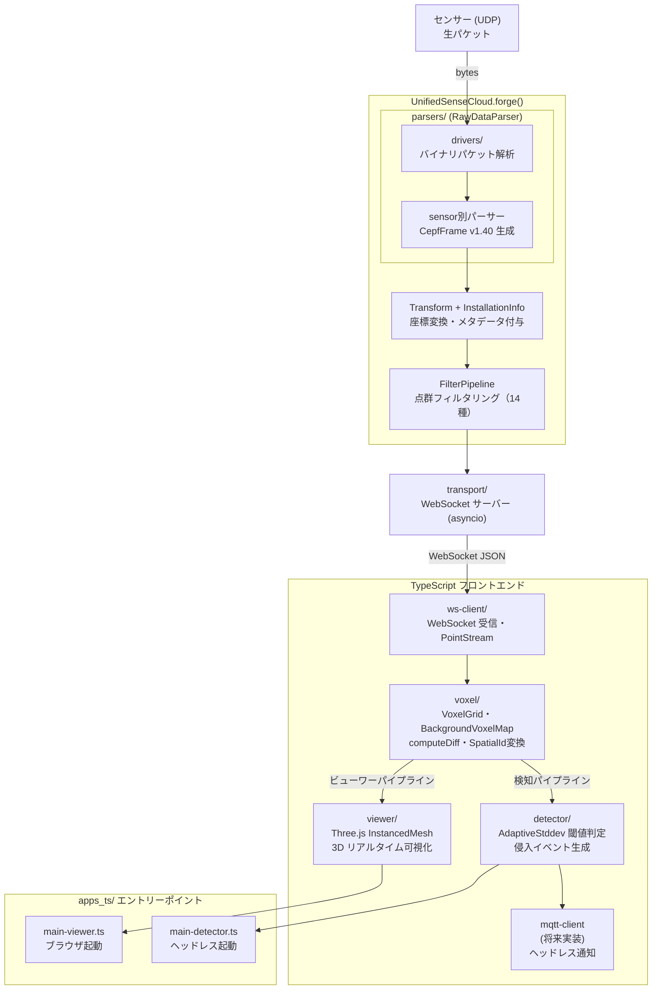
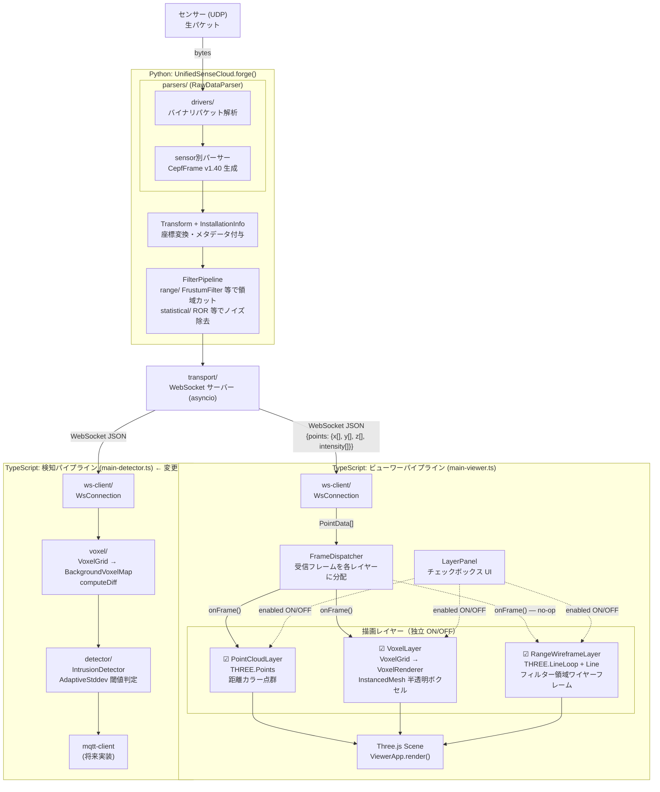

# トリプルレンダーレイヤー設計書

> **対象**: Node.js / TypeScript 領域のみ（Python 側は変更しない）  
> **目的**: Three.js ビューアで **点群・ボクセル・レンジフィルター領域** の 3 種を独立レイヤーとして描画し、個別に ON/OFF できるようにする  
> **作成日**: 2026-03-06

---

## 目次

1. [現行の全体フロー図（readme.md からの転記）](#1-現行の全体フロー図readmemd-からの転記)
2. [現状の問題分析](#2-現状の問題分析)
3. [「パイプラインの分離」ではなく「描画レイヤーの分離」](#3-パイプラインの分離ではなく描画レイヤーの分離)
4. [RangeWireframeLayer — フィルター領域のワイヤーフレーム描画](#4-rangewireframelayer--フィルター領域のワイヤーフレーム描画)
5. [新しい全体フロー図](#5-新しい全体フロー図)
6. [詳細設計](#6-詳細設計)
7. [レンジフィルター形状の定数管理](#7-レンジフィルター形状の定数管理)
8. [モジュール構成の変更](#8-モジュール構成の変更)
9. [シーケンス図](#9-シーケンス図)
10. [実装タスク一覧（TODO）](#10-実装タスク一覧todo)
11. [リスクと対策](#11-リスクと対策)
12. [まとめ](#12-まとめ)

---

## 1. 現行の全体フロー図（readme.md からの転記）

以下は `docs/readme.md` §5.1 に掲載されている現行の全体データフローである。



### 現行 TypeScript 側のコード上の実態

上のフロー図では `ws-client → voxel → viewer` と直列に見えるが、
実際のコード（`viewer/src/main.ts`）では **1 つのコールバック内に全処理がベタ書き** されている：

```typescript
// viewer/src/main.ts — 現行コード
conn.onMessage((points) => {
  viewer.updatePoints(points);                          // ① 生点群 Points 描画
  grid.clear();                                          // ② ボクセル化
  points.forEach((p) => grid.addPoint(p.x, p.y, p.z, frameId));
  frameId++;
  viewer.updateVoxels(grid.snapshot(), VOXEL_CELL_SIZE); // ③ ボクセル InstancedMesh 描画
  setStatus("接続済み ✓", frameId, points.length);
});
```

つまり **データパイプラインは 1 本**（WebSocket → `PointData[]`）であり、
ビューア側で行っているのは同じデータに対する **複数の描画処理** である。

---

## 2. 現状の問題分析

| # | 問題 | 詳細 |
|---|------|------|
| 1 | **描画処理が密結合** | `main.ts` の 1 コールバック内に、点群描画・ボクセル化・ボクセル描画が混在。表示モードの ON/OFF・独立テストが困難 |
| 2 | **レイヤーの表示制御がない** | 「点群だけ」「ボクセルだけ」「両方」を切り替える仕組みがない |
| 3 | **フィルター領域が不可視** | Python 側 `filters/range/` で適用している FrustumFilter 等の「残す範囲」が Three.js 上で可視化されていない。点群がどこで切られているか視覚的に分からない |
| 4 | **フィルター形状パラメータの二重管理** | Python 側にハードコードされた形状定数（`R_BOTTOM`, `R_TOP`, `HEIGHT` 等）が TS 側には存在しない |

---

## 3. 「パイプラインの分離」ではなく「描画レイヤーの分離」

### 3.1 そもそもパイプラインを分ける必要があるか？

**結論: データパイプラインの分離は不要。描画レイヤーの分離で十分。**

理由：

1. **データソースは 1 つ** — Python → WebSocket → `PointData[]` という流れは 1 本。これを複数のパイプラインに分岐させる意味がない
2. **ボクセル化は描画前処理** — `VoxelGrid` は表示用の集約処理であって、データ変換ではない。点群 → ボクセルは「同じデータの別の見せ方」
3. **ワイヤーフレームはデータ非依存** — フィルター領域の形状は **静的ジオメトリ** であり、受信データとは無関係に描画できる

したがって必要なのは：

```
                                 ┌─ PointCloudLayer      ← 受信データを毎フレーム描画
PointData[] ──→ FrameDispatcher ─┤
                                 └─ VoxelLayer           ← 受信データをボクセル化して描画

RangeFilterConfig ──→ RangeWireframeLayer                ← 静的ジオメトリ（データ非依存）
```

**3 つの描画レイヤー**（うち 2 つはフレームデータ連動、1 つは静的）を、それぞれ独立に ON/OFF できるようにする。

### 3.2 detector パイプラインとの関係

`main-detector.ts`（ヘッドレス検知）は **描画を行わない** ため、`RenderLayer` の影響を受けない。
detector が行うボクセル化は `voxel/VoxelGrid` を直接使い続ける。この設計変更の対象外。

```
main-viewer.ts  : WsConnection → FrameDispatcher → [ PointCloudLayer, VoxelLayer ] + RangeWireframeLayer
main-detector.ts: WsConnection → VoxelGrid → BackgroundVoxelMap → IntrusionDetector  ← 変更なし
```

---

## 4. RangeWireframeLayer — フィルター領域のワイヤーフレーム描画

### 4.1 描画対象

Python 側の `filters/range/` には以下の 5 種のフィルターがある。
いずれも「残す領域」を定義しており、その境界をワイヤーフレームで Three.js 上に表示する。

| Python フィルター | 形状 | Three.js ワイヤーフレーム構成 | 現在使用中 |
|------------------|------|:-------------------:|:-----:|
| `FrustumFilter` | 円錐台 | `LineLoop`(上下円) + `Line`(ガイドライン) | **✅** |
| `CylindricalFilter` | 円柱 | `LineLoop`(上下円) + `Line`(ガイドライン) | |
| `BoxFilter` | 直方体 | `EdgesGeometry(BoxGeometry)` → `LineSegments` | |
| `SphericalFilter` | 球 | `EdgesGeometry(SphereGeometry)` → `LineSegments` | |
| `PolygonFilter` | 多角形柱 | `LineLoop`(上下多角形) + `Line`(ガイドライン) | |

**当面は `FrustumFilter`（円錐台）のみ実装する。** 他の形状は同じインターフェースで後から追加可能。

### 4.2 FrustumFilter の形状パラメータ（Python 側の現行値）

`cepf_sdk/filters/range/frustum.py` に定義された設計値：

```
z=+29m  _______________   r=2.500m  直径=5000mm（実計測:4950mm）
        \  +25mm/m    /   ← 1m上がるごとに半径 +25mm
         \           /
          \         /
z=0        \_______/   r=1.775m  直径=3550mm（実計測:3390mm、安全側+160mm）
‐‐‐‐‐‐‐‐ LiDAR 高さ（離着陸面 +1.0m 想定、未確定）‐‐‐‐‐‐
z=-1m    r=1.750m  直径=3500mm
═════════ 離着陸面 ═════════
```

| 定数 | Python 側の値 | 意味 |
|------|:---:|------|
| `R_BOTTOM` | 1.775 m | LiDAR 高さ（z=0）での半径 |
| `R_TOP` | 2.5 m | z=+29m での半径 |
| `HEIGHT` | 29.0 m | 円錐台の高さ |
| `Z_BOTTOM` | 0.0 m | 底面の Z 座標（LiDAR 高さ） |

### 4.3 TS 側でのパラメータ管理方針

**〈現在〉TypeScript 側にハードコードする**

```typescript
// viewer/src/layers/range-filter-config.ts

/** Python 側 filters/range/ と同じ形状定数（手動同期） */
export const FRUSTUM_CONFIG = {
  rBottom: 1.775,    // LiDAR 高さでの半径 [m]
  rTop:    2.5,      // z=+29m での半径 [m]
  height:  29.0,     // 円錐台の高さ [m]
  zBottom: 0.0,      // 底面 Z 座標 [m]
} as const;
```

**〈将来〉JSON 設定ファイルを Python 側と共有する**

将来的には `apps/sensors.example.json`（または新設の `filters.json`）に形状パラメータを持たせ、
Python 起動時にそれを読ん FilterPipeline を構築し、同じ JSON を TS 側もインポートする共有設定方式に移行する。

```
sensors.json  ─────→  Python: FilterPipeline で使用
     │
     └───────────→  TypeScript: RangeWireframeLayer で使用
```

この移行は **Python 側の設定ファイル構造変更を伴う** ため、本設計では対象外とし、
TS 側は `range-filter-config.ts` のハードコード値を使う。値を変更する場合は手動で同期する。

### 4.4 Three.js でのワイヤーフレーム描画

`FrustumFilter` の形状は **Z 軸に直立した円錐台** である。
Three.js の座標系は Y-up だが、`ViewerApp` は `camera.up.set(0, 0, 1)` で Z-up に変更済み。
したがってジオメトリも Z 軸方向に生成する。

**描画方針:** `CylinderGeometry` + `EdgesGeometry` で Y 軸方向に生成して回転する方式も考えられるが、
Z-up 空間に **直接頂点を配置** するほうが回転ハックが不要で分かりやすい。
本設計では以下の 3 要素でワイヤーフレームを構築する（実装詳細は §6.5 参照）：

1. **底面の円** — `THREE.LineLoop`（z = zBottom, radius = rBottom）
2. **上面の円** — `THREE.LineLoop`（z = zBottom + height, radius = rTop）
3. **ガイドライン** — 上下の円を繋ぐ `THREE.Line` × 8 本

**描画結果イメージ:**

```
      ╱ ─ ─ ─ ─ ─ ╲        ← z=29m, r=2.5m のワイヤーフレーム円
     ╱╱             ╲╲       ← 8 本のガイドライン（等間隔）
    ╱╱               ╲╲
   ╱╱                 ╲╲
  ╱╱     点群 ☁         ╲╲
 ╱╱      ボクセル ▦       ╲╲
  ╲─ ─ ─ ─ ─ ─ ─ ─ ─ ─╱    ← z=0m, r=1.775m のワイヤーフレーム円
        [LiDAR]
```

### 4.5 RangeWireframeLayer は RenderLayer か？

`RenderLayer` インターフェースは `onFrame(points, frameId)` を持つ。
ワイヤーフレームはフレームデータに依存しない **静的ジオメトリ** なので、
`onFrame()` は何もしない（no-op）。

ただし `RenderLayer` インターフェースに統一することで以下のメリットがある：
- **同じ `enabled` フラグで ON/OFF 制御** できる
- **LayerPanel（UI パネル）で統一的に切り替え** できる
- 将来パラメータをリアルタイムに変更する場合も `onFrame()` で再構築できる

よって `RangeWireframeLayer` も `RenderLayer` を実装する。`onFrame()` はデフォルトでは no-op。

---

## 5. 新しい全体フロー図

### 5.1 全体データフロー（変更後）



### 5.2 変更前後の比較

| 観点 | 変更前 | 変更後 |
|------|--------|--------|
| データパイプライン | 1 本 | 1 本（**変更なし**） |
| 描画処理 | `main.ts` に全部ベタ書き | 3 つの `RenderLayer` に分離 |
| 表示切替 | 不可 | レイヤー単位で ON/OFF |
| フィルター領域の可視化 | なし | `RangeWireframeLayer` でワイヤーフレーム表示 |
| detector 側への影響 | — | なし |

---

## 6. 詳細設計

### 6.1 RenderLayer インターフェース

```typescript
// viewer/src/layers/types.ts

import type { PointData } from "../../../ws-client/src/types.js";

export interface RenderLayer {
  /** レイヤー名（UI 表示・デバッグ用） */
  readonly name: string;

  /** 日本語の表示ラベル */
  readonly label: string;

  /** レイヤーの表示 ON/OFF */
  enabled: boolean;

  /**
   * フレーム受信時に FrameDispatcher から呼ばれる。
   * 静的レイヤー（ワイヤーフレーム等）では no-op。
   */
  onFrame(points: PointData[], frameId: number): void;

  /** Three.js オブジェクトの visible を enabled に連動させる */
  setVisible(visible: boolean): void;

  /** レイヤー破棄時のクリーンアップ */
  dispose(): void;
}
```

### 6.2 FrameDispatcher

```typescript
// viewer/src/layers/frame-dispatcher.ts

export class FrameDispatcher {
  private _layers: RenderLayer[] = [];
  private _frameId = 0;

  register(layer: RenderLayer): void {
    this._layers.push(layer);
  }

  unregister(name: string): void {
    const layer = this._layers.find(l => l.name === name);
    if (layer) layer.dispose();
    this._layers = this._layers.filter(l => l.name !== name);
  }

  /** WsConnection.onMessage() から呼ぶ */
  dispatch(points: PointData[]): void {
    this._frameId++;
    for (const layer of this._layers) {
      if (layer.enabled) {
        try {
          layer.onFrame(points, this._frameId);
        } catch (e) {
          console.error(`[FrameDispatcher] ${layer.name} onFrame failed:`, e);
        }
      }
    }
  }

  /** レイヤーの enabled 切り替え + Three.js visible 連動 */
  toggle(name: string): void {
    const layer = this._layers.find(l => l.name === name);
    if (layer) {
      layer.enabled = !layer.enabled;
      layer.setVisible(layer.enabled);
    }
  }

  get frameId(): number { return this._frameId; }
  get layers(): readonly RenderLayer[] { return this._layers; }
}
```

### 6.3 PointCloudLayer

```typescript
// viewer/src/layers/point-cloud-layer.ts

export class PointCloudLayer implements RenderLayer {
  readonly name = "pointcloud";
  readonly label = "点群";
  enabled = true;

  constructor(private readonly _viewer: ViewerApp) {}

  onFrame(points: PointData[], _frameId: number): void {
    this._viewer.updatePoints(points);
  }

  setVisible(visible: boolean): void {
    this._viewer.pointCloudObject.visible = visible;  // ← ViewerApp に getter を追加
  }

  dispose(): void {}
}
```

### 6.4 VoxelLayer

```typescript
// viewer/src/layers/voxel-layer.ts

export class VoxelLayer implements RenderLayer {
  readonly name = "voxel";
  readonly label = "ボクセル";
  enabled = true;

  private _grid: VoxelGrid;
  private _cellSize: number;

  constructor(
    private readonly _viewer: ViewerApp,
    cellSize: number = 1.0,
  ) {
    this._grid = new VoxelGrid(cellSize);
    this._cellSize = cellSize;
  }

  onFrame(points: PointData[], frameId: number): void {
    this._grid.clear();
    for (const p of points) {
      this._grid.addPoint(p.x, p.y, p.z, frameId);
    }
    this._viewer.updateVoxels(this._grid.snapshot(), this._cellSize);
  }

  setVisible(visible: boolean): void {
    this._viewer.voxelObject.visible = visible;  // ← ViewerApp に getter を追加
  }

  dispose(): void {
    this._grid.clear();
  }
}
```

### 6.5 RangeWireframeLayer

```typescript
// viewer/src/layers/range-wireframe-layer.ts

import * as THREE from "three";
import type { RenderLayer } from "./types.js";
import type { PointData } from "../../../ws-client/src/types.js";
import { FRUSTUM_CONFIG } from "./range-filter-config.js";

export class RangeWireframeLayer implements RenderLayer {
  readonly name = "range-wireframe";
  readonly label = "フィルター領域";
  enabled = true;

  private _group: THREE.Group;

  /**
   * PointCloudLayer / VoxelLayer と異なり ViewerApp ではなく Scene を直接受け取る。
   * 理由: このレイヤーは ViewerApp のメソッド (updatePoints 等) を使わず、
   * Scene に静的ジオメトリを追加するだけのため。
   */
  constructor(scene: THREE.Scene) {
    this._group = new THREE.Group();

    // フラスタム（円錐台）ワイヤーフレームを生成
    const wireframe = createFrustumWireframe(
      FRUSTUM_CONFIG.rBottom,
      FRUSTUM_CONFIG.rTop,
      FRUSTUM_CONFIG.height,
      FRUSTUM_CONFIG.zBottom,
    );
    this._group.add(wireframe);

    scene.add(this._group);
  }

  /** 静的ジオメトリなのでフレームデータは使わない */
  onFrame(_points: PointData[], _frameId: number): void {
    // no-op: ワイヤーフレームはフレーム非依存
  }

  setVisible(visible: boolean): void {
    this._group.visible = visible;
  }

  dispose(): void {
    // GPU リソース（Geometry / Material）を解放してメモリリーク防止
    this._group.traverse((obj) => {
      if (obj instanceof THREE.Line || obj instanceof THREE.LineLoop) {
        obj.geometry.dispose();
        if (obj.material instanceof THREE.Material) obj.material.dispose();
      }
    });
    this._group.parent?.remove(this._group);
  }
}

// --- 内部ヘルパー ---

const WIREFRAME_SEGMENTS = 64;
const WIREFRAME_COLOR = 0x00ff88;
const WIREFRAME_OPACITY = 0.6;
const GUIDE_LINE_COUNT = 8; // 上円と下円を繋ぐガイドライン本数

function createFrustumWireframe(
  rBottom: number,
  rTop: number,
  height: number,
  zBottom: number,
): THREE.Group {
  const group = new THREE.Group();
  const mat = new THREE.LineBasicMaterial({
    color: WIREFRAME_COLOR,
    transparent: true,
    opacity: WIREFRAME_OPACITY,
  });

  // ① 底面の円（z = zBottom）
  group.add(createCircle(rBottom, zBottom, WIREFRAME_SEGMENTS, mat));

  // ② 上面の円（z = zBottom + height）
  group.add(createCircle(rTop, zBottom + height, WIREFRAME_SEGMENTS, mat));

  // ③ 上下を繋ぐガイドライン
  for (let i = 0; i < GUIDE_LINE_COUNT; i++) {
    const theta = (i / GUIDE_LINE_COUNT) * Math.PI * 2;
    const x0 = rBottom * Math.cos(theta);
    const y0 = rBottom * Math.sin(theta);
    const x1 = rTop * Math.cos(theta);
    const y1 = rTop * Math.sin(theta);

    const geom = new THREE.BufferGeometry().setFromPoints([
      new THREE.Vector3(x0, y0, zBottom),
      new THREE.Vector3(x1, y1, zBottom + height),
    ]);
    group.add(new THREE.Line(geom, mat));
  }

  return group;
}

function createCircle(
  radius: number,
  z: number,
  segments: number,
  material: THREE.LineBasicMaterial,
): THREE.LineLoop {
  const verts: number[] = [];
  // LineLoop は自動で閉路を生成するため i < segments で十分（重複頂点を避ける）
  for (let i = 0; i < segments; i++) {
    const theta = (i / segments) * Math.PI * 2;
    verts.push(radius * Math.cos(theta), radius * Math.sin(theta), z);
  }
  const geom = new THREE.BufferGeometry();
  geom.setAttribute("position", new THREE.Float32BufferAttribute(verts, 3));
  return new THREE.LineLoop(geom, material);
}
```

### 6.6 main.ts の書き換え

```typescript
// viewer/src/main.ts（変更後）
// ※ resolveWsUrl(), setStatus(), ステータス DOM 参照は現行 main.ts から変更なし

import { WsConnection }          from "../../ws-client/src/ws-connection.js";
import { ViewerApp }              from "./index.js";
import { FrameDispatcher }        from "./layers/frame-dispatcher.js";
import { PointCloudLayer }        from "./layers/point-cloud-layer.js";
import { VoxelLayer }             from "./layers/voxel-layer.js";
import { RangeWireframeLayer }    from "./layers/range-wireframe-layer.js";
import { LayerPanel }             from "./overlays/layer-panel.js";

// resolveWsUrl() — 現行と同一（URLパラメータ > metaタグ > 同一ホスト:8765）
const WS_URL = resolveWsUrl();
const VOXEL_CELL_SIZE = 1.0;

const container = document.getElementById("viewer-container")!;
const viewer    = new ViewerApp(container);
const dispatcher = new FrameDispatcher();

// --- 描画レイヤー登録 ---
dispatcher.register(new PointCloudLayer(viewer));
dispatcher.register(new VoxelLayer(viewer, VOXEL_CELL_SIZE));
dispatcher.register(new RangeWireframeLayer(viewer.scene));  // ← 静的ジオメトリ

// --- レイヤー切替 UI ---
const panel = new LayerPanel(container, dispatcher);

// --- WebSocket 受信 ---
const conn = new WsConnection({ url: WS_URL, reconnectInterval: 3000 });
conn.onMessage((points) => {
  dispatcher.dispatch(points);
  setStatus("接続済み ✓", dispatcher.frameId, points.length);
});

conn.connect();
viewer.render();
```

### 6.7 LayerPanel（表示切替 UI）

```typescript
// viewer/src/overlays/layer-panel.ts

export class LayerPanel {
  private _container: HTMLElement;

  constructor(parent: HTMLElement, dispatcher: FrameDispatcher) {
    this._container = document.createElement("div");
    this._container.className = "layer-panel";
    this._container.innerHTML = "<strong>表示レイヤー</strong>";

    for (const layer of dispatcher.layers) {
      const label = document.createElement("label");
      const checkbox = document.createElement("input");
      checkbox.type = "checkbox";
      checkbox.checked = layer.enabled;
      checkbox.addEventListener("change", () => dispatcher.toggle(layer.name));
      label.appendChild(checkbox);
      label.appendChild(document.createTextNode(` ${layer.label}`));
      this._container.appendChild(label);
    }

    parent.appendChild(this._container);
  }
}
```

表示イメージ：

```
┌─────────────────────┐
│ 表示レイヤー          │
│ ☑ 点群               │
│ ☑ ボクセル            │
│ ☑ フィルター領域       │
└─────────────────────┘
```

---

## 7. レンジフィルター形状の定数管理

### 7.1 Python 側の現行定数（参照のみ — 変更しない）

| ファイル | フィルター | 主な定数 |
|---------|-----------|---------|
| `filters/range/frustum.py` | `FrustumFilter` | `R_BOTTOM=1.775`, `R_TOP=2.5`, `HEIGHT=29.0`, `Z_BOTTOM=0.0` |
| `filters/range/cylindrical.py` | `CylindricalFilter` | `RADIUS_M=10.0`, `Z_MIN_M=-30.0`, `Z_MAX_M=30.0` |
| `filters/range/box.py` | `BoxFilter` | `X/Y/Z_MIN=-10.0`, `X/Y/Z_MAX=10.0` |
| `filters/range/spherical.py` | `SphericalFilter` | `RADIUS_M=10.0` |
| `filters/range/polygon.py` | `PolygonFilter` | `DEFAULT_POLYGON=[]`, `Z_MIN=-inf`, `Z_MAX=inf` |

### 7.2 TypeScript 側の新規定数ファイル

```typescript
// viewer/src/layers/range-filter-config.ts

/**
 * Python 側 cepf_sdk/filters/range/ の形状定数を TypeScript 側にミラー。
 * 現在はハードコード。将来は共通 JSON 設定ファイルから読み込む。
 *
 * ⚠ 変更時は Python 側の対応ファイルも手動で同期すること。
 *  - frustum → cepf_sdk/filters/range/frustum.py
 *  - cylindrical → cepf_sdk/filters/range/cylindrical.py
 *  - box → cepf_sdk/filters/range/box.py
 *  - spherical → cepf_sdk/filters/range/spherical.py
 *  - polygon → cepf_sdk/filters/range/polygon.py
 */

// ---- FrustumFilter（円錐台）— 現在のアクティブフィルター ----
export const FRUSTUM_CONFIG = {
  rBottom: 1.775,    // LiDAR 高さ（z=0）での半径 [m]
  rTop:    2.5,      // z=+29m での半径 [m]
  height:  29.0,     // 円錐台の高さ [m]
  zBottom: 0.0,      // 底面 Z 座標 [m]
} as const;

// ---- CylindricalFilter（円柱）— 将来用 ----
export const CYLINDRICAL_CONFIG = {
  radius: 10.0,      // 水平半径 [m]
  zMin:  -30.0,      // Z 下限 [m]
  zMax:   30.0,      // Z 上限 [m]
  cx:     0.0,       // 中心 X [m]
  cy:     0.0,       // 中心 Y [m]
} as const;

// ---- BoxFilter（直方体）— 将来用 ----
export const BOX_CONFIG = {
  xMin: -10.0, xMax: 10.0,
  yMin: -10.0, yMax: 10.0,
  zMin: -10.0, zMax: 10.0,
} as const;

// ---- SphericalFilter（球）— 将来用 ----
export const SPHERICAL_CONFIG = {
  radius: 10.0,
  cx: 0.0, cy: 0.0, cz: 0.0,
} as const;

// ---- PolygonFilter（多角形柱）— 将来用 ----
export const POLYGON_CONFIG = {
  polygon: [] as readonly [number, number][],  // XY 頂点配列（Python 側デフォルト: 空）
  zMin: -Infinity,   // Z 下限 [m]（Python 側デフォルト: -inf）
  zMax:  Infinity,   // Z 上限 [m]（Python 側デフォルト: +inf）
} as const;

// ---- 現在アクティブなフィルター形状 ----
export type ActiveRangeFilter = "frustum" | "cylindrical" | "box" | "spherical" | "polygon";
export const ACTIVE_FILTER: ActiveRangeFilter = "frustum";
```

### 7.3 将来の共通 JSON 化ロードマップ

```
Phase 1（本設計）: TS 側に range-filter-config.ts としてハードコード
     ↓
Phase 2: filters.json を新設し、Python 側の各 Filter.__init__() がそこから読む
     ↓
Phase 3: TS 側も同じ filters.json を import（webpack の json-loader 等で）
     ↓
結果: 1 つの JSON ファイルを Python と TypeScript の両方が参照
```

---

## 8. モジュール構成の変更

### 8.1 新規ファイル

| ファイル | 役割 |
|---------|------|
| `viewer/src/layers/types.ts` | `RenderLayer` インターフェース定義 |
| `viewer/src/layers/frame-dispatcher.ts` | フレーム分配器 |
| `viewer/src/layers/point-cloud-layer.ts` | 点群描画レイヤー |
| `viewer/src/layers/voxel-layer.ts` | ボクセル描画レイヤー |
| `viewer/src/layers/range-wireframe-layer.ts` | フィルター領域ワイヤーフレーム描画レイヤー |
| `viewer/src/layers/range-filter-config.ts` | フィルター形状定数（Python 側のミラー） |
| `viewer/src/layers/index.ts` | barrel export |
| `viewer/src/overlays/layer-panel.ts` | チェックボックス UI パネル |
| `viewer/tests/layers/frame-dispatcher.test.ts` | FrameDispatcher テスト |
| `viewer/tests/layers/point-cloud-layer.test.ts` | PointCloudLayer テスト |
| `viewer/tests/layers/voxel-layer.test.ts` | VoxelLayer テスト |
| `viewer/tests/layers/range-wireframe-layer.test.ts` | RangeWireframeLayer テスト |

### 8.2 変更ファイル

| ファイル | 変更内容 |
|---------|----------|
| `viewer/src/main.ts` | `FrameDispatcher` + 3 レイヤー + `LayerPanel` 導入。`resolveWsUrl()` / `setStatus()` は変更なし |
| `viewer/src/index.ts` | `scene`, `pointCloudObject`, `voxelObject` の public getter 追加 |
| `viewer/src/renderers/voxel-renderer.ts` | `mesh` の public getter 追加（`ViewerApp.voxelObject` が内部で参照） |
| `apps_ts/src/main-viewer.ts` | `FrameDispatcher` + 3 レイヤー + `LayerPanel` 導入。**注意:** 現行コードは `updatePoints()` を呼んでいない（ボクセルのみ）ため、`PointCloudLayer` 追加は挙動変更となる。WS URL は `config.websocket_url` を引き続き使用 |

### 8.3 変更しないファイル

| パッケージ/ファイル | 理由 |
|-----------|------|
| `cepf_sdk/` (Python 全般) | スコープ外 — フィルター形状定数も含め一切変更しない |
| `apps/` (Python) | スコープ外 |
| `ws-client/` | `WsConnection`, `PointData` は現行のまま |
| `voxel/` | `VoxelGrid` は `VoxelLayer` から利用するだけ |
| `detector/` | 検知パイプラインは変更なし |
| `viewer/src/renderers/spatial-id-renderer.ts` | 既存ファイル。現時点では RenderLayer 化しない（将来検討） |
| `viewer/webpack.config.js` | エントリーポイントの import パス変更なし。`layers/` は `main.ts` 経由で解決されるため設定変更不要 |
| `docs/readme.md` | 全体ドキュメントは本設計完了後に別途更新 |

---

## 9. シーケンス図

### 9.1 変更前（現行）

```
WsConnection       main.ts          ViewerApp       VoxelGrid     VoxelRenderer
    │                  │                 │               │               │
    │── onMessage() ──▶│                 │               │               │
    │                  │── updatePoints()▶│               │               │
    │                  │── grid.clear() ─────────────────▶│               │
    │                  │── addPoint() ×N ────────────────▶│               │
    │                  │── snapshot() ───────────────────▶│               │
    │                  │── updateVoxels() ▶│──────────────────── update()▶│
```

### 9.2 変更後

```
WsConnection   FrameDispatcher   PointCloudLayer   VoxelLayer   RangeWireframeLayer   ViewerApp   Scene
    │               │                  │               │                │                 │          │
    │               │                  │               │                │                 │          │
    │               │          ┌───────────────────────────────────────────── 初期化時 ──────────────┐
    │               │          │  new PointCloudLayer(viewer)                                        │
    │               │          │  new VoxelLayer(viewer, cellSize)                                   │
    │               │          │  new RangeWireframeLayer(scene)  → 円錐台ワイヤーフレームを scene に追加 │
    │               │          └────────────────────────────────────────────────────────────────────┘
    │               │                  │               │                │                 │          │
    │── onMessage()▶│                  │               │                │                 │          │
    │               │── onFrame() ────▶│               │                │                 │          │
    │               │                  │── updatePoints()─────────────────────────────────▶│          │
    │               │── onFrame() ─────────────────────▶│               │                 │          │
    │               │                                   │── clear() → grid               │          │
    │               │                                   │── addPoint() ×N → grid         │          │
    │               │                                   │── updateVoxels()───────────────▶│          │
    │               │                                   │               │                 │          │
    │               │  （RangeWireframeLayer は onFrame で何もしない — 静的ジオメトリ）       │          │
    │               │                                                                     │          │
    │               │                                              requestAnimationFrame ─▶│─ render()▶│
```

### 9.3 レイヤー表示切替フロー

```
ユーザー操作 (checkbox)
    │
    ▼
LayerPanel → dispatcher.toggle("voxel")
    │
    ├─ layer.enabled = false   → dispatch() がこのレイヤーの onFrame() をスキップ（CPU 節約）
    │
    └─ layer.setVisible(false) → Three.js の Object3D.visible = false（GPU 節約）
```

---

## 10. 実装タスク一覧（TODO）

### Phase 1: レイヤー基盤

| # | タスク | ファイル | 概要 |
|---|--------|---------|------|
| 1-1 | `RenderLayer` インターフェース定義 | `viewer/src/layers/types.ts` | `name`, `label`, `enabled`, `onFrame()`, `setVisible()`, `dispose()` |
| 1-2 | `FrameDispatcher` 実装 | `viewer/src/layers/frame-dispatcher.ts` | `register()`, `unregister()`, `dispatch()`, `toggle()` |
| 1-3 | `FrameDispatcher` テスト | `viewer/tests/layers/frame-dispatcher.test.ts` | モック RenderLayer を登録して dispatch / toggle 検証 |

### Phase 2: 点群レイヤー

| # | タスク | ファイル | 概要 |
|---|--------|---------|------|
| 2-1 | `PointCloudLayer` 実装 | `viewer/src/layers/point-cloud-layer.ts` | `updatePoints()` 委譲 + `setVisible` |
| 2-2 | `ViewerApp` に `pointCloudObject` getter 追加 | `viewer/src/index.ts` | `THREE.Points` を外部から `visible` 制御可能に |
| 2-3 | `PointCloudLayer` テスト | `viewer/tests/layers/point-cloud-layer.test.ts` | `enabled=false` で `updatePoints` が呼ばれないことを検証 |

### Phase 3: ボクセルレイヤー

| # | タスク | ファイル | 概要 |
|---|--------|---------|------|
| 3-1 | `VoxelLayer` 実装 | `viewer/src/layers/voxel-layer.ts` | `VoxelGrid` + `updateVoxels()` 委譲 + `setVisible` |
| 3-2 | `VoxelRenderer` に `mesh` getter 追加 | `viewer/src/renderers/voxel-renderer.ts` | `private _mesh` を `get mesh()` で公開 |
| 3-3 | `ViewerApp` に `voxelObject` getter 追加 | `viewer/src/index.ts` | `this._voxelRenderer.mesh` を返す。`InstancedMesh` を外部から `visible` 制御可能に |
| 3-4 | `VoxelLayer` テスト | `viewer/tests/layers/voxel-layer.test.ts` | `enabled=false` で `updateVoxels` が呼ばれないことを検証 |

### Phase 4: フィルター領域ワイヤーフレームレイヤー

| # | タスク | ファイル | 概要 |
|---|--------|---------|------|
| 4-1 | `range-filter-config.ts` 作成 | `viewer/src/layers/range-filter-config.ts` | Python 側のフィルター形状定数をミラー |
| 4-2 | `RangeWireframeLayer` 実装 | `viewer/src/layers/range-wireframe-layer.ts` | FrustumFilter の円錐台ワイヤーフレーム描画 |
| 4-3 | `RangeWireframeLayer` テスト | `viewer/tests/layers/range-wireframe-layer.test.ts` | `dispose()` でシーンから除去されることを検証 |

### Phase 5: エントリーポイント書き換え + UI

| # | タスク | ファイル | 概要 |
|---|--------|---------|------|
| 5-1 | `viewer/src/main.ts` 書き換え | `viewer/src/main.ts` | `FrameDispatcher` + 3 レイヤー + `LayerPanel` |
| 5-2 | `apps_ts/src/main-viewer.ts` 書き換え | `apps_ts/src/main-viewer.ts` | `FrameDispatcher` + 3 レイヤー + `LayerPanel`。WS URL は `config.websocket_url`、`PointCloudLayer` の新規追加に注意 |
| 5-3 | `LayerPanel` 実装 | `viewer/src/overlays/layer-panel.ts` | チェックボックス UI |
| 5-4 | `viewer/src/layers/index.ts` barrel export | `viewer/src/layers/index.ts` | 外部パッケージ向け re-export |
| 5-5 | CSS スタイル | `viewer/styles/layer-panel.css` | `position: absolute; top: 8px; left: 8px; z-index: 100`。半透明背景。既存 overlay（3D スプライト）とは HTML/3D レイヤーが異なるため干渉しない |

### Phase 6: 動作確認

| # | タスク | 概要 |
|---|--------|------|
| 6-1 | `npm run build` (tsc) 確認 | 型エラーがないこと |
| 6-2 | `npm run bundle` (webpack) 確認 | `dist/bundle.js` が生成されること |
| 6-3 | ブラウザ動作確認 | 3 レイヤーの ON/OFF を確認 |
| 6-4 | detector パイプライン影響なし確認 | `main-detector.ts` が変更なしで動作すること |

---

## 11. リスクと対策

| リスク | 影響 | 対策 |
|--------|------|------|
| Python 側のフィルター定数変更を TS 側に反映し忘れる | ワイヤーフレーム表示と実際のフィルター範囲がずれる | `range-filter-config.ts` 冒頭に「Python 側と手動同期」の警告コメントを記載。将来は共通 JSON 化で解消 |
| `updatePoints()` の毎フレーム `Float32Array` コピーが重い | 大規模点群でフレームレート低下 | `PointCloudLayer` 内でスロットリングまたは LOD を後から追加可能 |
| `VoxelGrid.clear()` の毎フレーム呼び出し | 現行と同じ | 将来は差分ボクセル化に置き換え可能（`VoxelLayer` 内部で閉じた変更） |
| ワイヤーフレームが点群と視覚的に重なり見えにくい | 操作性低下 | 色・透明度・線の太さを調整可能にする設計。`LayerPanel` で ON/OFF もできる |
| あるレイヤーの `onFrame()` 例外で後続レイヤーが停止 | 1 レイヤーの不具合が全描画を止める | `FrameDispatcher.dispatch()` 内で各レイヤーを try-catch で囲む（§6.2 参照） |
| WebSocket `onMessage` 内の同期処理がメインスレッドをブロック | 200K 点でフレームレート低下 | 将来的に `requestAnimationFrame` への遅延実行またはフレームスロットリングを導入可能。`PointCloudLayer` 内でスロットリングすることもできる |
| `VoxelLayer` を一時 OFF → ON に戻した際、前回の古いボクセルが表示される | 1 フレーム分のちらつき | 次フレームの `clear()` で解消されるため許容。気になる場合は `toggle()` 時に `_grid.clear()` を追加 |

---

## 12. まとめ

### 何をやるか

1. **パイプラインは 1 本のまま**（WebSocket → `PointData[]`）。分離不要
2. **描画処理を 3 つの `RenderLayer` に分離** する
   - `PointCloudLayer` — 距離カラー点群（`THREE.Points`）
   - `VoxelLayer` — 半透明ボクセル（`VoxelGrid` → `InstancedMesh`）
   - `RangeWireframeLayer` — フィルター領域ワイヤーフレーム（`THREE.LineLoop` + `THREE.Line` 静的ジオメトリ）
3. **`FrameDispatcher`** が受信フレームをレイヤーに分配（ワイヤーフレームはフレーム非依存）
4. **`LayerPanel`** の UI チェックボックスで 3 レイヤーを個別 ON/OFF
5. **Python 側は一切変更しない** — フィルター形状定数は TS 側にハードコード（手動同期）

### 何をやらないか

- Python 側のコード変更
- detector パイプラインの変更（`main-detector.ts` は対象外）
- 共通 JSON 設定ファイルの導入（将来フェーズ）
- FrustumFilter 以外のフィルター形状のワイヤーフレーム実装（将来フェーズ）
- `docs/readme.md` の変更（本設計完了後に別途更新）
