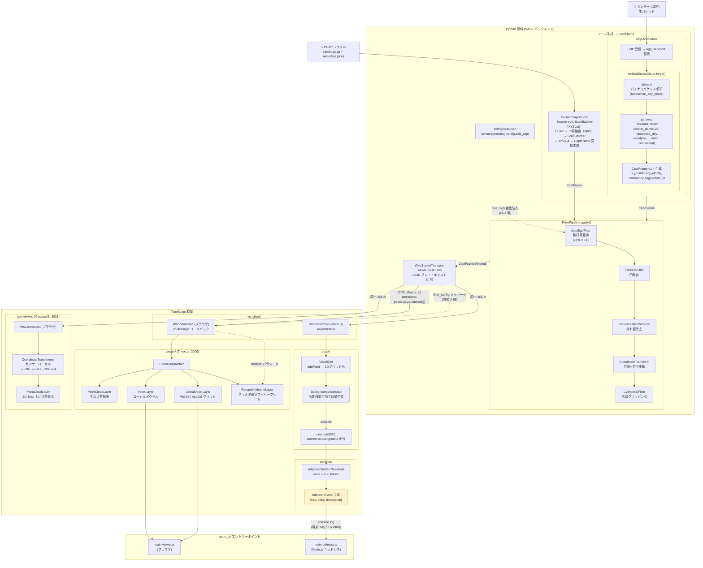
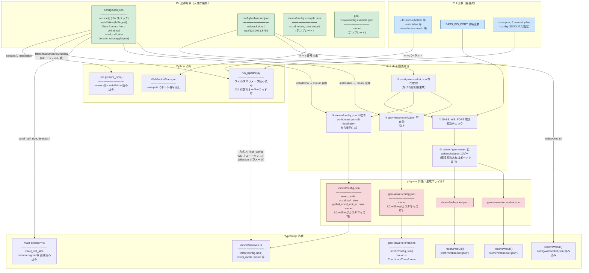
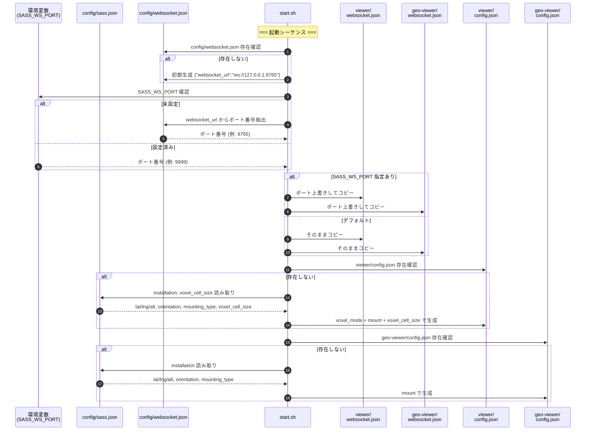
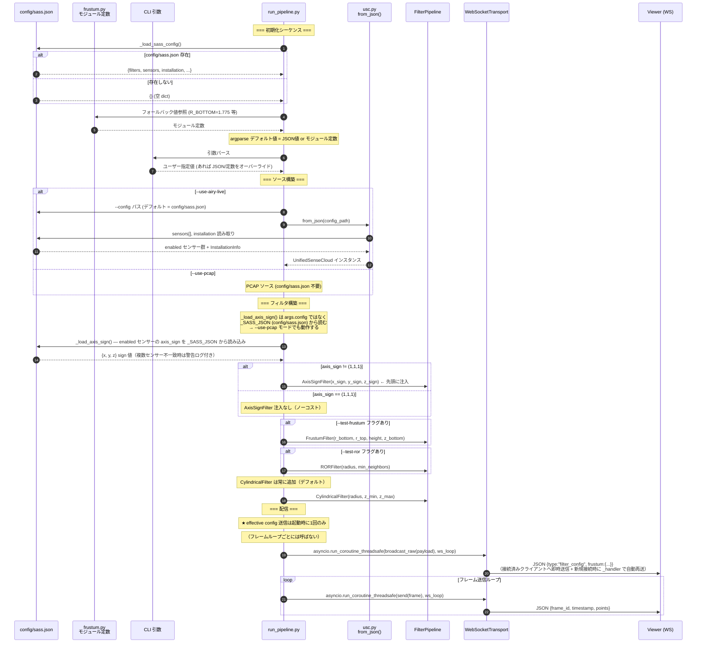
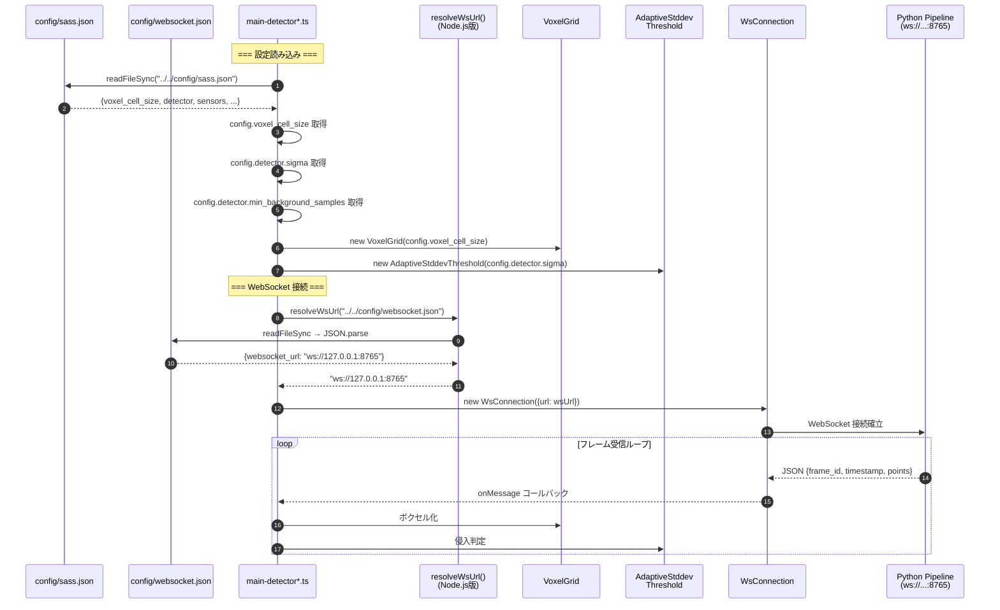
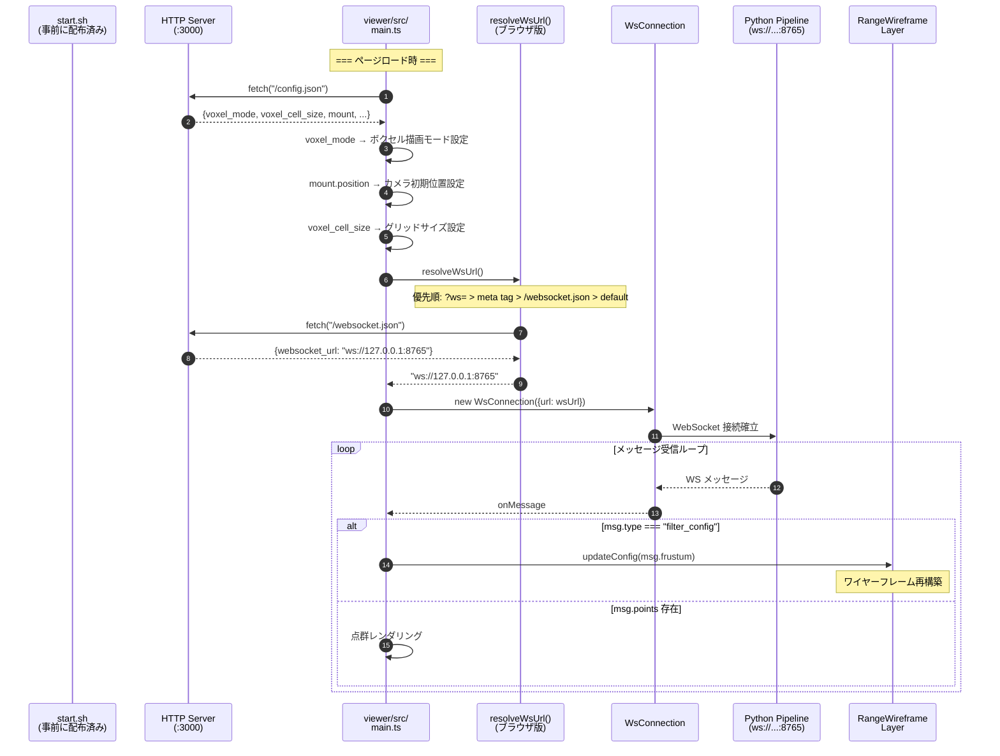
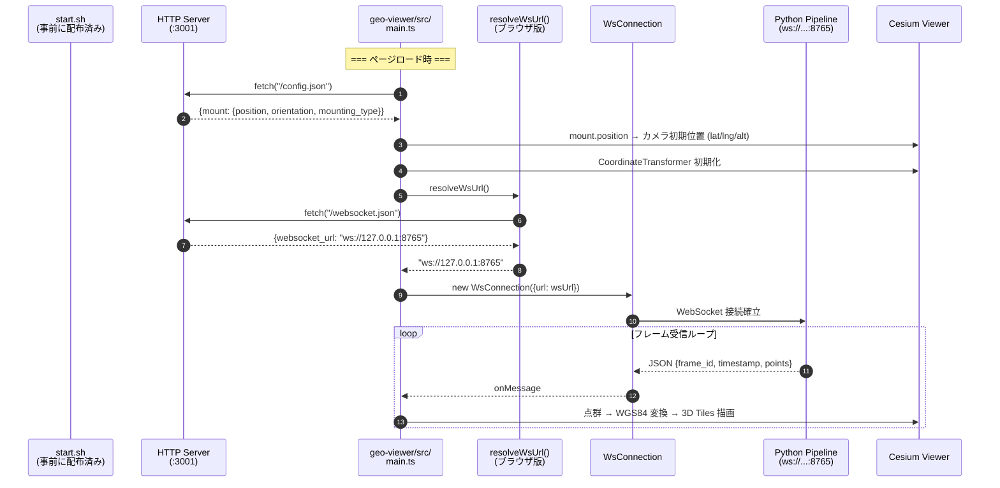
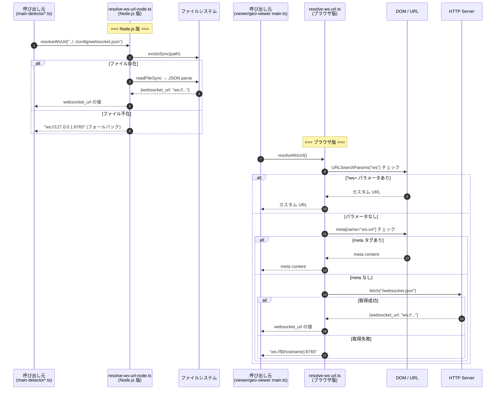
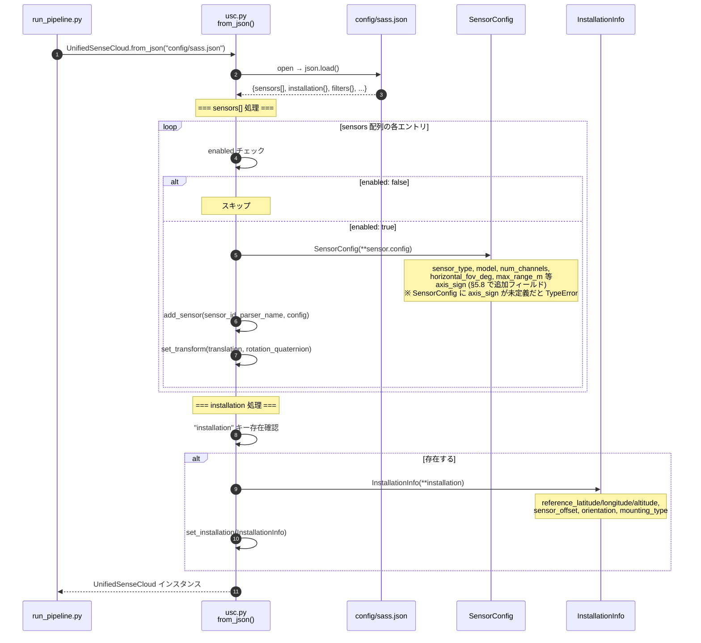

# 設定ファイル統合リファクタリング — 実装仕様書

> **目的**: この文書は AI コーディングエージェントへの実装指示書として機能する。  
> **対象リポジトリ**: `/home/jetson/repos/sass`  
> **作成日**: 2026-03-19  
> **ステータス**: 実装前レビュー完了 — 全決定事項解決済み

---

## 1. 概要

現在の設定ファイルは複数のディレクトリに分散し、値の重複・手動同期・生成ファイルの Git 管理漏れなど多くの問題を抱えている。本リファクタリングでは以下を実現する：

1. **`config/` ディレクトリの新設** — 人間が編集する正規設定の一元管理
2. **`runtime/` ディレクトリの廃止** — `config/` に統合
3. **`config/websocket.json`** — WebSocket 接続先の唯一の正規ソース
4. **`config/sass.json`** — センサー HW・フィルタ・設置情報・検出器設定の統合（「神様ファイル」）
5. **`apps_ts/sensors*.json` の完全廃止** — `config/sass.json` に統合
6. **ワイヤーフレーム描画値の同期解消** — 方式 A（WebSocket ブロードキャスト）で Python→Viewer に effective config を push

---

## 2. 現状分析

### 2.1 現在のファイル配置と役割

| ファイル | 役割 | 生成方法 | Git 追跡 |
|---------|------|---------|---------|
| `runtime/websocket.json` | WS 接続先 URL | `start.sh` が `WS_PORT` から生成 | ❌ ルールなし（追跡される危険） |
| `viewer/websocket.json` | WS URL（ブラウザ用コピー） | `start.sh` が `runtime/` からコピー | ❌ ルールなし |
| `geo-viewer/websocket.json` | WS URL（ブラウザ用コピー） | `start.sh` が `runtime/` からコピー | ❌ ルールなし |
| `viewer/config.json` | Viewer 表示設定 (voxel, coin, mount) | `start.sh` が初回のみ生成（存在すれば保護） | ❌ ルールなし |
| `geo-viewer/config.json` | Geo-Viewer 設定 (mount) | `start.sh` が初回のみ生成 | ❌ ルールなし |
| `apps/sensors.example.json` | センサー HW 仕様 + 設置情報 | 手動編集テンプレート | ✅ 追跡 |
| `apps_ts/sensors.example.json` | 検出アルゴリズムパラメータ（**ファイル名が不適切。§5.7 で廃止**） | 手動編集テンプレート | ✅ 追跡 |
| `apps_ts/sensors.json` | 検出器ランタイム設定（**§5.7 で廃止**） | `start.sh` が example からコピー（初回のみ） | ❌ `.gitignore` 済み |
| `cepf_sdk/filters/range/frustum.py` | Frustum フィルタ定数 | ハードコード (モジュール定数) | ✅ 追跡 |
| `viewer/src/layers/range-filter-config.ts` | Frustum 描画定数（TS ミラー） | ハードコード | ✅ 追跡 |

### 2.2 データフロー（現状）

```
start.sh
 ├─ WS_PORT=8765
 ├─ → runtime/websocket.json      ← 生成
 ├─ → viewer/websocket.json       ← コピー
 ├─ → geo-viewer/websocket.json   ← コピー
 ├─ → viewer/config.json          ← 初回のみ生成（apps_ts/sensors.example.json.mount を参照）
 ├─ → geo-viewer/config.json      ← 初回のみ生成
 ├─ → apps_ts/sensors.json        ← 初回のみ生成（❗ 不要な中間ファイル）

run_pipeline.py (OusterPcapSource 使用時)
 ├─ --use-pcap → OusterPcapSource
 │   ├─ dpkt: PCAP → IP フラグメント再結合
 │   ├─ ouster-sdk (ScanBatcher, XYZLut): XYZ 座標変換
 │   └─ CepfFrame 生成（x, y, z のみ。intensity なし）

run_pipeline.py (AiryLiveSource 使用時)
 ├─ --use-airy-live → USC.from_json(apps/sensors.example.json)
 ├─ cepf_sdk.parsers で複数センサー対応（ouster_dome128, robosense_airy, velodyne, ti_radar, continental）
 └─ CepfFrame v1.4 生成（x, y, z, intensity, velocity, confidence, flags, return_id）

ブラウザ (viewer/geo-viewer)
 ├─ resolveWsUrl() → fetch("/websocket.json") → ws://127.0.0.1:8765
 └─ fetch("/config.json") → voxel_mode, mount 等

Node.js (detector)
 ├─ resolveWsUrl("../../runtime/websocket.json") → ws://127.0.0.1:8765
 └─ require("../sensors.json") → detector strategy, voxel_cell_size
      └─ ❗ sensors.jsonはセンサーHW情報を含まない。名前が虚偽。
```

### 2.3 現状の課題

| # | 種別 | 課題 |
|---|------|------|
| C1 | **値の非同期** | `range-filter-config.ts` の `FRUSTUM_CONFIG` が陳腐化 (height=29.0, zBottom=0.0)。Python 側は height=32.0, zBottom=-2.0 |
| C2 | **gitignore 漏れ** | `runtime/websocket.json`, `viewer/websocket.json`, `geo-viewer/websocket.json`, `viewer/config.json`, `geo-viewer/config.json` に `.gitignore` ルールがない。かつすでに Git 追跡済みのため `git rm --cached` が必要 |
| C3 | **mount データ重複** | 同一の lat/lng/alt が `apps/sensors.example.json`(installation)、`apps_ts/sensors.example.json`(mount)、`viewer/config.json`(mount)、`geo-viewer/config.json`(mount) に散在 |
| C4 | **runtime/ の不要性** | `runtime/` は `start.sh` 生成ファイル置き場だが、1ファイルしかなく、正規ソースとの区別が曖昧 |
| C5 | **フィルタパラメータ散在** | Frustum 定数は `frustum.py`（モジュール定数）と `run_pipeline.py`（CLI デフォルト値）と `range-filter-config.ts`（TS ハードコード）の 3 箇所に存在 |
| C6 | **CylindricalFilter ハードコード** | `run_pipeline.py` が常に `CylindricalFilter(50m, -2, +30)` を追加。設定ファイルから制御不能 |
| C7 | **検出器設定の虎の子渡し** | `apps_ts/sensors.example.json` → `apps_ts/sensors.json` の生成パターンが不要。config/sass.json を直接読めば中間ファイルは不要 |
| C8 | **`flip_z` のハードコード** | Z 軸符号反転が `OusterPcapSource` の `flip_z` フラグ（CLI `--flip-z`）にハードコード。AiryLiveSource は未対応。X/Y 軸変換も不可。センサー交換・設置変更のたびに CLI を手修正する必要がある |
| C9 | **ファイル名虚偽** | `apps_ts/sensors.example.json` はセンサーHW情報を一切含まない。実態は検出アルゴリズム設定 |

---

## 3. 設計方針

### 3.1 基本原則

1. **`config/` = 人間が編集する正規設定**（Git 追跡対象）
2. **生成ファイルは Git 追跡しない** — `.gitignore` に追加
3. **Single Source of Truth** — 同一データの複数箇所記述を排除
4. **CLI 引数 > 設定ファイル** — CLI 引数は設定ファイルの値をオーバーライドする
5. **ブラウザアプリへは `start.sh` がコピーで配信** — ブラウザは `config/` を直接読めないため

### 3.2 ターゲットディレクトリ構成

```
config/                          ← 新設：正規設定ディレクトリ（「神様ファイル」）
  websocket.json                 ← WS 接続先（正規ソース）
  sass.json                      ← センサー HW + フィルタ + 設置情報 + 検出器パラメータ

apps/
  sensors.example.json           ← 廃止（config/sass.json に統合）
apps_ts/
  sensors.example.json           ← 廃止（config/sass.json に統合。§5.7）
  sensors.json                   ← 廃止（生成不要。§5.7）

viewer/
  config.json                    ← 存続（Viewer 固有の表示設定。start.sh が初回生成。.gitignore 対象）
  config.example.json            ← 新規（config.json のテンプレート。Git 追跡）
  websocket.json                 ← 存続（start.sh が config/ からコピー。.gitignore 対象）

geo-viewer/
  config.json                    ← 存続（Geo-Viewer 固有設定。start.sh が初回生成。.gitignore 対象）
  config.example.json            ← 新規（config.json のテンプレート。Git 追跡）
  websocket.json                 ← 存続（start.sh が config/ からコピー。.gitignore 対象）

runtime/                         ← 廃止（ディレクトリごと削除）
```

---

## 4. `config/websocket.json` 仕様

### 4.1 スキーマ

```json
{
  "websocket_url": "ws://127.0.0.1:8765"
}
```

フィールドは既存の `runtime/websocket.json` と同一。変更なし。

### 4.2 所有権と編集ルール

- **正規ソース**: `config/websocket.json`（Git 追跡、人間が編集）
- **コピー先**: `viewer/websocket.json`, `geo-viewer/websocket.json`（`.gitignore` 対象）
- **コピータイミング**: `start.sh` 起動時に毎回コピー（`config/websocket.json` を上書きせず読み取りのみ）
- **初期生成**: `config/websocket.json` は Git 追跡対象であり通常 clone 後に必ず存在する。`start.sh` の「存在しなければ初期生成」ロジック（§6.1）は Git 管理外の環境（手動セットアップ・テスト環境等）向けのフォールバックであり、通常の運用では実行されない。

> **⚠️ リモートアクセス時の注意**: デフォルト値 `ws://127.0.0.1:8765` はローカルホスト固定。Jetson をサーバーとして別 PC のブラウザから接続する場合（例: 開発 PC → Jetson）は、`127.0.0.1` を Jetson の実 IP（例: `192.168.1.10`）に変更して `config/websocket.json` を編集すること。この値は環境依存なので `.env` や `SASS_WS_HOST` 環境変数での上書き機構は将来的な拡張事項とし、現時点では手編集で対応する。

### 4.3 `WS_PORT` 変数との関係

**現状の問題**: `start.sh` は `WS_PORT` をスクリプト内でハードコード（`WS_PORT=8765`、L49）しており、環境変数からの取得は行っていない。このため `runtime/websocket.json` は事実上固定値で生成されている。`config/` を正規ソースにすると、将来的にポートを変更したい場合の柔軟性と矛盾する。

**解決策**: `start.sh` の `WS_PORT` を環境変数対応に変更し、以下のロジックで動作させる：

```
優先順: SASS_WS_PORT 環境変数 > config/websocket.json > デフォルト (8765)
```

```
1. config/websocket.json を読み込む（存在しなければ ws://127.0.0.1:8765 で初期生成）
2. SASS_WS_PORT 環境変数が設定されている場合（空でない場合）：
   a. config/websocket.json のポート番号を SASS_WS_PORT で上書きした内容を
      viewer/websocket.json と geo-viewer/websocket.json に書き出す
   b. config/websocket.json 自体は変更しない
   c. WS_PORT=$SASS_WS_PORT を設定し、run_pipeline.py に --ws-port $WS_PORT を渡す
3. SASS_WS_PORT が未設定の場合：
   a. config/websocket.json をそのまま viewer/ と geo-viewer/ にコピー
   b. config/websocket.json からポート番号を読み取り WS_PORT に設定し --ws-port に渡す
```

> **根拠**: `config/` は人間が編集する正規ファイルであり、スクリプトが書き換えてはならない。環境変数によるオーバーライドはランタイムのコピーにのみ反映する。条件分岐は `WS_PORT` の値（数値）ではなく `SASS_WS_PORT` 環境変数の有無で判断する（§6.1 参照）。

### 4.4 Node.js アプリでの読み取り

**変更対象**: 以下 4 ファイルの `resolveWsUrl()` 呼び出しパスを変更：

| ファイル | 変更前 | 変更後 |
|---------|--------|--------|
| `apps_ts/src/main-detector.ts` (L28) | `../../runtime/websocket.json` | `../../config/websocket.json` |
| `apps_ts/src/main-detector-debug.ts` (L22) | `../../runtime/websocket.json` | `../../config/websocket.json` |
| `apps_ts/src/main-detector-nodejs.ts` (L47) | `../../runtime/websocket.json` | `../../config/websocket.json` |
| `apps_ts/src/simple-ws-test.ts` (L11) | `../../runtime/websocket.json` | `../../config/websocket.json` |

**注意**: `ws-client/src/resolve-ws-url-node.ts` 自体の修正は不要（パスは呼び出し元から渡される）。コメント中の `runtime/websocket.json` 記述（L4）は更新する。

### 4.5 ブラウザアプリでの読み取り

変更なし。`ws-client/src/resolve-ws-url.ts` は `fetch("/websocket.json")` で相対パスを読むため、`viewer/websocket.json` がHTTP ルートに存在すれば動作する。

---

## 5. `config/sass.json` 仕様

### 5.1 統合対象データ

| データ | 現在のソース | 備考 |
|--------|-------------|------|
| センサー HW スペック (`sensors[]`) | `apps/sensors.example.json` | enabled, sensor_id, parser_name, config, transform |
| 設置情報 (`installation`) | `apps/sensors.example.json` | lat/lng/alt, sensor_offset |
| Frustum フィルタパラメータ | `cepf_sdk/filters/range/frustum.py` (モジュール定数) | R_BOTTOM, R_TOP, HEIGHT, Z_BOTTOM |
| ROR フィルタパラメータ | `apps/run_pipeline.py` (CLI デフォルト値) | radius, min_neighbors, distance_scale |
| Cylindrical フィルタパラメータ | `apps/run_pipeline.py` (ハードコード) | radius=50, z_min=-2, z_max=30 |
| 軸符号変換 (`sensors[].config.axis_sign`) | `OusterPcapSource` の `flip_z` (CLI `--flip-z`) | 直交座標変換後の X/Y/Z 符号反転。下向き設置センサー等に使用 |
| Voxel セルサイズ | `apps_ts/sensors.example.json` | voxel_cell_size=1.0（detector/viewer が共用） |
| 検出アルゴリズムパラメータ | `apps_ts/sensors.example.json` | strategy, sigma, min_background_samples |

### 5.2 スキーマ

```json
{
  "_comment": "SASS 統合設定 — センサー HW、フィルタ、設置情報、検出器パラメータ",

  "voxel_cell_size": 1.0,

  "sensors": [
    {
      "_sensors_note": "以下は 1 エントリのみ記載。実際の sensors.example.json には 7 エントリ: ouster_dome128, ouster, robosense_airy, velodyne ×2, ti_radar ×2",
      "_transform_note": "transform は USC がセンサー座標系を共通座標系に変換するための 3D 剛体変換（位置・回転）。axis_sign は符号反転のみ（±1）で FilterPipeline 層で適用。両者は異なるレイヤーで動作する。",
      "enabled": true,
      "sensor_id": "lidar",
      "parser_name": "ouster_dome128",
      "config": {
        "sensor_type": "LIDAR",
        "model": "Ouster Dome 128",
        "serial_number": "",
        "firmware_version": "",
        "num_channels": 128,
        "horizontal_fov_deg": 360.0,
        "vertical_fov_deg": 90.0,
        "max_range_m": 120.0,
        "range_resolution_m": 0.02,
        "velocity_resolution_mps": 0.1,
        "axis_sign": { "x": 1, "y": 1, "z": 1 }
      },
      "transform": {
        "translation": [0.0, 0.0, 0.0],
        "rotation_quaternion": [1.0, 0.0, 0.0, 0.0]
      }
    }
  ],

  "installation": {
    "reference_description": "明石市立天文科学館 時計台（日本標準時子午線 東経135度00分 真上）",
    "reference_latitude": 34.649394,
    "reference_longitude": 135.001478,
    "reference_altitude": 54.0,
    "reference_datum": "WGS84",
    "sensor_offset": [0.0, 0.0, 1.0],
    "sensor_offset_description": "離着陸面から LiDAR 設置高さ（マスト高さ確定後に変更）",
    "orientation": {
      "heading": 0.0,
      "pitch": 0.0,
      "roll": 0.0
    },
    "mounting_type": "pole_mounted"
  },

  "filters": {
    "frustum": {
      "r_bottom": 1.775,
      "r_top": 2.5,
      "height": 32.0,
      "z_bottom": -2.0
    },
    "ror": {
      "radius": 0.3,
      "min_neighbors": 5,
      "distance_scale": 0.0
    },
    "cylindrical": {
      "radius": 50.0,
      "z_min": -2.0,
      "z_max": 30.0
    }
  },

  "detector": {
    "strategy": "adaptive-stddev",
    "sigma": 2.0,
    "min_background_samples": 30
  }
}
```

### 5.3 Python 側の読み込み（`run_pipeline.py`）

**変更方針**: CLI 引数のデフォルト値を `config/sass.json` から動的に取得する。

```
起動フロー:
1. config/sass.json を読み込む（見つからなければデフォルト値で続行）
2. CLI 引数をパース（デフォルト値 = JSON の値 or ハードコードフォールバック）
3. CLI で明示指定された値が JSON の値をオーバーライド
4. FrustumFilter, ROR, CylindricalFilter を構築
```

**具体的な変更**:

```python
# run_pipeline.py の冒頭で定数とローダーを定義
import json
from pathlib import Path

# config/sass.json のパス（apps/run_pipeline.py から見て ../../config/sass.json）
_SASS_JSON: Path = Path(__file__).resolve().parent.parent / "config" / "sass.json"

def _load_sass_config() -> dict:
    """config/sass.json を読み込む。存在しない・読み込み失敗時は空 dict を返す。"""
    try:
        if _SASS_JSON.exists():
            return json.loads(_SASS_JSON.read_text(encoding="utf-8"))
    except (json.JSONDecodeError, OSError) as e:
        logger.warning("config/sass.json の読み込みに失敗しました（フォールバック値を使用）: %s", e)
    return {}

# _SASS_JSON と _load_sass_config() はモジュールレベルで定義するが、
# argparse グループ変数（fr, ror, airy 等）は _build_parser() 関数内でのみ有効。
# 以下は _build_parser() 関数の内部コードとして記述する。

# ── _build_parser() の内部 ──
def _build_parser() -> argparse.ArgumentParser:
    # config/sass.json を読み込み（失敗時は空 dict。フォールバック値を使用）
    sass_cfg = _load_sass_config()
    _filters = sass_cfg.get("filters", {})
    _frustum = _filters.get("frustum", {})
    _ror     = _filters.get("ror", {})
    _cyl     = _filters.get("cylindrical", {})

    p = argparse.ArgumentParser(...)

    # ... 他の引数定義 ...

    # Frustum フィルタ（フォールバック: frustum.py モジュール定数）
    fr = p.add_argument_group("FrustumFilter")
    fr.add_argument("--frustum-r-bottom", type=float, default=_frustum.get("r_bottom", R_BOTTOM))
    fr.add_argument("--frustum-r-top",    type=float, default=_frustum.get("r_top",    R_TOP))
    fr.add_argument("--frustum-height",   type=float, default=_frustum.get("height",   HEIGHT))
    fr.add_argument("--frustum-z-bottom", type=float, default=_frustum.get("z_bottom", Z_BOTTOM))

    # RadiusOutlierRemoval（フォールバック: ハードコード値）
    ror_grp = p.add_argument_group("RadiusOutlierRemoval")
    ror_grp.add_argument("--ror-radius",         type=float, default=_ror.get("radius",           0.3))
    ror_grp.add_argument("--ror-min-neighbors",  type=int,   default=_ror.get("min_neighbors",    5))
    ror_grp.add_argument("--ror-distance-scale", type=float, default=_ror.get("distance_scale",   0.0))

    # CylindricalFilter（CLI 引数なし。_build_pipeline() 内で直接使用）
    _cyl_radius = _cyl.get("radius", 50.0)
    _cyl_z_min  = _cyl.get("z_min",  -2.0)
    _cyl_z_max  = _cyl.get("z_max",  30.0)
    # NOTE: CylindricalFilter パラメータは argparse に露出しない。
    # _build_pipeline() で sass_cfg から再取得するか、ここで p.set_defaults() を使う。

    # --config のデフォルトも絶対パスに変更（cwd 非依存）
    airy_grp = p.add_argument_group("AiryLive ソース設定")
    airy_grp.add_argument("--config", "-c", default=str(_SASS_JSON),
                      help="AiryLiveSource 用センサー設定 JSON ファイルパス（--use-airy-live 時のみ使用）")
    return p
```

> **重要**: `_SASS_JSON` と `_load_sass_config()` はモジュールレベルに定義するが、argparse グループ変数（`fr`, `ror_grp` 等）は `_build_parser()` 関数内のローカル変数。`sass_cfg = _load_sass_config()` の呼び出しも `_build_parser()` 内で行う（モジュール import 時の実行を避けるため）。

### 5.4 `frustum.py` モジュール定数の扱い

**方針**: モジュール定数は**フォールバック値として残す**。

- `frustum.py` の `R_BOTTOM`, `R_TOP`, `HEIGHT`, `Z_BOTTOM` はそのまま保持
- `FrustumFilter` クラスのコンストラクタ引数のデフォルト値として機能し続ける
- `run_pipeline.py` は `config/sass.json` → CLI 引数 の優先順で値を決定し、`FrustumFilter(r_bottom=..., r_top=..., ...)` に渡す
- JSON ファイルが存在しない環境でも動作する（モジュール定数がフォールバック）

> **根拠**: `FrustumFilter` は独立したライブラリクラスであり、外部 JSON に依存すべきでない。JSON 読み込みはアプリ層（`run_pipeline.py`）の責務。

### 5.5 `apps/sensors.example.json` の廃止

`config/sass.json` に統合後、`apps/sensors.example.json` は廃止する。

**影響箇所**:

| ファイル | 現在の参照 | 変更後 |
|---------|-----------|--------|
| `apps/run_pipeline.py` | `--config sensors.json`（デフォルト値、`--use-airy-live` 時に使用） | `--config` デフォルトを `_SASS_JSON`（`Path(__file__)`ベースの絶対パス）に変更 |
| `cepf_sdk/usc.py` `from_json()` | 呼び出し元がパス指定 | スキーマ互換のため変更不要 |
| `start.sh` | `viewer/config.json` 生成時に `apps_ts/sensors.example.json` の mount を参照 | `config/sass.json` の installation に変更（§6.3）。apps_ts 側の mount 依存は完全解消 |

> **注意**: `cepf_sdk/usc.py` の `from_json()` は `sensors[]` と `installation{}` をトップレベルキーとして読む。`config/sass.json` のスキーマはこれと互換なので、`from_json()` 自体のコード変更は不要。

### 5.6 mount / installation データの重複解消

**現状の重複**:

```
apps/sensors.example.json    → installation.reference_latitude = 34.649394
apps_ts/sensors.example.json → mount.position.lat              = 34.649394
viewer/config.json           → mount.position.lat              = 34.649394
geo-viewer/config.json       → mount.position.lat              = 34.649394
```

4 箇所に同一座標が存在する。形式も 2 種類ある:

- **installation 形式** (`reference_latitude`, `sensor_offset` 等) — Python SDK が使用
- **mount 形式** (`position.lat`, `orientation.heading` 等) — TypeScript アプリが使用

**解決策**:

`config/sass.json` の `installation` を正規ソースとする。

`start.sh` が `viewer/config.json` と `geo-viewer/config.json` を初回生成する際、`config/sass.json` の `installation` から `mount` 形式に変換して埋め込む。

```python
# start.sh 内の Python ワンライナー（概念）
installation = sass_json["installation"]
mount = {
    "position": {
        "lat": installation["reference_latitude"],
        "lng": installation["reference_longitude"],
        "alt": installation["reference_altitude"]
    },
    "orientation": installation.get("orientation", {"heading": 0.0, "pitch": 0.0, "roll": 0.0}),
    "mounting_type": installation.get("mounting_type", "pole_mounted")
}
```

> **注意**: `apps_ts/sensors.example.json` の `mount` も同一データだが、§5.7 で `apps_ts/sensors*.json` を完全廃止するため、この重複は自動的に解消される。

### 5.7 `apps_ts/sensors*.json` の完全廃止

**問題**: `apps_ts/sensors.example.json` と `apps_ts/sensors.json` には以下の課題がある：

1. **ファイル名が虚偽** — 「sensors」と名乗るが、センサーHW 情報は一切含まない
2. **example + runtime の二重管理が不要** — `config/sass.json` が Git 追跡される正規ファイルとして存在する以上、テンプレート→生成パターンは不要
3. **中身がすべて `config/sass.json` に包含される** — `voxel_cell_size` と `detector` セクションを追加すれば、検出器コードは `config/sass.json` を直接読める

**現在の `apps_ts/sensors.example.json`**:
```json
{
  "voxel_cell_size": 1.0,
  "detector": { "strategy": "...", "sigma": 2.0, "min_background_samples": 30 },
  "mount": { ... }
}
```

**統合後**: 上記 3 フィールドの行き先：

| フィールド | 移行先 | 根拠 |
|-----------|--------|------|
| `voxel_cell_size` | `config/sass.json` トップレベル | detector/viewer が共用するグリッド基本設定 |
| `detector` | `config/sass.json` の `detector` セクション | 検出アルゴリズム固有パラメータ |
| `mount` | 削除（`installation` に一本化済み §5.6） | 重複データ |

**互換性**: 検出器コードのアクセスパターンは変更不要：

```typescript
// main-detector.ts — 変更前
const config = _require("../sensors.json");
config.voxel_cell_size      // ← sass.json でもトップレベルに存在
config.detector.sigma        // ← sass.json でも detector セクションに存在

// main-detector.ts — 変更後（パスのみ変更、アクセスパス同一）
const config = JSON.parse(readFileSync("../../config/sass.json", "utf-8"));
config.voxel_cell_size      // ✅ 同一
config.detector.sigma        // ✅ 同一
```

**影響箇所（コード変更が必要）**:

| ファイル | 変更内容 |
|---------|---------|
| `apps_ts/src/main-detector.ts` (L20-27) | `sensors.json` / `sensors.example.json` フォールバック読み込み → `../../config/sass.json` 直接読み込み |
| `apps_ts/src/main-detector-debug.ts` (L13-19) | 同上 |
| `apps_ts/src/main-detector-nodejs.ts` (L20-35) | 同上 |
| `apps_ts/src/main-viewer.ts` (L14) | 静的 JSON インポートを削除し、`fetch('/config.json')` 非同期読み込みに変更（詳細は下記） |
| `start.sh` (L484-493) | `apps_ts/sensors.json` 生成ステップを完全削除 |
| `.gitignore` | `apps_ts/sensors.json` エントリを削除（ファイル自体が廃止） |

#### `apps_ts/src/main-viewer.ts` の変更詳細

`main-viewer.ts` は **ブラウザアプリのエントリーポイント**（webpack バンドル）であり、Node.js ファイルシステムにアクセスできない。`config/sass.json` を直接パス参照することはできない（§3.1 原則5: ブラウザは `config/` ディレクトリを直接読めない）。

現状は `sensors.example.json` を静的インポートして `voxel_cell_size` を取得している：
```typescript
// 変更前 (L14)
import config from "../sensors.example.json" with { type: "json" };
// ...
dispatcher.register(new VoxelLayer(viewer, config.voxel_cell_size)); // L24
```

`voxel_cell_size` は `start.sh` が生成する `viewer/config.json` にすでに含まれている（§6.3）。したがって修正は **HTTP `fetch('/config.json')` から取得**する形に変更する：

```typescript
// 変更後: 静的インポートを削除し、非同期初期化ブロックに統合
(async () => {
    // viewer/config.json から voxel_cell_size を取得（存在しなければデフォルト 1.0）
    // fetch は WebSocket 接続より先に行う（VoxelLayer をすぐ登録するため）
    let voxelCellSize = 1.0;
    try {
        const resp = await fetch("/config.json");
        if (resp.ok) {
            const cfg = await resp.json() as { voxel_cell_size?: number };
            voxelCellSize = cfg.voxel_cell_size ?? 1.0;
        }
    } catch { /* ネットワーク不達・ファイル不在時はデフォルト値 1.0 で続行 */ }

    // VoxelLayer は fetch 完了後に登録（voxelCellSize が確定してから）
    // fetch 中に WebSocket メッセージが届いた場合は dispatcher 未登録のため無視される
    // （通常 fetch は < 100ms で完了するため実運用上の問題はない）
    dispatcher.register(new VoxelLayer(viewer, voxelCellSize));

    const wsUrl = await resolveWsUrl();
    // ... 以降は変更なし
})();
```

> **根拠**: `viewer/config.json` は `start.sh` が `config/sass.json` から生成し（§6.3）、`voxel_cell_size` を含む。ブラウザはこのファイルを HTTP 経由で読める。`sensors.example.json` への依存はすべて解消される。`fetch` は同一オリジンのローカルファイルへのリクエストであり通常 < 100ms で完了するため、WebSocket フレーム到着前に VoxelLayer 登録が完了することが期待できる。

**start.sh の変更**: ステップ 7（Detector 起動）から `sensors.json` 生成ブロックを丸ごと削除：

```bash
# 削除対象（start.sh L484-493）
if [[ ! -f apps_ts/sensors.json ]]; then
    python3 -c "..." > apps_ts/sensors.json
fi
```

> **根拠**: `config/sass.json` は Git 追跡される正規ファイルであり、clone 後に必ず存在する。テンプレートからの生成は不要。検出器は Node.js で動作するため、`config/` ディレクトリを直接読める（ブラウザのようなコピー配信は不要）。

### 5.8 軸符号変換 (`axis_sign`) のセンサー設定化

**目的**: 下向き設置センサー（例: OS-DOME 天井マウント）のZ軸反転をハードコード・CLI 依存から脱却し、`config/sass.json` のセンサー設定として管理する。

#### 適用タイミング

```
CepfFrame 生成（XYZ 直交座標変換済み）
  ↓
FilterPipeline
  ┌─[0] AxisSignFilter   ← axis_sign から自動注入（全センサー共通）
  ├─[1] FrustumFilter
  ├─[2] RoR
  └─...
  ↓
WebSocket → Viewer
```

> **制約**: 極座標（azimuth / elevation / range）の段階では符号変換を行わない。`AxisSignFilter` は直交座標 x/y/z フィールドのみを操作する。

#### `axis_sign` スキーマ

```json
"axis_sign": { "x": 1, "y": 1, "z": 1 }
```

- 各値は `1`（正方向維持）または `-1`（符号反転）のみ有効
- 省略時は `{ "x": 1, "y": 1, "z": 1 }` と同等（変換なし）

#### 全センサーの既知設定値

| センサー | `parser_name` | x | y | z | 根拠 |
|---------|-------------|---|---|---|------|
| Ouster Dome 128（通常・上向き設置） | `ouster_dome128` | 1 | 1 | 1 | ビームが上半球、Z 上方向 |
| Ouster Dome 128（逆さま・天井マウント） | `ouster_dome128` | 1 | 1 | -1 | ドームが下向き、Z を反転して上方向に補正 |
| Ouster OS1-128 | `ouster` | 1 | 1 | 1 | 水平設置、通常上向き |
| RoboSense Airy | `robosense_airy` | 1 | 1 | 1 | 地面設置、通常上向き |
| Velodyne VLP-16 | `velodyne` | 1 | 1 | 1 | 地面設置、通常上向き |
| Velodyne VLP-32C | `velodyne` | 1 | 1 | 1 | 地面設置、通常上向き |
| TI AWR1843 (RADAR) | `ti_radar` | 1 | 1 | 1 | 通常設置 |
| TI IWR6843 (RADAR) | `ti_radar` | 1 | 1 | 1 | 通常設置 |

> **運用**: `sensors` リストに OS-DOME の通常設置エントリ（z=1）と天井設置エントリ（z=-1）の両方を用意し、`enabled: true/false` で切り替える。

#### `AxisSignFilter` 設計（新規: `cepf_sdk/filters/transform/axis_sign.py`）

`AxisSignFilter` は点の**削除ではなく座標変換**を行う特殊なフィルター。`PointFilter` の基底クラスは `compute_mask()` を `@abstractmethod` で要求するため、ダミー実装が必要だが、実際には使われない（`apply()` を完全オーバーライドするため）。

> **設計上の注意**: `PointFilter.apply()` のドキュメントには「サブクラスはオーバーライド不要」とあるが、`AxisSignFilter` は例外として `apply()` を完全オーバーライドする。`compute_mask()` は抽象メソッドを満たすためのダミーとして実装する（呼ばれない）。`mode` と `flag_bit` はオーバーライドした `apply()` 内では参照されない。

```python
@dataclass
class AxisSignFilter(PointFilter):
    """直交座標変換後の軸符号変換フィルター。

    x_sign / y_sign / z_sign は 1 (正方向維持) または -1 (符号反転) のみ有効。
    点の削除は行わない（座標変換のみ）。apply() を完全オーバーライドする。
    """
    x_sign: int = 1
    y_sign: int = 1
    z_sign: int = 1

    def compute_mask(self, points: CepfPoints) -> np.ndarray:
        """PointFilter の抽象メソッドを満たすダミー実装（実際には呼ばれない）。"""
        for v in points.values():
            return np.ones(len(np.asarray(v)), dtype=bool)
        return np.ones(0, dtype=bool)

    def apply(self, points: CepfPoints) -> FilterResult:
        """x/y/z 各軸に sign を乗じる。sign==1 の軸はコピーコストなしスキップ。"""
        n = 0
        for v in points.values():
            n = len(np.asarray(v))
            break
        if n == 0:
            return FilterResult(points=points, mask=None, count_before=0, count_after=0)
        out = dict(points)
        for axis, sign in (("x", self.x_sign), ("y", self.y_sign), ("z", self.z_sign)):
            if sign != 1 and axis in out:
                arr = np.asarray(out[axis])
                out[axis] = (arr * sign).astype(arr.dtype)
        return FilterResult(points=out, mask=None, count_before=n, count_after=n)
```

#### `run_pipeline.py` 自動注入ロジック

`_load_axis_sign()` は **`args.config`（AiryLive 用センサー設定）ではなく `_SASS_JSON`（正規設定）** から読み込む。これにより `--use-pcap` モードでも `axis_sign` が正しく適用される。

```python
def _load_axis_sign() -> tuple[int, int, int]:
    """config/sass.json の enabled センサーの axis_sign を読み込む。

    複数センサーが enabled の場合、全センサーで axis_sign が一致しているかチェックし、
    不一致ならログ警告を出した上で最初の enabled センサーの値を使用する。
    読み込み失敗時は (1,1,1) を返す。

    NOTE: 将来マルチセンサーのパーソース axis_sign が必要になった場合は、
    FilterPipeline をセンサーごとに分け、ソース別に AxisSignFilter を注入する
    アーキテクチャへの拡張を検討する。
    """
    try:
        data = json.loads(_SASS_JSON.read_text(encoding="utf-8"))
        signs = []
        for s in data.get("sensors", []):
            if s.get("enabled"):
                ax = s.get("config", {}).get("axis_sign", {})
                x, y, z = ax.get("x", 1), ax.get("y", 1), ax.get("z", 1)
                # 有効値チェック: 1 または -1 のみ許可
                for name, val in (("x", x), ("y", y), ("z", z)):
                    if val not in (1, -1):
                        logger.warning("axis_sign.%s = %s は無効な値（1 か -1 のみ有効）。1 に補正。", name, val)
                        if name == "x": x = 1
                        elif name == "y": y = 1
                        else: z = 1
                signs.append((x, y, z))
        if not signs:
            return (1, 1, 1)
        if len(set(signs)) > 1:
            logger.warning(
                "複数の enabled センサーで axis_sign が異なります: %s — 最初の値 %s を使用",
                signs, signs[0]
            )
        return signs[0]
    except Exception:
        return (1, 1, 1)


def _build_pipeline(args) -> FilterPipeline:
    filters = []

    # ── axis_sign 自動注入（フィルター先頭に配置）──
    # args.config（AiryLive 用）ではなく _SASS_JSON から読み込むため PCAP モードでも動作する
    ax = _load_axis_sign()
    if ax != (1, 1, 1):
        filters.append(AxisSignFilter(x_sign=ax[0], y_sign=ax[1], z_sign=ax[2]))
        logger.info("AxisSignFilter: x=%+d y=%+d z=%+d", *ax)

    # ── 既存フィルター ──
    if args.test_frustum:
        ...
```

#### `SensorConfig` への `axis_sign` 追加と `usc.py` 連携

`config/sass.json` の `sensors[].config` に `axis_sign` フィールドを追加すると、`usc.py` の `from_json()` が `SensorConfig(**sensor_config_dict)` を呼ぶ際に `axis_sign` が渡される。`SensorConfig` にフィールドが存在しない場合は `TypeError` が発生する。

**`cepf_sdk/config.py` に追加するフィールド**:

```python
@dataclass
class SensorConfig:
    # ... 既存フィールド ...
    axis_sign: dict = field(default_factory=lambda: {"x": 1, "y": 1, "z": 1})
    """軸符号変換設定。x/y/z それぞれ 1 (正方向維持) または -1 (符号反転)。"""
```

`usc.py` の `from_json()` 自体のコード変更は不要。`SensorConfig` にフィールドを追加するだけで `**sensor_config_dict` が透過的に動作する。

> **注意**: `usc.py` が `axis_sign` を使うことは現時点でない（`run_pipeline.py` が `_load_axis_sign()` でJSON から直接読む）。`SensorConfig.axis_sign` は将来の SDK 拡張のためにフィールドとして保持するが、`run_pipeline.py` はあえて `SensorConfig` 経由ではなくJSON 直読みで `axis_sign` を取得する（USC に依存しない独立性を保つため）。

---

#### `--flip-z` の廃止

`--flip-z` CLI オプションおよび `OusterPcapSource(flip_z=...)` は**廃止**する。

- `OusterPcapSource._single_pass()` 内の `if self._flip_z: pts[:,2] = -pts[:,2]` を削除
- `OusterPcapSource.__init__` から `flip_z: bool = False` 引数を削除
- `run_pipeline.py` の `--flip-z` 引数定義および `flip_z=args.flip_z` 渡し処理を削除

> **後方互換**: 移行期間として `--flip-z` を受け付けるが `DeprecationWarning` を出力する。`--flip-z` は **config の `axis_sign.z` 値に関わらず常に `z_sign=-1` を強制**し、`AxisSignFilter(z_sign=-1)` をパイプライン先頭に注入する（`_load_axis_sign()` の結果を上書き）。`config/sass.json` の `axis_sign.z` が既に `-1` の場合は「二重反転」を防ぐためログ警告を出す。一定期間後に完全削除。

---

## 6. `start.sh` 変更仕様

> **実行順序**: §6.2（WS_PORT の読み取り）を §6.1（websocket.json コピー）より**先に**実行すること。§6.1 は `$WS_PORT` が設定済みであることを前提とする。

### 6.1 ステップ 4c の変更（WebSocket 設定）

**変更前**:
```bash
mkdir -p runtime
cat > runtime/websocket.json <<EOF
{
  "websocket_url": "ws://127.0.0.1:$WS_PORT"
}
EOF
cp runtime/websocket.json viewer/websocket.json
cp runtime/websocket.json geo-viewer/websocket.json
```

**変更後**:
```bash
# config/websocket.json が存在しなければ初期生成
if [ ! -f "config/websocket.json" ]; then
    mkdir -p config
    cat > config/websocket.json <<EOF
{
  "websocket_url": "ws://127.0.0.1:8765"
}
EOF
    log_ok "config/websocket.json を初期生成しました"
fi

# SASS_WS_PORT 環境変数が設定されている場合はポートをオーバーライドしてコピー
# 未設定の場合は config/websocket.json をそのままコピー
if [ -n "${SASS_WS_PORT:-}" ]; then
    python3 -c "
import json, pathlib, re
cfg = json.loads(pathlib.Path('config/websocket.json').read_text())
url = cfg.get('websocket_url', 'ws://127.0.0.1:8765')
# ポート番号のみ置換（count=1 で多重置換防止。ws:// の :// は \d+ に非一致）
cfg['websocket_url'] = re.sub(r':\d+', ':${SASS_WS_PORT}', url, count=1)
out = json.dumps(cfg, indent=2)
pathlib.Path('viewer/websocket.json').write_text(out)
pathlib.Path('geo-viewer/websocket.json').write_text(out)
" 2>/dev/null
    log_ok "viewer/ geo-viewer/ に SASS_WS_PORT=${SASS_WS_PORT} でコピー"
else
    cp config/websocket.json viewer/websocket.json 2>/dev/null || true
    cp config/websocket.json geo-viewer/websocket.json 2>/dev/null || true
    log_ok "viewer/ geo-viewer/ に config/websocket.json をコピー"
fi
```

### 6.2 WS_PORT の読み取り変更

**変更が必要な箇所**: `start.sh` がパイプラインに `--ws-port` を渡す部分。

`SASS_WS_PORT` 環境変数が設定されている場合はその値を、未設定の場合は `config/websocket.json` からポート番号を読み取る：

```bash
# SASS_WS_PORT が指定されていればそれを使用、なければ config/websocket.json から取得
if [ -n "${SASS_WS_PORT:-}" ]; then
    WS_PORT="$SASS_WS_PORT"
else
    WS_PORT=$(python3 -c "
import json, re
url = json.load(open('config/websocket.json')).get('websocket_url','ws://127.0.0.1:8765')
m = re.search(r':(\d+)', url)
print(m.group(1) if m else '8765')
" 2>/dev/null || echo "8765")
fi
```

> **注意**: この WS_PORT 読み取りは §6.1 の websocket.json コピー処理より**前に**実行すること（§6 の冒頭注意事項参照）。

### 6.3 viewer/config.json 生成ソースの変更

**変更前**: `apps_ts/sensors.example.json` の `mount` を使用
**変更後**: `config/sass.json` から `installation` と `voxel_cell_size` を取得

`$VIEWER_VOXEL_MODE` は `start.sh` 内の変数で、環境変数 `SASS_VOXEL_MODE` があればそれを使い、なければ `"local"` をデフォルトとする：

```bash
# viewer/config.json 生成の前に定義しておく
VIEWER_VOXEL_MODE="${SASS_VOXEL_MODE:-local}"
```

```bash
if [ ! -f "viewer/config.json" ]; then
    python3 -c "
import json, pathlib, sys
sass_path = pathlib.Path('config/sass.json')
if not sass_path.exists():
    print('Warning: config/sass.json not found, using defaults', file=sys.stderr)
    obj = {}
else:
    try:
        obj = json.loads(sass_path.read_text())
    except json.JSONDecodeError as e:
        print(f'Warning: config/sass.json parse error: {e}, using defaults', file=sys.stderr)
        obj = {}
inst = obj.get('installation', {})
config = {
    'voxel_mode': '$VIEWER_VOXEL_MODE',
    'voxel_cell_size': obj.get('voxel_cell_size', 1.0),
    'global_voxel_unit_m': 10.0,
    'global_grid_mode': 'wgs84',
    'coin': {},
    'mount': {
        'position': {
            'lat': inst.get('reference_latitude', 0.0),
            'lng': inst.get('reference_longitude', 0.0),
            'alt': inst.get('reference_altitude', 0.0)
        },
        'orientation': inst.get('orientation', {'heading': 0.0, 'pitch': 0.0, 'roll': 0.0}),
        'mounting_type': inst.get('mounting_type', 'pole_mounted')
    }
}
print(json.dumps(config, indent=2, ensure_ascii=False))
" > viewer/config.json
fi
```

`geo-viewer/config.json` 生成も変更する。`geo-viewer` は Three.js Viewer とは異なり `voxel_mode` / `voxel_cell_size` / `coin` を持たず、`mount` のみ必要：

```bash
if [ ! -f "geo-viewer/config.json" ]; then
    python3 -c "
import json, pathlib, sys
sass_path = pathlib.Path('config/sass.json')
if not sass_path.exists():
    print('Warning: config/sass.json not found, using defaults', file=sys.stderr)
    obj = {}
else:
    try:
        obj = json.loads(sass_path.read_text())
    except json.JSONDecodeError as e:
        print(f'Warning: config/sass.json parse error: {e}, using defaults', file=sys.stderr)
        obj = {}
inst = obj.get('installation', {})
config = {
    'mount': {
        'position': {
            'lat': inst.get('reference_latitude', 0.0),
            'lng': inst.get('reference_longitude', 0.0),
            'alt': inst.get('reference_altitude', 0.0)
        },
        'orientation': inst.get('orientation', {'heading': 0.0, 'pitch': 0.0, 'roll': 0.0}),
        'mounting_type': inst.get('mounting_type', 'pole_mounted')
    }
}
print(json.dumps(config, indent=2, ensure_ascii=False))
" > geo-viewer/config.json
fi
```

> **viewer と geo-viewer の config.json の構造差異**:
> - `viewer/config.json`: `voxel_mode`, `voxel_cell_size`, `global_voxel_unit_m`, `global_grid_mode`, `coin`, `mount`
> - `geo-viewer/config.json`: `mount` のみ（CesiumJS は独立した地球儀ビューアで Voxel/Coin は不要）

### 6.4 runtime/ ディレクトリの削除

`start.sh` 内の `mkdir -p runtime` と `runtime/` 参照をすべて除去した後、ディレクトリを削除する。

```bash
rm -rf runtime/
```

---

## 7. TypeScript 側変更仕様

### 7.1 `runtime/` パス参照の変更（4 ファイル）

すべて同一パターンの修正：

```typescript
// 変更前
const wsUrl = resolveWsUrl(join(__dirname, "../../runtime/websocket.json"));

// 変更後
const wsUrl = resolveWsUrl(join(__dirname, "../../config/websocket.json"));
```

対象ファイル:

1. `apps_ts/src/main-detector.ts` (L28)
2. `apps_ts/src/main-detector-debug.ts` (L22)
3. `apps_ts/src/main-detector-nodejs.ts` (L47)
4. `apps_ts/src/simple-ws-test.ts` (L11)

### 7.2 `resolve-ws-url-node.ts` コメント更新

```typescript
// 変更前（L4）
* runtime/websocket.json から読み込み、なければデフォルト値を返す。

// 変更後
* config/websocket.json から読み込み、なければデフォルト値を返す。
```

### 7.3 `range-filter-config.ts` の即時修正（値の同期）

**ワイヤーフレーム描画の設定ソース問題（§8）とは独立に、現在の値のズレを即時修正する。**

```typescript
// 変更前
export const FRUSTUM_CONFIG = {
  rBottom: 1.775,
  rTop: 2.5,
  height: 29.0,    // ← 陳腐化
  zBottom: 0.0,    // ← 陳腐化
} as const;

// 変更後
export const FRUSTUM_CONFIG = {
  rBottom: 1.775,
  rTop: 2.5,
  height: 32.0,    // ← Python 側 (frustum.py) と同期
  zBottom: -2.0,   // ← Python 側 (frustum.py) と同期
} as const;
```

---

## 8. ワイヤーフレーム描画の設定同期（方式 A — WebSocket ブロードキャスト）

### 8.1 問題

`viewer/src/layers/range-wireframe-layer.ts` は `FRUSTUM_CONFIG`（TS ハードコード）からワイヤーフレームを描画する。`config/sass.json` にフィルタパラメータが移っても、CLI 引数でオーバーライドされた場合、Viewer 側の描画は実際のフィルタ形状と一致しない。

### 8.2 決定: 方式 A（WebSocket ブロードキャスト）

パイプライン起動時に effective config を WS メッセージとして送信。Viewer が受信して描画更新する。

**選定理由**: CLI オーバーライドが自動反映され、リアルタイムで最も正確。

### 8.3 実装概要

#### WebSocketTransport への `broadcast_raw()` と新規接続時再送

**現状の API**: `WebSocketTransport.send(frame: CepfFrame)` — CepfFrame を JSON に変換して全クライアントに送信。

**問題1**: 既存の `send()` は `CepfFrame` 型のみ受け付ける。effective config のような任意 JSON を送信する手段がない。

**問題2**: パイプライン起動時に一回だけ `broadcast_raw()` を呼んでも、**その時点でクライアントが未接続**の場合は送信されない。Viewer が後から接続しても effective config を受け取れず、ワイヤーフレームが更新されない。

**変更**: `broadcast_raw(payload: str)` メソッドを追加し、**かつ新規クライアント接続時にも再送**するため、`effective_config` を `WebSocketTransport` 内に保持する：

```python
# cepf_sdk/transport/websocket_server.py に追加
# ファイル先頭のインポートに以下を追加（既に typing からインポートしていない場合）:
# from typing import Optional

class WebSocketTransport:
    def __init__(self, ...):
        # ... 既存 ...
        self._last_raw: Optional[str] = None  # 新規接続時に再送する最新ブロードキャスト

    async def broadcast_raw(self, payload: str) -> None:
        """接続中の全クライアントに任意の JSON 文字列を送信する。"""
        self._last_raw = payload  # 最新ペイロードを保持（新規接続時再送用）
        if not self._clients:
            return
        dead: Set[ServerConnection] = set()
        for ws in list(self._clients):
            try:
                await ws.send(payload)
            except websockets.ConnectionClosed:
                dead.add(ws)
        self._clients -= dead

    async def _handler(self, websocket: ServerConnection) -> None:
        """クライアント接続ハンドラ（既存メソッドに追記）"""
        self._clients.add(websocket)
        # ... 既存ログ ...

        # ★ 新規接続クライアントに最新 effective config を即座に再送
        if self._last_raw is not None:
            try:
                await websocket.send(self._last_raw)
            except websockets.ConnectionClosed:
                pass

        try:
            await websocket.wait_closed()
        finally:
            self._clients.discard(websocket)
            # ... 既存ログ ...
```

#### メッセージ型の判別

既存の WS メッセージ（点群フレーム）は `{frame_id, timestamp, points}` 形式で、`type` フィールドを持たない。新規メッセージは `{"type": "filter_config", ...}` 形式。Viewer 側は `type` フィールドの有無で判別する：

```typescript
// Viewer 側の判別ロジック
conn.onMessage((data) => {
  const msg = JSON.parse(data);
  if (msg.type === "filter_config") {
    // effective config メッセージ
    wireframeLayer.updateConfig(msg.frustum);
  } else if (msg.points) {
    // 通常の点群フレーム
    dispatcher.dispatch(msg);
  }
});
```

> **注意**: 既存のフレーム JSON には `type` フィールドが存在しないため、この判別は安全に共存できる。

#### パイプライン側の送信

`run_pipeline.py` のメインループは同期（`for frame in source.frames():`）。`broadcast_raw()` は `async def` であり、`asyncio.run_coroutine_threadsafe()` で呼ぶ必要がある。

```python
# run_pipeline.py — パイプライン初期化後（WebSocket サーバー起動後）に送信
# NOTE: --test-frustum が指定されていない場合でも送信する。
# Viewer 側は filter_config を受信してワイヤーフレームを更新するが、
# FrustumFilter がパイプラインにない場合はワイヤーフレームは参考表示となる。
# （config/sass.json の「設定値」を表示しているのであり、実際に適用中のフィルタとは限らない）
# 将来的には "active": false フィールドを追加して Viewer 側で非表示にできるようにする。
import json

effective_config = {
    "type": "filter_config",
    # frustum フィルターの現在設定パラメータ（CLI オーバーライド反映後の値）
    # active: args.test_frustum で FrustumFilter が実際にパイプラインに存在するかを示す
    # NOTE: 現時点では frustum のみ対象。将来 ror/cylindrical も追加可能。
    "frustum": {
        "r_bottom": args.frustum_r_bottom,
        "r_top": args.frustum_r_top,
        "height": args.frustum_height,
        "z_bottom": args.frustum_z_bottom,
        "active": args.test_frustum,   # True: パイプライン適用中 / False: 参考表示のみ
    }
}
payload = json.dumps(effective_config)

# 同期コードから非同期メソッドを呼ぶため run_coroutine_threadsafe を使用
asyncio.run_coroutine_threadsafe(
    transport.broadcast_raw(payload), ws_loop
)
```

> **注意**: `await transport.broadcast_raw(...)` は同期コンテキストでは使用不可。必ず `asyncio.run_coroutine_threadsafe()` 経由で呼ぶこと。

`RangeWireframeLayer` に `updateConfig(cfg)` メソッドを追加し、ジオメトリを再構築する。

---

## 9. `.gitignore` 変更

### 9.1 `.gitignore` に追加するルール

```gitignore
# ランタイム生成ファイル
runtime/

# start.sh がコピーする配信用ファイル
viewer/websocket.json
geo-viewer/websocket.json

# start.sh が初回生成する設定（ユーザーがカスタマイズする可能性あり）
viewer/config.json
geo-viewer/config.json
```

> **注意**: `viewer/config.example.json` と `geo-viewer/config.example.json` をテンプレート（ファイル形式の参考）として Git 追跡する。`start.sh` は `config.json` が存在しない場合に `config/sass.json` の `installation` から動的に `config.json` を生成する（§6.3）。

### 9.2 ⚠️ 既存 tracked ファイルの追跡解除（必須）

上記ファイル群は現在すでに `git` に追跡されている（`git status` で `M` として表示）。`.gitignore` に追加するだけでは追跡は解除されない。以下のコマンドで追跡を解除してからコミットする：

```bash
# 追跡解除（ファイル自体はディスクに残る。--ignore-unmatch で未追跡でも安全）
git rm --cached --ignore-unmatch viewer/websocket.json
git rm --cached --ignore-unmatch geo-viewer/websocket.json
git rm --cached --ignore-unmatch viewer/config.json
git rm --cached --ignore-unmatch geo-viewer/config.json
git rm --cached --ignore-unmatch runtime/websocket.json

# .gitignore への追加とともにコミット
git add .gitignore
git commit -m "chore: config/ へ移行、生成ファイルを gitignore に追加"
```

> **根拠**: `git rm --cached` はインデックスからのみ削除し、ワーキングツリーのファイルは保持する。コミット後は `.gitignore` が有効になり、以降の変更は追跡されない。`--ignore-unmatch` により、対象ファイルがまだ追跡されていない環境（clone 直後など）でもエラーなく実行できる。

---

## 10. 変更対象ファイル一覧（チェックリスト）

### 10.1 新規作成

| ファイル | 内容 |
|---------|------|
| `config/websocket.json` | §4.1 のスキーマ |
| `config/sass.json` | §5.2 のスキーマ（`apps/sensors.example.json` の全データ + filters + detector + axis_sign セクション）|
| `viewer/config.example.json` | 現在 `start.sh` が生成する `viewer/config.json` のテンプレート |
| `geo-viewer/config.example.json` | 同上（geo-viewer 用） |
| `cepf_sdk/filters/transform/axis_sign.py` | `AxisSignFilter` 実装（§5.8）|

### 10.2 変更

| ファイル | 変更内容 | セクション |
|---------|---------|-----------|
| `start.sh` | runtime/ → config/ 移行、WS_PORT ロジック変更、viewer/config.json 生成ソース変更 | §6 |
| `apps_ts/src/main-detector.ts` (L28) | `runtime/` → `config/` | §7.1 |
| `apps_ts/src/main-detector-debug.ts` (L22) | `runtime/` → `config/` | §7.1 |
| `apps_ts/src/main-detector-nodejs.ts` (L47) | `runtime/` → `config/` | §7.1 |
| `apps_ts/src/simple-ws-test.ts` (L11) | `runtime/` → `config/` | §7.1 |
| `ws-client/src/resolve-ws-url-node.ts` (L4) | コメント更新 | §7.2 |
| `viewer/src/layers/range-filter-config.ts` | height: 29→32, zBottom: 0→-2 | §7.3 |
| `apps/run_pipeline.py` | config/sass.json からデフォルト値読み込み、`--config` デフォルトパス変更、effective config WS ブロードキャスト追加 | §5.3, §8.3 |
| `cepf_sdk/transport/websocket_server.py` | `broadcast_raw(payload: str)` メソッド追加（任意 JSON を全クライアントに送信） | §8.3 |
| `apps_ts/src/main-detector.ts` (L20-27) | sensors.json フォールバック読み込み → config/sass.json 直接読み込み | §5.7 |
| `apps_ts/src/main-detector-debug.ts` (L13-19) | 同上 | §5.7 |
| `apps_ts/src/main-detector-nodejs.ts` (L20-35) | 同上 | §5.7 |
| `apps_ts/src/main-viewer.ts` (L14, L24) | 静的 JSON インポートを削除、`fetch('/config.json')` 非同期読み込みで `voxel_cell_size` を取得するよう変更（§5.7 詳細参照） | §5.7 |
| `start.sh` (L484-493) | 検出器設定生成ステップを削除 | §5.7 |
| `.gitignore` | runtime/, viewer/websocket.json, geo-viewer/websocket.json, viewer/config.json, geo-viewer/config.json 追加。apps_ts/sensors.json 削除 | §9 |
| `viewer/src/main.ts` | `filter_config` WS メッセージハンドラ追加 | §8.3 |
| `viewer/src/layers/range-wireframe-layer.ts` | `updateConfig()` メソッド追加 | §8.3 |
| `viewer/src/layers/range-filter-config.ts` | フォールバック値のみに降格 | §8.3 |
| `cepf_sdk/filters/transform/__init__.py` | `AxisSignFilter` エクスポート追加 | §5.8 |
| `cepf_sdk/config.py` | `SensorConfig` に `axis_sign: dict` フィールド追加 | §5.8 |
| `apps/run_pipeline.py` | `_load_axis_sign()` 追加、`_build_pipeline()` に自動注入ロジック追加、`--flip-z` 廃止 (DeprecationWarning 付き) | §5.8 |
| `cepf_sdk/sources/ouster_pcap.py` | `flip_z` パラメータ・`if self._flip_z` 処理を削除 | §5.8 |

> **注意**: `config/sass.json` は §10.1 で `axis_sign` を含む §5.2 スキーマで**初期作成**するため、§10.2 での別途変更は不要。

### 10.3 削除

| 対象 | 理由 |
|------|------|
| `runtime/` ディレクトリ | `config/` に移行 |
| `apps/sensors.example.json` | `config/sass.json` に統合 |
| `apps_ts/sensors.example.json` | `config/sass.json` に統合（§5.7） |
| `apps_ts/sensors.json` | 廃止（生成ステップごと削除。§5.7） |

### 10.4 ~~条件付き変更~~ → §10.2 に統合済み

方式 A（WebSocket ブロードキャスト）が決定したため、従来「条件付き」だった変更は §10.2 に統合済み。

---

## 11. 決定事項ログ

### 11.1 ~~ワイヤーフレーム方式の選択（§8）~~ → **解決済み**

**方式 A（WebSocket ブロードキャスト）**に決定。パイプライン起動時に effective config を WS メッセージとして Viewer に push する。§8 を更新済み。

### 11.2 ~~`apps_ts/sensors.example.json` の mount データ~~ → **解決済み**

§5.7 で決定済み。`apps_ts/sensors*.json` を完全廃止し、全データを `config/sass.json` に統合。検出器コードは `config/sass.json` を直接読み込む。アクセスパス（`config.voxel_cell_size`, `config.detector.sigma`）は完全互換。

### 11.3 ~~`viewer/config.json` の Git 追跡~~ → **解決済み**

`.gitignore` に追加。`viewer/config.example.json` と `geo-viewer/config.example.json` をテンプレート（ファイル形式の参考）として Git 追跡する。`start.sh` は `config.json` が存在しない場合に `config/sass.json` の `installation` から動的に `config.json` を生成する（§6.3）。§9 を更新済み。

### 11.4 ~~`config/cepf_sdk.json` のファイル名~~ → **解決済み**

**`config/sass.json`** に決定。プロジェクト名と一致し、直感的。本文書全体を更新済み。

### 11.5 ~~CoordinateTransform パラメータの所在~~ → **解決済み**

**説明**: `CoordinateTransform` は点群に対して 3D 回転（方位角・Z軸回り、仰角・Y軸回り）と平行移動（tx, ty, tz）を適用するフィルタ。LiDAR センサーの設置角度や位置の補正に使用する。

```
CLI 引数:
  --transform               座標変換フィルターを有効化（フラグ。省略時は変換なし）
  --transform-azimuth DEG   方位角回転 [deg]（デフォルト: 0.0）
  --transform-elevation DEG 仰角回転 [deg]（デフォルト: 0.0）
  --transform-tx M          X 方向平行移動 [m]（デフォルト: 0.0）
  --transform-ty M          Y 方向平行移動 [m]（デフォルト: 0.0）
  --transform-tz M          Z 方向平行移動 [m]（デフォルト: 0.0）
```

**決定**: `config/sass.json` には含めない。座標変換は実験的機能であり、現時点では CLI 専用で十分。将来必要になった時点で `filters` セクションに追加する。

---

## 12. 実装順序

相互依存を考慮した推奨実装順序：

```
Phase 1: 基盤（破壊的変更なし）
  1. config/ ディレクトリ作成
  2. config/websocket.json 作成（runtime/websocket.json の内容をコピー）
  3. config/sass.json 作成（apps/sensors.example.json + filters + detector セクション）
  4. viewer/config.example.json 作成（現在の viewer/config.json 形式のテンプレート）
  5. geo-viewer/config.example.json 作成（同上）
  6. .gitignore 更新

Phase 2: 参照先の切り替え
  7. apps_ts/src/ 4ファイルの runtime/ → config/ パス変更
  8. ws-client/src/resolve-ws-url-node.ts コメント更新
  9. start.sh のステップ 4c を config/ ベースに変更
  10. start.sh の viewer/config.json 生成ソースを config/sass.json に変更
  11. run_pipeline.py に config/sass.json 読み込みロジック追加
  12. apps_ts/src/ の検出器コードを config/sass.json 直接読み込みに変更
  13. start.sh から apps_ts/sensors.json 生成ステップを削除

Phase 3: 陳腐化値の修正
  14. range-filter-config.ts の FRUSTUM_CONFIG 値を修正 (height=32, zBottom=-2)

Phase 4: クリーンアップ ⚠️ Phase 2 完了後にのみ実行すること
  # 前提: Step 9 (start.sh の runtime/ 参照除去) 完了後に Step 15 を実行
  # 前提: Step 11 (run_pipeline.py の --config デフォルト変更) 完了後に Step 16 を実行
  # 前提: Step 12 (main-detector*.ts の sensors.json 参照除去) 完了後に Step 17-18 を実行
  # 前提: Step 7 (apps_ts/ の git rm --cached および .gitignore 更新) は §9.2 参照
  15. runtime/ ディレクトリ削除（start.sh が runtime/ を参照していないことを確認してから）
  16. apps/sensors.example.json 削除（run_pipeline.py の --config デフォルトが config/sass.json に変更済みであることを確認してから）
  17. apps_ts/sensors.example.json 削除（main-detector*.ts と main-viewer.ts の参照が除去済みであることを確認してから）
  18. apps_ts/sensors.json 削除（存在する場合）
  19. ビルド & 動作確認

Phase 5: ワイヤーフレーム同期（方式 A: WebSocket ブロードキャスト）
  # 注意: Step 14 で FRUSTUM_CONFIG 値を静的同期済み（height=32, zBottom=-2）
  # Step 24 で「フォールバック値のみ」に降格するが、Step 23 の updateConfig() 完成前に
  # Step 24 を実行するとワイヤーフレームが動的更新不能になる。必ず 20→21→22→23→24 の順で実施。
  20. cepf_sdk/transport/websocket_server.py に broadcast_raw(payload: str) メソッドと
      _last_raw 保持 + _handler 新規接続時再送ロジックを追加
  21. run_pipeline.py に effective config ブロードキャスト追加
      （asyncio.run_coroutine_threadsafe 経由、フレームループ外・起動時1回）
  22. viewer/src/main.ts に filter_config メッセージハンドラ追加（type 判別ロジック含む）
  23. range-wireframe-layer.ts に updateConfig() メソッド追加
  24. range-filter-config.ts をフォールバック値のみに降格
      ⚠️ Step 23 完了後にのみ実施（updateConfig() が動作していることを確認してから）

Phase 6: 軸符号変換のセンサー設定化（axis_sign）
  # 注意: config/sass.json は Phase 1 Step 3 で axis_sign を含む §5.2 スキーマで作成済み
  # Step 28 は不要（Phase 1 完了後は config/sass.json に既に axis_sign が存在する）
  25. cepf_sdk/filters/transform/axis_sign.py 新規作成（AxisSignFilter 実装）
  26. cepf_sdk/filters/transform/__init__.py に AxisSignFilter エクスポート追加
  27. cepf_sdk/config.py の SensorConfig に axis_sign フィールド追加
  28. [スキップ] config/sass.json への axis_sign 追加 → Phase 1 Step 3 で完了済み
  29. apps/run_pipeline.py に _load_axis_sign() と AxisSignFilter 自動注入追加、--flip-z 廃止
  30. cepf_sdk/sources/ouster_pcap.py から flip_z パラメータ・処理を削除
  31. ビルド & 動作確認（§13 の axis_sign 関連チェック項目を確認）
```

---

## 13. 動作確認チェックリスト

実装完了後に確認すべき項目：

- [ ] `./start.sh` が正常起動し、Viewer(:3000) に点群が表示される
- [ ] `config/websocket.json` が存在し、`start.sh` が書き換えない
- [ ] `viewer/websocket.json` が `start.sh` 起動時に生成される
- [ ] `SASS_WS_PORT=9999 ./start.sh` で Viewer が `:9999` に接続する
- [ ] `runtime/` ディレクトリが存在しない
- [ ] `apps_ts/sensors.json`, `apps_ts/sensors.example.json` が存在しない
- [ ] Detector が `config/sass.json` を参照して動作する（`config.detector.sigma` 等）
- [ ] Detector が `config/websocket.json` を参照して接続する
- [ ] Viewer のワイヤーフレームが正しい形状で描画される (height=32, zBottom=-2)
- [ ] `git status` で `viewer/websocket.json` が追跡されていない
- [ ] `config/sass.json` が `git status` で追跡対象に含まれる
- [ ] `run_pipeline.py --test-frustum` の Frustum パラメータが `config/sass.json` の値と一致する
- [ ] `run_pipeline.py --test-frustum --frustum-height 50` で CLI オーバーライドが優先される
- [ ] `viewer/config.json` が `git status` で追跡されていない（`.gitignore` 済み）
- [ ] `viewer/config.example.json` が Git 追跡対象に含まれる
- [ ] パイプライン起動後、Viewer が WS 経由で `filter_config` メッセージを受信し、ワイヤーフレームが更新される
- [ ] `config/sass.json` で `axis_sign: {"z": -1}` を持つセンサーが `enabled: true` のとき、Viewer の点群 Z 座標が符号反転されている
- [ ] `axis_sign` が `{"x": 1, "y": 1, "z": 1}` のセンサーのとき、`AxisSignFilter` がパイプラインに注入されない（不要なコピーが発生しない）
- [ ] `--flip-z` CLI オプション使用時に `DeprecationWarning` が出力される
- [ ] `AiryLiveSource` (`--use-airy-live`) 使用時も `axis_sign` 設定が適用される（FilterPipeline 経由）
- [ ] `OusterPcapSource` (`--use-pcap`) 使用時も `axis_sign` 設定が適用される（`_load_axis_sign()` が `_SASS_JSON` から読み込むため、`--use-airy-live` と同一動作）
- [ ] `config/sass.json` の `axis_sign.z=-1` かつ `--flip-z` 同時使用時に警告ログ「二重反転」が出力される
- [ ] `start.sh` が `config/sass.json` の破損時（JSON 構文エラー）でも起動クラッシュせず、警告ログを出してデフォルト値で続行する

---

## 14. アーキテクチャ図

### 14.1 データフロー（リファクタリング後）

点群データが生成・処理・配信・消費される流れ。



**凡例**:
- 実線: 現在実装済みのデータフロー
- 点線: リファクタリングで新規追加されるフロー（§8 方式 A）
- 黄色背景: 将来拡張予定（MQTT 等）

**技術スタック（データソース層）**:

| ソース | 役割 | 使用ライブラリ | 出力内容 |
|--------|------|-----------------|---------|
| **OusterPcapSource** | PCAP ファイル再生 | `dpkt` (PCAP パース) + `ouster-sdk` (ScanBatcher, XYZLut) | CepfFrame: {x, y, z} のみ（intensity なし） |
| **AiryLiveSource** | UDP リアルタイム受信 → USC.forge() | `cepf_sdk.parsers` (複数 sensor対応: ouster_dome128, robosense_airy, velodyne, ti_radar, continental) | CepfFrame v1.4: {x, y, z, intensity, velocity, confidence, flags, return_id} |

**元図との主な差分**:

| 元図の要素 | 現状 |
|-----------|------|
| MQTT ゾーン / mqtt-client | **未実装**。コードベースに存在しない。将来計画のみ |
| airspace_telemetry.json（動的メタデータ）| **未実装**。ファイルもコードも存在しない |
| 侵入者フラグ (WebSocket) Detector→Python | **未実装**。WS は Python→クライアント一方向。Detector は console.log のみ |
| 「静的メタデータ」WS 送信 | **未送信**。WS JSON は {frame_id, timestamp, points:{x,y,z,intensity}} のみ |
| ドローンポート / MQTT Broker | **未実装**。外部システム連携なし |

### 14.2 設定ファイルフロー（リファクタリング後）

設定データが読み込まれ・コピーされ・消費される流れ。



**凡例**:
- 🟩 緑背景: Git 追跡対象の正規設定ファイル（人間が編集）
- 🟥 赤背景: `.gitignore` 対象の生成ファイル（`start.sh` が生成）
- 🟦 青背景: CLI 引数（最優先オーバーライド）
- 点線: リファクタリングで新規追加されるフロー

**設定の優先順位**:

```
CLI 引数 ＞ config/sass.json ＞ モジュール定数（フォールバック）
           ↑ 人間が編集         ↑ frustum.py 等のハードコード値
```

### 14.3 設定取得シーケンス図（モジュール別）

正本ファイル（`config/sass.json`, `config/websocket.json`）から各モジュールが設定を引き取る流れ。
リファクタリング後の構成を示す。

#### 14.3.1 start.sh — 起動時の設定配布



#### 14.3.2 apps/run_pipeline.py — Python パイプライン



#### 14.3.3 apps_ts/ — Detector（検出器）



#### 14.3.4 viewer/ — 3D ビューア（ブラウザ）



#### 14.3.5 geo-viewer/ — 地理ビューア（Cesium / ブラウザ）



#### 14.3.6 ws-client/ — WebSocket URL 解決（2 バリアント）



#### 14.3.7 cepf_sdk/ — USC (UnifiedSenseCloud) センサー設定読み込み


