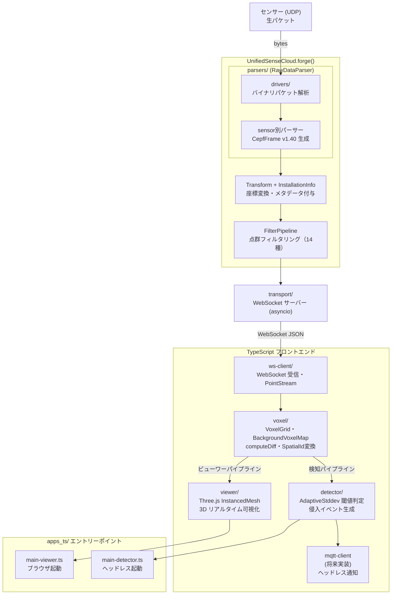

# SASS(Smart Airspace Surveillance System)　開発ドキュメント

**プロジェクト:** [JPD-studio/sass](https://github.com/JPD-studio/sass)
**組織:** Japan Process Development Co., Ltd.
**CEPF 仕様バージョン:** v1.40
**SDK パッケージバージョン:** 0.2.0
**Python:** 3.10+

---

## 目次

1. [プロジェクト概要](#1-プロジェクト概要)
2. [リポジトリ構成](#2-リポジトリ構成)
3. [セットアップ](#3-セットアップ)
4. [コアアーキテクチャ（Python）](#4-コアアーキテクチャpython)
5. [データストリーミングアーキテクチャ](#5-データストリーミングアーキテクチャ)
6. [API リファレンス](#6-api-リファレンス)
7. [フィルター体系](#7-フィルター体系)
8. [TypeScript パッケージ](#8-typescript-パッケージ)
9. [対応センサー](#9-対応センサー)
10. [使用例](#10-使用例)
11. [開発ガイド](#11-開発ガイド)
12. [テスト](#12-テスト)
13. [ドキュメント一覧](#13-ドキュメント一覧)

---

## 1. プロジェクト概要

**SASS(Smart Airspace Surveillance System)** :上空監視システム
LiDAR・Radar 等の複数センサーから取得した点群データを
**CEPF (CubeEarth Point Format) v1.40** という統一フォーマットに変換するマルチセンサー対応 Python SDK と、
WebSocket 経由でリアルタイム 3D 可視化・侵入検知を行う TypeScript クライアント群で構成されます。

### 解決する課題

各センサーメーカーはそれぞれ独自のパケットフォーマットと SDK を持っています。
SASS は **UnifiedSenseCloud (USC)** クラスを通じて、センサー差異を吸収し、後段処理（フィルタリング・可視化・記録）を
センサー種別に依存しない共通コードで記述できるようにします。

```
[RoboSense Airy] ──┐
[Ouster Dome 128] ──┤─── USC.forge() ──→ CepfFrame (v1.40) ──→ FilterPipeline ──→ WebSocket
[Velodyne VLP-16] ──┤
[TI AWR1843 Radar]──┘
```

---

## 2. リポジトリ構成

```
sass/
├── cepf_sdk/                    # Python SDK コア
│   ├── __init__.py              #   公開 API（CepfFrame, USC 等）
│   ├── frame.py                 #   CepfFrame / CepfMetadata データクラス
│   ├── usc.py                   #   UnifiedSenseCloud メインクラス
│   ├── enums.py                 #   SensorType, CoordinateMode, PointFlag 等
│   ├── config.py                #   SensorConfig, Transform, InstallationInfo
│   ├── errors.py                #   例外階層（9 種）
│   ├── types.py                 #   CepfPoints 型エイリアス
│   │
│   ├── drivers/                 #   センサー固有バイナリ解析（CepfFrame 非依存）
│   │   └── robosense_airy_driver.py
│   │
│   ├── parsers/                 #   センサー → CepfFrame 変換
│   │   ├── base.py              #     RawDataParser 抽象基底クラス
│   │   ├── robosense_airy.py    #     RoboSense Airy
│   │   ├── ouster.py            #     Ouster OS シリーズ（ouster-sdk 依存）
│   │   ├── ouster_dome128.py    #     Ouster Dome 128
│   │   ├── velodyne.py          #     Velodyne VLP-16 / VLP-32C
│   │   ├── ti_radar.py          #     TI AWR1843 / IWR6843
│   │   └── continental.py       #     Continental ARS（スタブ）
│   │
│   ├── filters/                 #   点群フィルタリング（14 種）
│   │   ├── base.py              #     FilterMode, PointFilter ABC
│   │   ├── pipeline.py          #     FilterPipeline（複数フィルター順次適用）
│   │   ├── range/               #     領域カット系（5 種）
│   │   ├── statistical/         #     統計系（3 種）
│   │   ├── attribute/           #     属性値系（3 種）
│   │   └── classification/      #     分類系（2 種）
│   │
│   ├── transport/               #   WebSocket / HTTP 配信
│   │   ├── base.py              #     TransportBase 抽象基底クラス
│   │   ├── websocket_server.py  #     asyncio WebSocket ブロードキャスト
│   │   └── http_server.py       #     静的ファイル配信（viewer HTML/JS）
│   │
│   └── utils/                   #   汎用ユーティリティ
│       ├── coordinates.py       #     球面⇔直交, LLA⇔ECEF
│       ├── quaternion.py        #     回転行列
│       └── io.py                #     CEPF ファイル I/O
│
├── tests/                       # pytest テスト群（156 テスト）
│   ├── test_frame.py
│   ├── test_enums.py
│   ├── test_usc.py
│   ├── test_parsers/
│   ├── test_filters/
│   ├── test_transport/
│   └── test_utils/
│
├── apps/                        # Python アプリケーション層
│   ├── run_pipeline.py          #   エントリーポイント（argparse）
│   ├── processor.py             #   FrameProcessor ハンドラー管理
│   └── sensors.example.json    #   センサー設定テンプレート
│
├── ws-client/                   # TS: WebSocket クライアント
│   └── src/
│       ├── ws-connection.ts     #   WsConnection（コールバック・AsyncIterator）
│       ├── point-stream.ts      #   PointStream（マルチソース）
│       ├── types.ts             #   ConnectionConfig, PointData 等
│       └── index.ts
│
├── voxel/                       # TS: ボクセル演算エンジン
│   └── src/
│       ├── voxel-grid.ts        #   VoxelGrid（3D グリッド化）
│       ├── background-voxel-map.ts  # BackgroundVoxelMap（指数移動平均）
│       ├── voxel-diff.ts        #   computeDiff（背景差分計算）
│       ├── spatial-id-converter.ts  # 空間ID変換（スタブ）
│       ├── types.ts             #   VoxelKey, VoxelSnapshot 等
│       └── index.ts
│
├── detector/                    # TS: 侵入検知エンジン
│   └── src/
│       ├── intrusion-detector.ts    # IntrusionDetector（ストラテジーパターン）
│       ├── types.ts             #   IntrusionEvent
│       ├── threshold/
│       │   ├── threshold-strategy.ts   # ThresholdStrategy interface
│       │   ├── static-threshold.ts     # 固定閾値
│       │   ├── adaptive-mean.ts        # 平均ベース適応閾値
│       │   └── adaptive-stddev.ts      # 標準偏差ベース適応閾値
│       └── index.ts
│
├── viewer/                      # TS: Three.js 3D ビューワー
│   ├── index.html
│   └── src/
│       ├── index.ts             #   ViewerApp クラス
│       ├── renderers/
│       │   ├── voxel-renderer.ts    # InstancedMesh（最大 100,000 ボクセル）
│       │   └── spatial-id-renderer.ts
│       └── overlays/
│           ├── drone-sprite.ts
│           └── intrusion-highlight.ts
│
├── apps_ts/                     # TS: アプリケーションエントリーポイント
│   ├── src/
│   │   ├── main-viewer.ts       #   ブラウザビューワー起動
│   │   └── main-detector.ts     #   ヘッドレス検知起動
│   └── sensors.example.json    #   TS 側センサー設定テンプレート
│
├── vendor/                      # 空間ID TypeScript ライブラリ（変更禁止）
│   └── alogs/                   #   Encode.js / Decode.js (CJS)
│
├── docs/                        # ドキュメント
│   ├── readme.md                #   ← 本ファイル
│   ├── CEPF_USC_Specification_v1_4.md
│   ├── cepf-sdk-refactoring-guide.md
│   └── implementation-log.md
│
└── pyproject.toml
```

---

## 3. セットアップ

### 3.1 基本インストール

```bash
git clone https://github.com/JPD-studio/sass.git
cd sass
pip install -e .
```

### 3.2 Ouster センサーを使う場合

```bash
pip install -e ".[ouster]"
```

### 3.3 開発環境（テスト込み）

```bash
pip install -e ".[dev]"
~/.local/bin/pytest tests/ -v
```

### 3.4 TypeScript パッケージのセットアップ

```bash
# Node.js は NVM で管理（Jetson 環境）
export NVM_DIR="/home/jetson/.nvm" && . /home/jetson/.nvm/nvm.sh

# 各パッケージを個別にインストール
cd ws-client  && npm install
cd ../voxel   && npm install
cd ../detector && npm install
cd ../viewer  && npm install
cd ../apps_ts && npm install
```

### 3.5 依存関係

| パッケージ | 用途 | 必須/任意 |
|-----------|------|:--------:|
| numpy | 点群配列演算 | 必須 |
| scipy | KD-tree（ROR/SOR フィルター） | 必須 |
| websockets >= 12.0 | asyncio WebSocket サーバー | 必須 |
| ouster-sdk >= 0.13 | Ouster センサーパーサー | 任意 |
| laspy | LAS ファイル出力 | 任意 |
| pytest | テスト実行 | 開発時 |

---

## 4. コアアーキテクチャ（Python）

### 4.1 レイヤー構造

```
┌───────────────────────────────────────────────────────────────┐
│                   UnifiedSenseCloud (USC)                      │
│                                                               │
│  add_sensor(sensor_id, parser_name, config)                   │
│  forge(sensor_id, raw_data)  ──→  CepfFrame (CEPF v1.40)     │
│  forge_multi(data_dict)      ──→  CepfFrame (統合)            │
└──────────────────┬────────────────────────────────────────────┘
                   │ パーサーレジストリ経由
         ┌─────────┴──────────────────┐
         │                            │
  RoboSenseAiryParser         OusterLidarParser  ...
         │                            │
  drivers/                     ouster-sdk
  robosense_airy_driver.py    （外部ライブラリ）
         │                            │
         └──────────┬─────────────────┘
                    ↓
              CepfFrame (CEPF v1.40)
           ┌──────────────┐
           │ metadata      │  ← センサー種別・座標系・タイムスタンプ
           │ points        │  ← {x, y, z, intensity, flags, velocity, ...}
           │ extensions    │  ← センサー固有拡張データ
           └──────────────┘
                    ↓
             FilterPipeline（14 種のフィルター）
                    ↓
             transport/
             ├── WebSocketTransport（asyncio ブロードキャスト）
             └── http_server（viewer 静的配信）
```

### 4.2 レイヤー別責務

| レイヤー | 役割 | CepfFrame 依存 |
|---------|------|:----------:|
| `drivers/` | センサーバイナリパケット解析 | なし |
| `parsers/` | RAW データ → CepfFrame 変換 | あり |
| `usc.py` | センサー管理・座標変換・フィルター適用 | あり |
| `filters/` | 点群フィルタリング | あり |
| `transport/` | フレーム配信（WebSocket / HTTP） | あり |
| `utils/` | 座標変換・I/O ユーティリティ | なし |

### 4.3 forge() 処理フロー（7 ステップ）

1. `sensor_id` → パーサー特定
2. `validate(raw_data)` — バリデーション
3. `coordinate_mode` 決定（引数 or USC デフォルト）
4. `parse(raw_data, coordinate_mode)` — CepfFrame 生成
5. 設置情報 `InstallationInfo` 付与
6. `Transform`（平行移動 + 四元数回転）適用
7. 登録済みフィルター順次実行

---

## 5. データストリーミングアーキテクチャ

SASS はセンサーからブラウザまでの **エンドツーエンドのリアルタイム点群パイプライン** を実装しています。
Python バックエンドと TypeScript フロントエンドが WebSocket で接続され、
`voxel/` の後でパイプラインが **ビューワー系** と **検知系** の 2 本に分岐します。

### 5.1 全体データフロー



### 5.2 transport/ レイヤー（Python 側）

`cepf_sdk/transport/` は、フィルタリング済み `CepfFrame` をネットワーク経由で送信する配信レイヤーです。

| モジュール | クラス/関数 | 役割 | 状態 |
|----------|------------|------|:----:|
| `base.py` | `TransportBase` (ABC) | `send()`, `start()`, `stop()` 抽象定義 | ✅ 実装済み |
| `websocket_server.py` | `WebSocketTransport` | asyncio WebSocket ブロードキャスト | ✅ 実装済み |
| `http_server.py` | `serve(directory, port)` | viewer HTML/JS 静的配信 | ✅ 実装済み |

**WebSocket 送信フォーマット（JSON）:**

```json
{
  "frame_id": 1234,
  "timestamp": 1709500000.0,
  "points": {
    "x": [1.0, 2.0],
    "y": [0.5, 1.5],
    "z": [0.0, 0.1],
    "intensity": [100, 200]
  }
}
```

### 5.3 TypeScript コンポーネント（フロントエンド側）

| コンポーネント | 役割 | テスト | 状態 |
|-------------|------|:------:|:----:|
| `ws-client/` | WebSocket 受信・点群ストリーム抽象化 | 8 | ✅ 実装済み |
| `voxel/` | VoxelGrid・BackgroundVoxelMap・VoxelDiff・空間ID変換 | 26 | ✅ 実装済み |
| `detector/` | 閾値ストラテジー・侵入検知エンジン | 18 | ✅ 実装済み |
| `viewer/` | Three.js シーン・InstancedMesh 大量点描画 | 2 + tsc | ✅ 実装済み |
| `apps_ts/` | フロントエンド配線・センサー設定読み込み | tsc | ✅ 実装済み |
| `vendor/` | 空間ID TS ライブラリ（変更禁止） | — | ✅ 組み込み済み |

### 5.4 実装状況サマリー

| レイヤー | 状態 |
|---------|:----:|
| `drivers/` | ✅ 実装済み |
| `parsers/` | ✅ 実装済み（Continental はスタブ） |
| `usc.py` | ✅ 実装済み |
| `filters/` | ✅ 実装済み（14 種） |
| `transport/` | ✅ 実装済み |
| `ws-client/` | ✅ 実装済み |
| `voxel/` | ✅ 実装済み |
| `detector/` | ✅ 実装済み |
| `viewer/` | ✅ 実装済み |

---

## 6. API リファレンス

### 6.1 CepfFrame

1 フレーム分の点群データを保持する **イミュータブル** なデータクラスです。

```python
@dataclass(frozen=True)
class CepfFrame:
    format: str                          # "CEPF"
    version: str                         # "1.40"
    metadata: CepfMetadata               # メタデータ（frozen）
    schema: Dict[str, Any]               # フィールド定義
    points: CepfPoints                   # 点群データ辞書 {"x": ndarray, ...}
    point_count: int                     # 点数
    extensions: Optional[Dict[str, Any]] # センサー固有拡張データ
```

**主なメソッド:**

```python
frame.format            # "CEPF"
frame.version           # "1.40"
frame.metadata          # CepfMetadata (frozen)
frame.points            # {"x": ndarray, "y": ndarray, "z": ndarray, ...}
frame.point_count       # int
frame.extensions        # センサー固有拡張 (dict | None)

frame.to_json(indent=2)     # CEPF JSON 文字列
frame.to_binary()           # CEPF バイナリ
frame.to_numpy()            # Dict[str, ndarray]

CepfFrame.from_json(json_str)    # CepfFrame
CepfFrame.from_binary(data)      # CepfFrame

frame.filter_by_flags(include=PointFlag.VALID, exclude=PointFlag.NOISE)  # CepfFrame
frame.transform_points(transform)  # CepfFrame
```

### 6.2 CepfMetadata

```python
@dataclass(frozen=True)
class CepfMetadata:
    timestamp_utc: str              # ISO 8601 UTC タイムスタンプ
    frame_id: int                   # フレーム連番
    coordinate_system: str          # "sensor_local" | "vehicle_body" | "world_enu" | "world_ecef"
    coordinate_mode: str            # "cartesian" | "spherical" | "both" | "cartesian_with_range"
    units: Dict[str, str]           # {"position": "meters", ...}
    sensor: Optional[Dict[str, Any]]              # センサー種別情報
    transform_to_world: Optional[Dict[str, Any]]  # 座標変換パラメータ
    installation: Optional[Dict[str, Any]]        # 設置地点情報
    extra: Optional[Dict[str, Any]]               # 拡張フィールド
```

### 6.3 座標モード (CoordinateMode)

| モード | 含まれるフィールド |
|--------|-----------------|
| `CARTESIAN` | x, y, z |
| `SPHERICAL` | azimuth, elevation, range |
| `BOTH` | x, y, z, azimuth, elevation, range |
| `CARTESIAN_WITH_RANGE` | x, y, z, range |

### 6.4 PointFlag（ビットフラグ）

| フラグ | 値 | 意味 |
|--------|-----|------|
| `VALID` | 0x0001 | 有効な点 |
| `DYNAMIC` | 0x0002 | 動体 |
| `GROUND` | 0x0004 | 地面（GroundClassifier が付与） |
| `SATURATED` | 0x0008 | 飽和 |
| `NOISE` | 0x0010 | ノイズ（NoiseClassifier が付与） |
| `RAIN` | 0x0020 | 雨滴 |
| `MULTIPATH` | 0x0040 | マルチパス反射 |
| `LOW_CONFIDENCE` | 0x0080 | 低信頼度 |

### 6.5 UnifiedSenseCloud

```python
usc = UnifiedSenseCloud()

# センサー登録・設定（メソッドチェーン対応）
usc.add_sensor(sensor_id, parser_name, config, **kwargs)  → self
usc.set_transform(translation, rotation_quat)              → self
usc.set_output_coordinate(coord_sys)                       → self
usc.set_output_coordinate_mode(coord_mode)                 → self
usc.set_installation(installation)                         → self
usc.add_filter(filter_func)                                → self

# JSON 設定ファイルから一括ロード
usc = UnifiedSenseCloud.from_json("apps/sensors.example.json")

# 変換実行
frame = usc.forge(sensor_id, raw_data, coordinate_mode=None)       → CepfFrame
frame = usc.forge_multi(data_dict, coordinate_mode=None)            → CepfFrame

# カスタムパーサー動的登録
UnifiedSenseCloud.register_parser("my_sensor", MyParser)

# パーサー参照
parser = usc.get_parser(sensor_id)   → Optional[RawDataParser]
```

### 6.6 SensorConfig / Transform / InstallationInfo

```python
@dataclass
class SensorConfig:
    sensor_type: SensorType
    model: str
    serial_number: str = ""
    firmware_version: str = ""
    num_channels: int = 0
    horizontal_fov_deg: float = 360.0
    vertical_fov_deg: float = 45.0
    max_range_m: float = 200.0
    range_resolution_m: float = 0.1
    velocity_resolution_mps: float = 0.1

@dataclass
class Transform:
    translation: np.ndarray          # [x, y, z]（デフォルト: [0,0,0]）
    rotation_quaternion: np.ndarray  # [w, x, y, z]（デフォルト: [1,0,0,0]）

    def to_matrix() → np.ndarray     # 4×4 同次変換行列
    def inverse()   → Transform      # 逆変換

@dataclass
class InstallationInfo:
    reference_description: str = ""
    reference_latitude: float = 0.0    # WGS84 緯度（度）
    reference_longitude: float = 0.0   # WGS84 経度（度）
    reference_altitude: float = 0.0    # 標高（m）
    reference_datum: str = "WGS84"
    sensor_offset: np.ndarray = ...    # 基準点からの相対位置 [x, y, z]（m）
    sensor_offset_description: str = ""
```

### 6.7 例外階層

```
CEPFError
├── ParseError
│   ├── InvalidHeaderError    # ヘッダー不正
│   ├── InvalidDataError      # データ不正
│   └── ChecksumError         # チェックサム不一致
├── ValidationError           # バリデーション失敗
├── ConfigurationError
│   ├── SensorNotFoundError   # 未登録センサー ID
│   └── ParserNotFoundError   # 未登録パーサー名
└── SerializationError        # JSON/バイナリ変換失敗
```

---

## 7. フィルター体系

### 7.1 FilterMode

| モード | 動作 |
|--------|------|
| `MASK` | 条件外の点を除去した新フレームを返す |
| `FLAG` | 条件に合う点にビットフラグを付与する |

### 7.2 フィルター一覧（14 種）

| カテゴリ | クラス | 主なパラメータ |
|---------|--------|-------------|
| **領域カット** | `CylindricalFilter` | min/max_radius, min/max_z, center_x/y, invert |
| | `SphericalFilter` | min/max_range, invert |
| | `BoxFilter` | x/y/z_min, x/y/z_max, invert |
| | `PolygonFilter` | vertices（XY 多角形）, invert |
| | `FrustumFilter` | r_bottom, r_top, height, z_bottom, invert |
| **統計** | `RadiusOutlierRemoval` | radius, min_neighbors（cKDTree） |
| | `StatisticalOutlierRemoval` | k, std_ratio（cKDTree） |
| | `VoxelDownsample` | voxel_size |
| **属性値** | `IntensityFilter` | min_intensity, max_intensity |
| | `ConfidenceFilter` | min_confidence |
| | `FlagFilter` | include_flags, exclude_flags |
| **分類** | `GroundClassifier` | height_threshold（FLAG モード） |
| | `NoiseClassifier` | radius, min_neighbors（FLAG モード） |

#### 各カテゴリの概要

**領域カット（range）**
センサー座標系における空間的な範囲を定義し、その範囲外の点を除去します。
- `CylindricalFilter`：センサー原点（または任意の中心点）から水平半径 `radius_m` 以内・Z軸方向 `z_min_m`〜`z_max_m` 以内の円柱状領域を通過させます。上空監視では最も使用頻度が高く、センサー直近の不要点と遠距離ノイズを同時にカットできます。
- `SphericalFilter`：原点からの三次元距離が `radius_m` 以内の球形領域を通過させます。全方向に均等な距離フィルターが必要なときに使います。
- `BoxFilter`：XYZ 各軸の min/max で定義した直方体（AABB: Axis-Aligned Bounding Box）領域を通過させます。建物の壁面や床などの既知形状を矩形で除去する用途に向いています。
- `PolygonFilter`：XY 平面上の任意の多角形（ポリゴン）と Z 範囲で柱状の関心領域を定義します。フェンスや立入禁止エリアなど不規則な形状の領域指定に使います。レイキャスティングアルゴリズムで内外判定するため CPU のみで動作します。
- `FrustumFilter`：底面半径 `r_bottom`・上面半径 `r_top`・高さ `height` で定義した円錐台（フラスタム）形状の関心領域を通過させます。底部の `z_bottom` から上に向かって線形補間された半径で内外判定します。CuPy が利用可能な場合は GPU で演算します。

  本センサー設置条件における設計値（LiDAR をセンサー原点 z=0 とする座標系）：

  ```
  z=+29m  _______________   r=2.500m  直径=5000mm（実計測:4950mm）
          \  +25mm/m    /   ← 1m上がるごとに半径 +25mm
           \           /
            \         /
  z=0        \_______/   r=1.775m  直径=3550mm（実計測:3390mm、安全側+160mm）
  ‐‐‐‐‐‐‐‐ LiDAR 高さ（離着陸面 +1.0m 想定、未確定）‐‐‐‐‐‐
  z=-1m    r=1.750m  直径=3500mm
  ═════════ 離着陸面 ═════════
  ```

  | 定数 | 値 | 意味 |
  |---|---|---|
  | `R_BOTTOM` | 1.775 m | LiDAR 高さ（z=0）での半径 |
  | `R_TOP` | 2.5 m | z=+29m（離着陸面から 30m）での半径 |
  | `HEIGHT` | 29.0 m | LiDAR から上限高度まで |
  | `Z_BOTTOM` | 0.0 m | LiDAR 高さを底面とする |

  マスト高さが確定し LiDAR 設置高度が変わった場合は、[frustum.py](../cepf_sdk/filters/range/frustum.py) 冒頭の定数を変更するだけで反映されます。
  離着陸面まで含めたい場合は `Z_BOTTOM = -1.0`（LiDAR の設置高さ分だけ下げる）に変更してください。


**統計系（statistical）**
点群全体の統計的特性に基づいて孤立点や重複点を除去します。
- `RadiusOutlierRemoval（ROR）`：各点の半径 `radius_m` 内に `min_neighbors` 個以上の近傍点がない孤立点を除去します。センサーの反射ノイズや遠距離の単発誤検出を取り除くのに有効です。
- `StatisticalOutlierRemoval（SOR）`：k 近傍点との平均距離を算出し、全体平均から `std_ratio × 標準偏差` を超える点を除去します。ROR より計算コストは高いですが、点密度が不均一な場合でも安定して機能します。
- `VoxelDownsample`：三次元空間を `voxel_size` メートルの格子（ボクセル）に分割し、各ボクセル内の最初の 1 点だけを残します。処理負荷の軽減やリアルタイム配信のデータ量削減に使用します。CuPy 利用時は GPU でハッシュ演算を実行します。

**属性値系（attribute）**
強度・信頼度・フラグなど、XYZ 座標以外の付帯情報に基づいてフィルタリングします。
- `IntensityFilter`：受光強度が `min_intensity`〜`max_intensity` の範囲内の点のみ通過させます。舗装面や特定素材など反射率で対象物を選別できます。
- `ConfidenceFilter`：センサーが出力する信頼度スコアが `min_confidence` 以上の点のみ残します。低確度点をまとめて除去し、後段処理の精度を上げるのに使います。
- `FlagFilter`：ビットマスクで点のフラグを評価します。`include_flags` に指定したビットが立っている点を通過させ、`exclude_flags` に指定したビットが立っている点を除去します。GroundClassifier や NoiseClassifier が付与したフラグとの組み合わせで活用できます。

**分類系（classification）**
点に除去はせず FLAG モードでビットフラグを付与し、後段での選択的な処理を可能にします。
- `GroundClassifier`：Z 座標が `z_threshold` 以下の点に `PointFlag.GROUND` ビットを付与します。地面点を完全に除去するのではなく「地面である」という情報を保持したまま後段に渡せるため、再フィルタリングや可視化色分けに利用できます。
- `NoiseClassifier`：半径 `radius` 内の近傍点数が `neighbors` 未満の孤立点に `PointFlag.NOISE` ビットを付与します。ROR と検出ロジックは同等ですが点を削除せず分類するため、ノイズ点の位置を保存したままデバッグや統計収集が行えます。

#### GPU 対応状況

ファイル上部の定数（`RADIUS_M`、`Z_MIN_M` 等）を変更することでパラメータを一元管理できます。
CuPy がインストールされ GPU が利用可能な場合、領域カット・属性値・VoxelDownsample の各フィルターは自動的に GPU 演算に切り替わります。
scipy の cKDTree を使用する ROR・SOR・NoiseClassifier は GPU 非対応（CPU 演算のみ）です。

### 7.3 フィルター実行順序

FilterPipeline に渡すリストの順序がそのまま実行順序になります。
データの特性に応じた効率的なパイプラインを設計する際には、以下の推奨順序を参考にしてください。

#### 推奨実行順序

| 順序 | カテゴリ | フィルター例 | 目的 |
|---|---|---|---|
| **1** | 領域カット | `CylindricalFilter`, `BoxFilter` | 観測範囲外の点をまず削除 → 後段を高速化 |
| **2** | 統計除去 | `RadiusOutlierRemoval`, `VoxelDownsample` | ノイズ・外れ値を除去 → 点密度を正規化 |
| **3** | 属性フィルター | `IntensityFilter`, `ConfidenceFilter` | 反射強度・信頼度で品質向上 |
| **4** | 分類（フラグ付与） | `GroundClassifier`, `NoiseClassifier` | FLAG モードでメタデータ追加 → 可視化・検知向け |

#### 実装例：Ouster Dome-128（上空監視）

```python
from cepf_sdk import UnifiedSenseCloud
from cepf_sdk.filters.pipeline import FilterPipeline
from cepf_sdk.filters.range.cylindrical import CylindricalFilter
from cepf_sdk.filters.statistical.ror import RadiusOutlierRemoval
from cepf_sdk.filters.attribute.confidence import ConfidenceFilter
from cepf_sdk.filters.classification.ground import GroundClassifier

pipeline = FilterPipeline(filters=[
    # 1️⃣ 領域カット（131K点 → ~60K点）
    CylindricalFilter(
        radius_m=50.0,
        z_min_m=-2.0,          # 地面
        z_max_m=30.0,          # 上限高度
        distance_scale=0.1,    # LiDAR距離減衰補正（重要）
    ),
    # 2️⃣ 統計除去（~60K点 → ~50K点）
    RadiusOutlierRemoval(
        radius_m=0.3,
        min_neighbors=5,
        distance_scale=0.1,    # 遠距離の点密度低下を補正
        use_gpu=False,         # 131K点ではCPU cKDTree が最適
    ),
    # 3️⃣ 属性フィルター（信頼度で品質管理）
    ConfidenceFilter(min_confidence=0.6),
    # 4️⃣ 分類（地面検出 → 後段で色分け可能）
    GroundClassifier(z_threshold=-1.0),
], verbose=True)

# フレーム処理
from dataclasses import replace

usc = UnifiedSenseCloud.from_json("sensors.json")

def apply_pipeline(frame):
    """FilterPipeline を CepfFrame に適用"""
    result = pipeline.apply(frame.points)
    return replace(frame, points=result.points, point_count=result.count_after)

usc.add_filter(apply_pipeline)

# リアルタイムフレーム処理ループ（例）
# for raw_data in sensor_stream:
#     frame = usc.forge("lidar", raw_data)
#     process_frame(frame)  # フィルター自動適用

```

#### 設計のポイント

**distance_scale（距離適応）の重要性**
- LiDAR の点群密度は距離 $d$ の 2 乗に反比例
- 固定半径フィルターで遠距離の正常点を誤除去しないため、**範囲カットと統計除去に必ず `distance_scale > 0` を設定**
- Ouster Dome-128：$k = 0.05 \sim 0.15$ を推奨

**CPU/GPU 選択**
- Ouster 131K 点/フレーム → **CPU cKDTree** が最適（$O(N \log N)$）
- RoboSense Airy 10K 点/フレーム → **CPU 推奨**（GPU メモリOH が支配的）
- 小規模センサー <5K点 かつ CuPy インストール時のみ GPU 検討

**FLAG モード（分類系）の活用**
- 地面・ノイズの点を削除せず、ビットフラグを付与
- 後段で「地面をグレイで表示」「ノイズを赤でハイライト」等の処理が可能

---

## 8. TypeScript パッケージ

### 8.1 ws-client/

WebSocket 接続の管理と点群フレームの受信を担います。

```typescript
import { WsConnection, PointStream } from "./ws-client/src/index.js";

// コールバック方式（viewer 向け）
const conn = new WsConnection({ url: "ws://192.168.1.100:8765", reconnectInterval: 3000 });
conn.onMessage((points: PointData[]) => { /* ... */ });
conn.connect();

// AsyncIterator 方式（detector ヘッドレス向け）
for await (const points of conn.frames()) { /* ... */ }

// マルチソース統合
const stream = new PointStream();
stream.addSource("lidar_north", conn1);
stream.addSource("lidar_south", conn2);
for await (const { sourceId, points } of stream.mergedFrames()) { /* ... */ }
```

### 8.2 voxel/

点群の 3D グリッド化・背景学習・差分計算を行います。

```typescript
import { VoxelGrid, BackgroundVoxelMap, computeDiff } from "./voxel/src/index.js";

const grid = new VoxelGrid(1.0);  // cellSize = 1.0 m
points.forEach(p => grid.addPoint(p.x, p.y, p.z, frameId));
const snapshot = grid.snapshot();           // Map<VoxelKey, VoxelState>
const center = grid.keyToCenter("2:3:-1"); // { x: 2.5, y: 3.5, z: -0.5 }

const bg = new BackgroundVoxelMap();
bg.learn(snapshot);              // alpha=0.1 の指数移動平均
if (bg.isStable(30)) {           // 全ボクセルが 30 サンプル以上
  const diffs = computeDiff(snapshot, bg);  // delta > 0 のみ返す
}
```

### 8.3 detector/

ストラテジーパターンで閾値判定ロジックを差し替えられる侵入検知エンジンです。

```typescript
import { IntrusionDetector, AdaptiveStddevThreshold, StaticThreshold } from "./detector/src/index.js";

const detector = new IntrusionDetector(new AdaptiveStddevThreshold(2.0));
const events: IntrusionEvent[] = detector.evaluate(diffs);

// 実行時にストラテジー交換
detector.setStrategy(new StaticThreshold(5));
```

| ストラテジー | 判定条件 | デフォルト引数 |
|------------|---------|:--------:|
| `StaticThreshold(threshold)` | `delta > threshold` | — |
| `AdaptiveMeanThreshold(multiplier)` | `delta > bgMean × multiplier` | 2.0 |
| `AdaptiveStddevThreshold(sigma)` | `delta > sigma × bgStddev`（stddev=0 なら delta>0） | 2.0 |

### 8.4 viewer/

Three.js `InstancedMesh` で最大 100,000 ボクセルをリアルタイム描画します。

```typescript
import { ViewerApp } from "./viewer/src/index.js";

const viewer = new ViewerApp(document.getElementById("viewer-container")!);
viewer.updateVoxels(snapshot);  // VoxelSnapshot を渡すだけで描画更新
viewer.render();                // requestAnimationFrame ループ開始
viewer.dispose();               // リソース解放
```

---

## 9. 対応センサー

| メーカー | モデル | 種別 | パーサー名 | 状態 |
|---------|--------|------|-----------|:----:|
| RoboSense | Airy | LiDAR | `robosense_airy` | ✅ 実装済み |
| Ouster | OS0/OS1/OS2 | LiDAR | `ouster` | ✅ 実装済み |
| Ouster | Dome 128 | LiDAR | `ouster_dome128` | ✅ 実装済み |
| Velodyne | VLP-16 | LiDAR | `velodyne` | ✅ 実装済み |
| Velodyne | VLP-32C | LiDAR | `velodyne` | ✅ 実装済み |
| Texas Instruments | AWR1843 | Radar | `ti_radar` | ✅ 実装済み |
| Texas Instruments | IWR6843 | Radar | `ti_radar` | ✅ 実装済み |
| Continental | ARS シリーズ | Radar | `continental` | 🔲 スタブ |

---

## 10. 使用例

### 基本的な変換フロー

```python
from cepf_sdk import UnifiedSenseCloud, SensorConfig, SensorType, CoordinateMode

usc = UnifiedSenseCloud()
usc.add_sensor(
    sensor_id="front_lidar",
    parser_name="velodyne",
    config=SensorConfig(
        sensor_type=SensorType.LIDAR,
        model="Velodyne VLP-16",
        num_channels=16,
        max_range_m=100.0,
    ),
)

# raw_data は UDP パケット bytes
frame = usc.forge("front_lidar", raw_data, coordinate_mode=CoordinateMode.CARTESIAN)
print(f"CEPF version: {frame.version}")   # "1.40"
print(f"点数: {frame.point_count}")
print(f"x[0]: {frame.points['x'][0]:.3f} m")
```

### JSON 設定ファイルから一括ロード

```python
usc = UnifiedSenseCloud.from_json("apps/sensors.example.json")
frame = usc.forge("lidar_north", raw_data)
```

### JSON 設定ファイルによるセンサー切り替え

センサーを切り替えるには **`apps/sensors.example.json`** の `"enabled"` フラグを編集するだけです。
Python コードは一切変更不要です。`from_json()` は `"enabled": true` のエントリだけを USC に登録します。

#### 10.3.1 enabled フラグの仕組み

`sensors.example.json` には全メーカーのセンサー定義が入っています。
**使いたいセンサーを `true`、他を `false` にするだけ**で切り替えられます。

```json
{
  "sensors": [
    {
      "enabled": true,
      "sensor_id": "lidar",
      "parser_name": "ouster_dome128",
      ...
    },
    {
      "enabled": false,
      "sensor_id": "lidar",
      "parser_name": "velodyne",
      ...
    }
  ]
}
```

`from_json()` 内部では以下のように処理されます：

```python
for sensor_cfg in config_dict.get('sensors', []):
    if not sensor_cfg.get('enabled', True):  # false はスキップ
        continue
    usc.add_sensor(...)  # true のみ登録
```

> **注意：** `enabled: true` のエントリが複数ある場合、同じ `sensor_id` で後から登録したものが上書きされます。  
> 1つの `sensor_id` に対して `enabled: true` は必ず 1 エントリだけにしてください。

#### 10.3.2 対応センサー一覧と parser_name

| メーカー | モデル | parser_name | num_channels | max_range_m | 現在の状態 |
|---------|--------|-------------|:----------:|:----------:|:--------:|
| **Ouster** | Dome 128 | `ouster_dome128` | 128 | 120 | ✅ `enabled: true` |
| **Ouster** | OS0/OS1/OS2 | `ouster` | 64 or 128 | 120～240 | `enabled: false` |
| **RoboSense** | Airy | `robosense_airy` | 16 | 25 | `enabled: false` |
| **Velodyne** | VLP-16 | `velodyne` | 16 | 100 | `enabled: false` |
| **Velodyne** | VLP-32C | `velodyne` | 32 | 200 | `enabled: false` |
| **TI** | AWR1843 | `ti_radar` | 1 | 60 | `enabled: false` |
| **TI** | IWR6843 | `ti_radar` | 1 | 60 | `enabled: false` |

#### 10.3.3 実例：Ouster Dome-128 → RoboSense Airy への切り替え

`apps/sensors.example.json` を開き、`enabled` を以下のように変更するだけです：

```json
{
  "sensors": [
    {
      "enabled": false,          ← false に変更
      "sensor_id": "lidar",
      "parser_name": "ouster_dome128",
      ...
    },
    {
      "enabled": true,           ← true に変更
      "sensor_id": "lidar",
      "parser_name": "robosense_airy",
      "config": {
        "model": "RoboSense Airy",
        ...
      }
    }
  ]
}
```

Python コードは変更不要：

```python
from cepf_sdk import UnifiedSenseCloud

usc = UnifiedSenseCloud.from_json("apps/sensors.example.json")
# robosense_airy パーサーが自動選択される
frame = usc.forge("lidar", raw_data)
```

#### 10.3.4 センサー別フィルター推奨パラメータ

| センサー | 点数/frame | distance_scale | min_neighbors | 処理 |
|---------|:----------:|:--------------:|:-------------:|------|
| Ouster Dome-128 | ~131K | 0.10～0.15 | 5～7 | CPU |
| Ouster OS1 | ~80K | 0.10～0.15 | 5～7 | CPU |
| Velodyne VLP-32C | ~40K | 0.05～0.10 | 3～5 | CPU |
| Velodyne VLP-16 | ~25K | 0.05～0.10 | 3～4 | CPU |
| RoboSense Airy | ~10K | 0.00～0.05 | 2～3 | CPU / GPU 可 |
| TI Radar | ~1K | 0.00 | 1～2 | CPU |

#### 10.3.5 センサー切り替えチェックリスト

| 項目 | 確認内容 |
|------|---------|
| `enabled` | 使いたいセンサーだけ `true`、同一 `sensor_id` で重複しないか |
| `parser_name` | 対応センサー一覧の値と一致しているか |
| `num_channels` / `max_range_m` | センサー仕様書に合わせて更新したか |
| `distance_scale` / `min_neighbors` | 上表の推奨値に設定したか |
| `transform` | センサーの設置向き（天吊り等）に合わせて rotation を設定したか |

#### 10.3.6 設定ファイルの配置

```bash
sass/
├── apps/
│   ├── sensors.example.json    # ← 全センサー定義入り（このリポジトリ管理）
│   ├── sensors.prod.json       # ← 本番環境設定（.gitignore 推奨）
│   └── run_pipeline.py
```

本番環境では `sensors.example.json` をコピーして使います：

```bash
cp apps/sensors.example.json apps/sensors.prod.json
# sensors.prod.json で enabled フラグを本番用に設定
```

```python
usc = UnifiedSenseCloud.from_json("apps/sensors.prod.json")   # 本番
usc = UnifiedSenseCloud.from_json("apps/sensors.example.json") # 開発・テスト
```

### 複数センサーの統合

```python
frame = usc.forge_multi(
    data_dict={"lidar_north": raw_a, "lidar_south": raw_b},
    coordinate_mode=CoordinateMode.CARTESIAN,
)
print(f"統合点数: {frame.point_count}")
```

### PointFlag によるフィルタリング

```python
from cepf_sdk import PointFlag

# 有効かつノイズ・地面でない点のみ抽出
moving = frame.filter_by_flags(
    include=PointFlag.VALID,
    exclude=PointFlag.GROUND | PointFlag.NOISE | PointFlag.RAIN,
)
```

### フィルターパイプライン

```python
from cepf_sdk.filters.pipeline import FilterPipeline
from cepf_sdk.filters.range.cylindrical import CylindricalFilter
from cepf_sdk.filters.statistical.ror import RadiusOutlierRemoval
from cepf_sdk.filters.classification.ground import GroundClassifier

pipeline = FilterPipeline([
    CylindricalFilter(min_radius=0.5, max_radius=50.0, min_z=-2.0, max_z=5.0),
    RadiusOutlierRemoval(radius=0.5, min_neighbors=3),
    GroundClassifier(height_threshold=-1.5),
])
filtered = pipeline.run(frame)
```

### WebSocket 配信（Python 側）

```python
import asyncio
from cepf_sdk.transport.websocket_server import WebSocketTransport
from cepf_sdk.transport.http_server import serve

serve("viewer/", port=8080, daemon=True)   # viewer HTML/JS 静的配信

ws = WebSocketTransport(host="0.0.0.0", port=8765)

async def main():
    await ws.start()
    while True:
        raw_data = recv_udp()
        frame = usc.forge("lidar_north", raw_data)
        filtered = pipeline.run(frame)
        await ws.send(filtered)           # 全クライアントにブロードキャスト

asyncio.run(main())
```

### Ouster センサー（LidarScan を使う場合）

```python
from cepf_sdk.parsers.ouster import OusterLidarParser
from cepf_sdk import SensorConfig, SensorType

parser = OusterLidarParser(SensorConfig(sensor_type=SensorType.LIDAR, model="OS1-128"))
parser.set_sensor_info(sensor_info)     # ouster_sdk.SensorInfo
frame = parser.parse_scan(lidar_scan)   # ouster_sdk.LidarScan
```

---

### Three.js ビューワーの起動（PCAP リプレイ）

PCAPファイルを使ってビューワーを動かすエンド・ツー・エンドの手順です。

#### ① ビューワーのビルド（初回のみ）

```bash
cd viewer
npm install          # three.js, webpack, ts-loader をインストール
npm run bundle       # dist/bundle.js を生成（約 1.4 MiB）
cd ..
```

#### ② Python 依存パッケージのインストール（初回のみ）

```bash
python3 -m pip install dpkt websockets numpy
```

#### ③ Python リプレイサーバーを起動

```bash
# ターミナル A — WebSocket サーバー + PCAP リプレイ
PYTHONPATH=/home/jetson/repos/sass \
  python3 apps/pcap_replay.py \
    --pcap  data/sample.pcap \
    --parser velodyne          # velodyne / velodyne32 / ouster / ouster128 / ti_radar
    --rate  1.0                # 1.0=実時間, 2.0=2倍速, 0=最速
    --loop                     # ループ再生する場合


# 初回起動時はクライアント（ブラウザ）が接続するまで送信を待機します。
```

#### ④ 静的ファイルサーバーを起動

```bash
# ターミナル B — index.html / dist/bundle.js を配信
cd viewer
npx http-server . -p 3000 --cors
# または:
python3 -m http.server 3000    # Python 内蔵サーバーでも可
```

#### ⑤ ブラウザで確認

```
http://localhost:3000
```

デフォルトの WebSocket 接続先は `ws://localhost:8765` です。
別のホスト/ポートに変更する場合は URL クエリパラメータを使います:

```
http://localhost:3000?ws=ws://192.168.1.100:8765
```

#### データフロー まとめ

```
PCAP ファイル
  └─ dpkt で UDP ペイロード抽出
       └─ VelodyneLidarParser / OusterLidarParser 等で CepfFrame へ変換
            └─ WebSocketTransport (ws://0.0.0.0:8765) でブロードキャスト
                  └─ [ブラウザ] WsConnection → VoxelGrid → ViewerApp (Three.js)
```

#### PCAP リプレイオプション一覧

| オプション | 説明 | デフォルト |
|-----------|------|-----------|
| `--pcap` | PCAP ファイルパス（必須） | — |
| `--parser` | パーサー名 | `velodyne` |
| `--port` | WebSocket ポート | `8765` |
| `--rate` | 再生速度倍率（0=最速） | `1.0` |
| `--loop` | ループ再生 | off |
| `--verbose` | フレーム毎のログ | off |

---

## 11. 開発ガイド

### 11.1 新しいパーサーを追加する手順

**1. `cepf_sdk/parsers/your_sensor.py` を作成**

```python
from cepf_sdk.parsers.base import RawDataParser
from cepf_sdk.frame import CepfFrame, CepfMetadata
from cepf_sdk.enums import CoordinateMode

class YourSensorParser(RawDataParser):
    def validate(self, raw_data: bytes) -> bool:
        return len(raw_data) == EXPECTED_SIZE

    def parse(self, raw_data: bytes,
              coordinate_mode: CoordinateMode | None = None) -> CepfFrame:
        # バイナリ解析 → CepfFrame 生成
        ...
```

**2. `cepf_sdk/parsers/__init__.py` のレジストリに追加**

```python
_PARSER_MAP = {
    ...
    "your_sensor": ("cepf_sdk.parsers.your_sensor", "YourSensorParser"),
}
```

**3. `tests/test_parsers/test_your_sensor.py` にテストを書く**

### 11.2 コミット規約

| プレフィックス | 意味 |
|-------------|------|
| `feat:` | 新機能 |
| `fix:` | バグ修正 |
| `docs:` | ドキュメント更新 |
| `chore:` | ビルド・設定変更 |
| `test:` | テスト追加・修正 |

### 11.3 重要な制約

- `vendor/` は **変更禁止**（空間ID TS ライブラリ）
- `CepfFrame` は `frozen=True` のデータクラス — 直接変更不可
- パーサーは `CepfFrame` を返す前に必ず `validate()` を通すこと
- `drivers/` は `CepfFrame` を import しないこと（レイヤー分離の維持）
- `node_modules/` は `.gitignore` 済み — コミットしないこと

---

## 12. テスト

### Python テスト（pytest）

```bash
cd /home/jetson/repos/sass
~/.local/bin/pytest tests/ -v                # 全テスト（156 テスト）
~/.local/bin/pytest tests/test_parsers/ -v   # パーサーのみ
~/.local/bin/pytest tests/test_filters/ -v   # フィルターのみ
~/.local/bin/pytest tests/test_transport/ -v # トランスポートのみ
```

### TypeScript テスト（Jest）

```bash
export NVM_DIR="/home/jetson/.nvm" && . /home/jetson/.nvm/nvm.sh

cd ws-client  && npm test   #  8 テスト
cd ../voxel   && npm test   # 26 テスト
cd ../detector && npm test  # 18 テスト
cd ../viewer  && npm test   #  2 テスト + tsc --noEmit
```

### テスト総数

| 対象 | テスト数 |
|------|:-------:|
| Python（pytest） | 156 |
| ws-client（Jest） | 8 |
| voxel（Jest） | 26 |
| detector（Jest） | 18 |
| viewer（Jest + tsc） | 2 |
| **合計** | **210** |

---

## 13. ドキュメント一覧

| ドキュメント | 内容 |
|------------|------|
| [`docs/CEPF_USC_Specification_v1_4.md`](CEPF_USC_Specification_v1_4.md) | CEPF v1.40 完全仕様書（フォーマット・API 仕様） |
| [`docs/cepf-sdk-refactoring-guide.md`](cepf-sdk-refactoring-guide.md) | アーキテクチャ設計方針・実装ガイド |
| [`docs/implementation-log.md`](implementation-log.md) | 実装履歴・フェーズ別成果物一覧 |
| [`apps/sensors.example.json`](../apps/sensors.example.json) | Python センサー設定ファイルのテンプレート |
| [`apps_ts/sensors.example.json`](../apps_ts/sensors.example.json) | TypeScript センサー設定ファイルのテンプレート |

---

*最終更新: 2026-03-04 / CEPF v1.40 / SDK v0.2.0*
