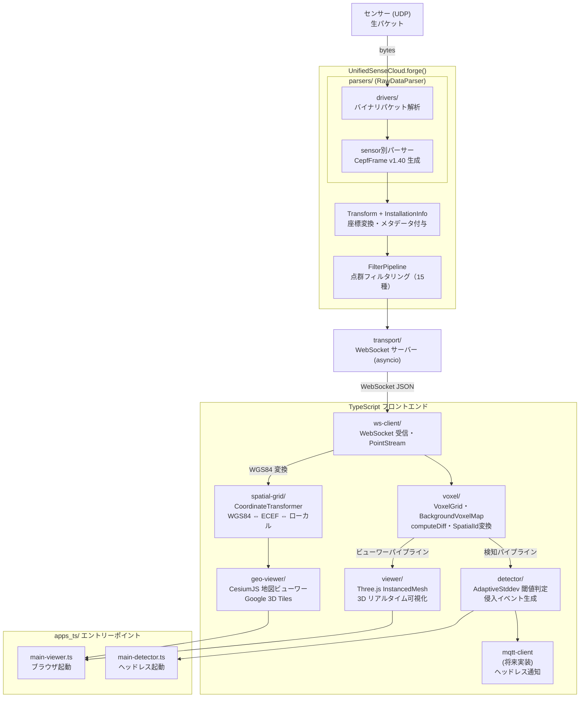
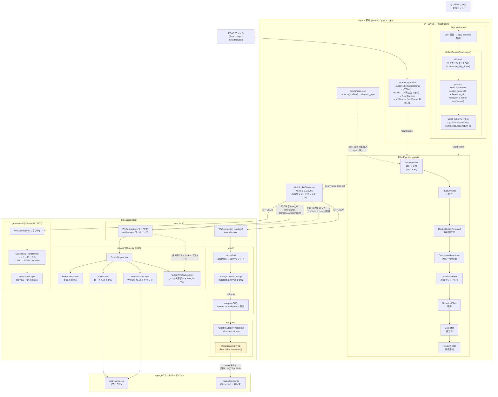
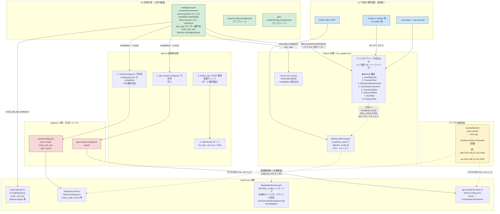
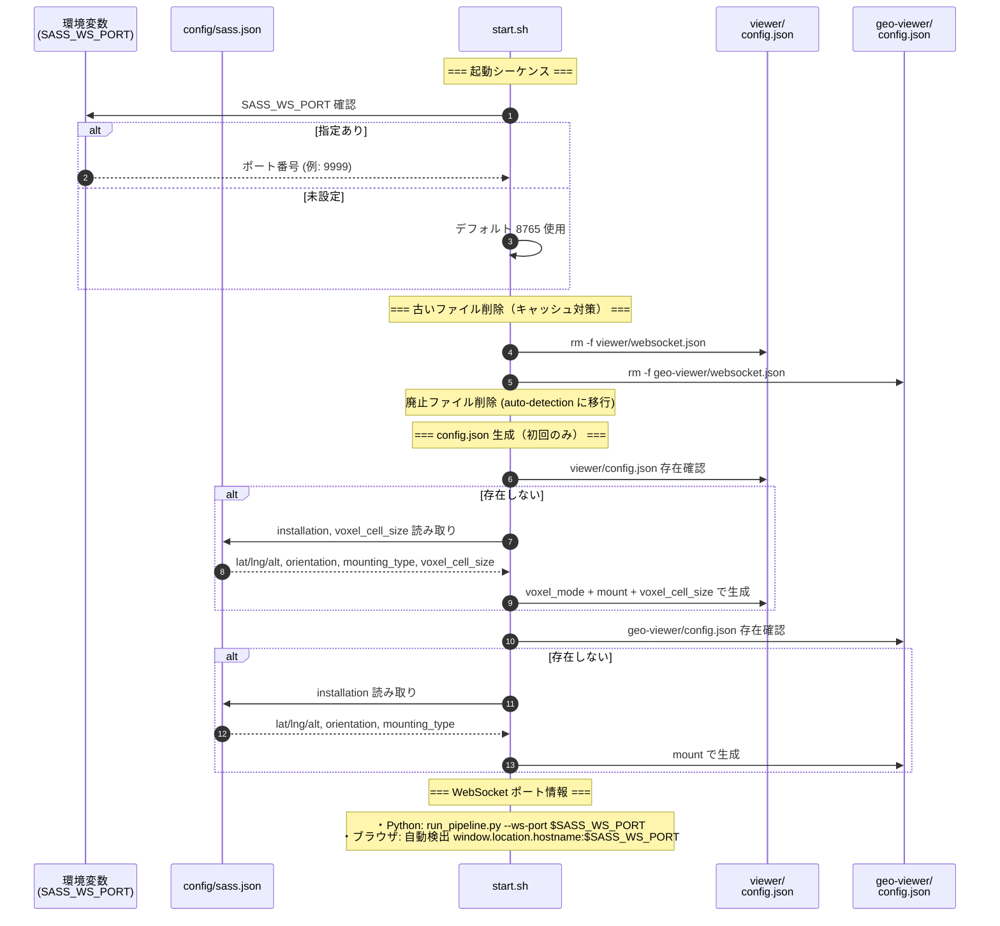
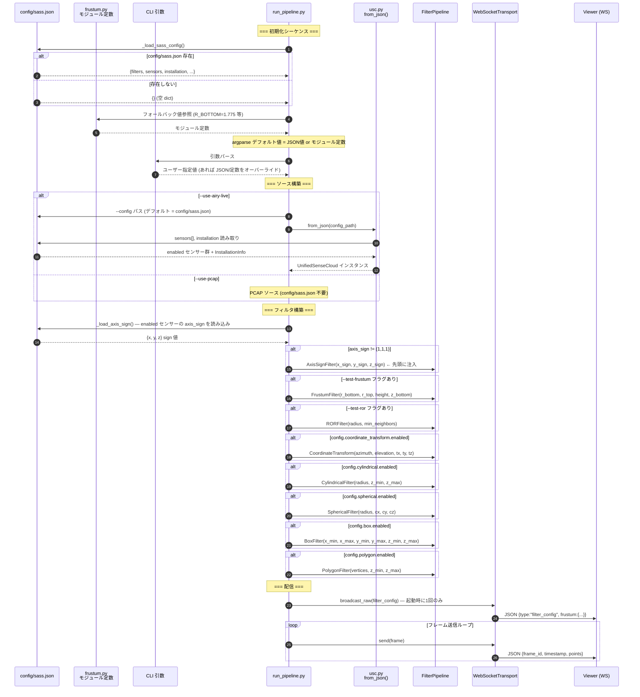
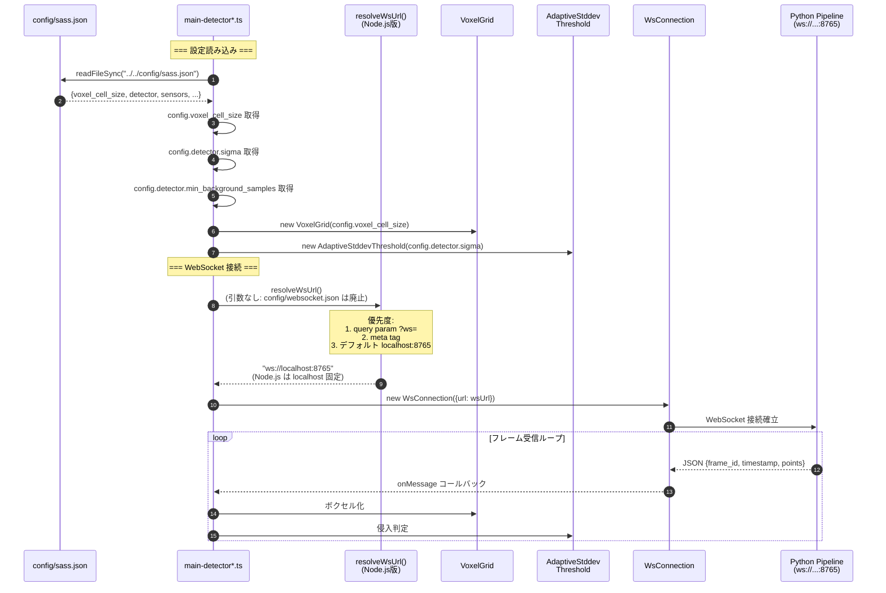
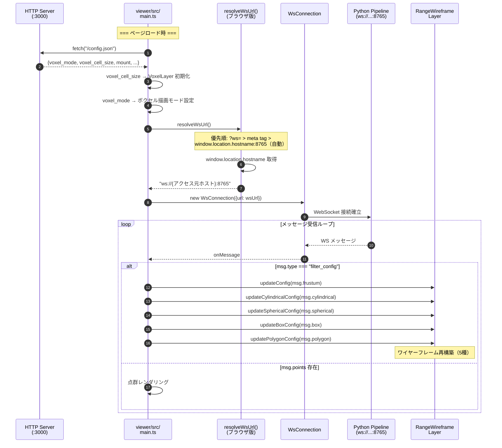
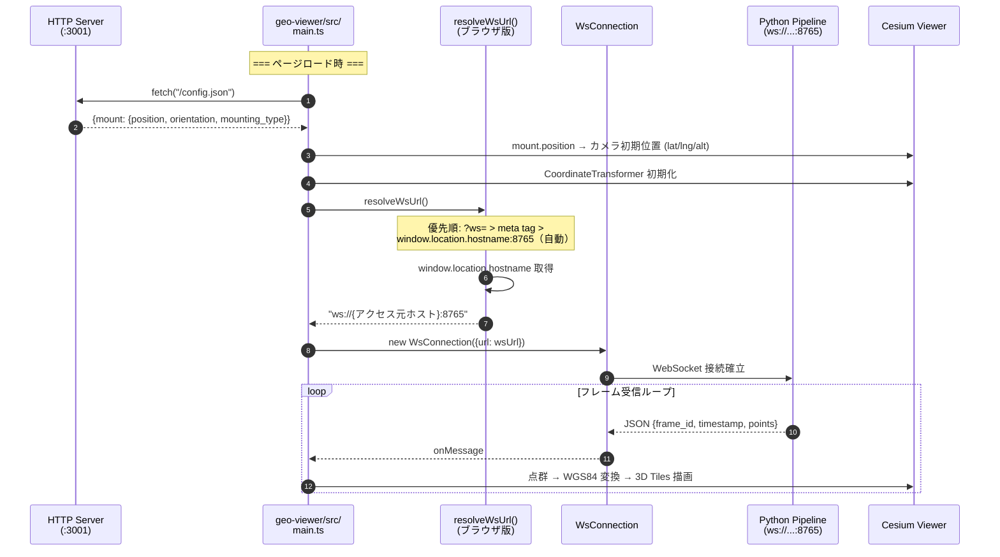
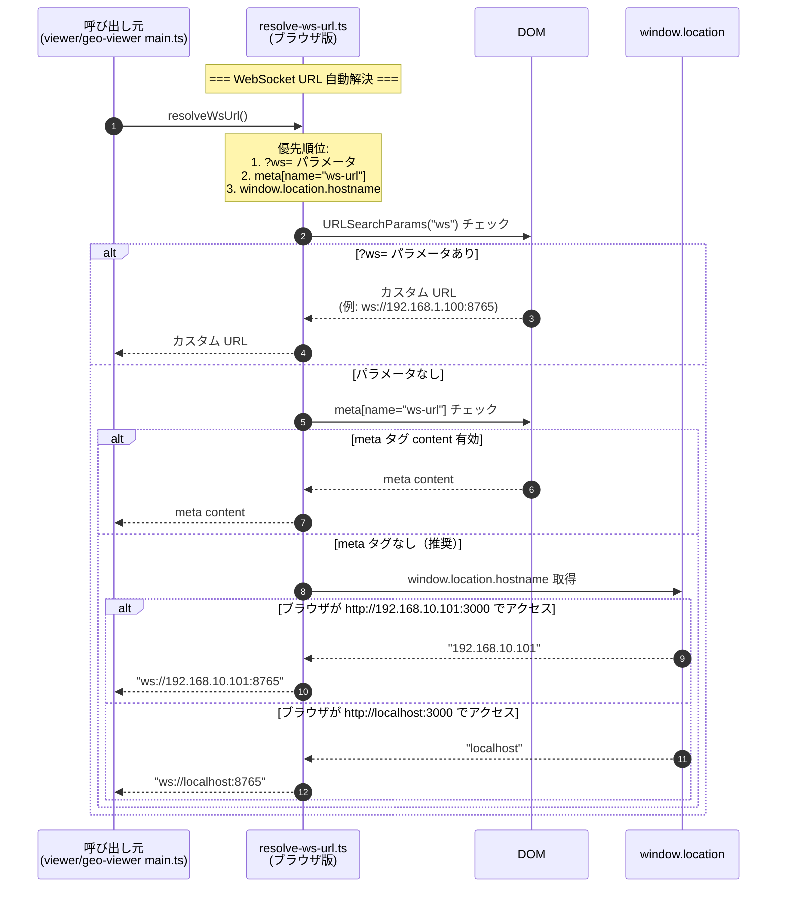
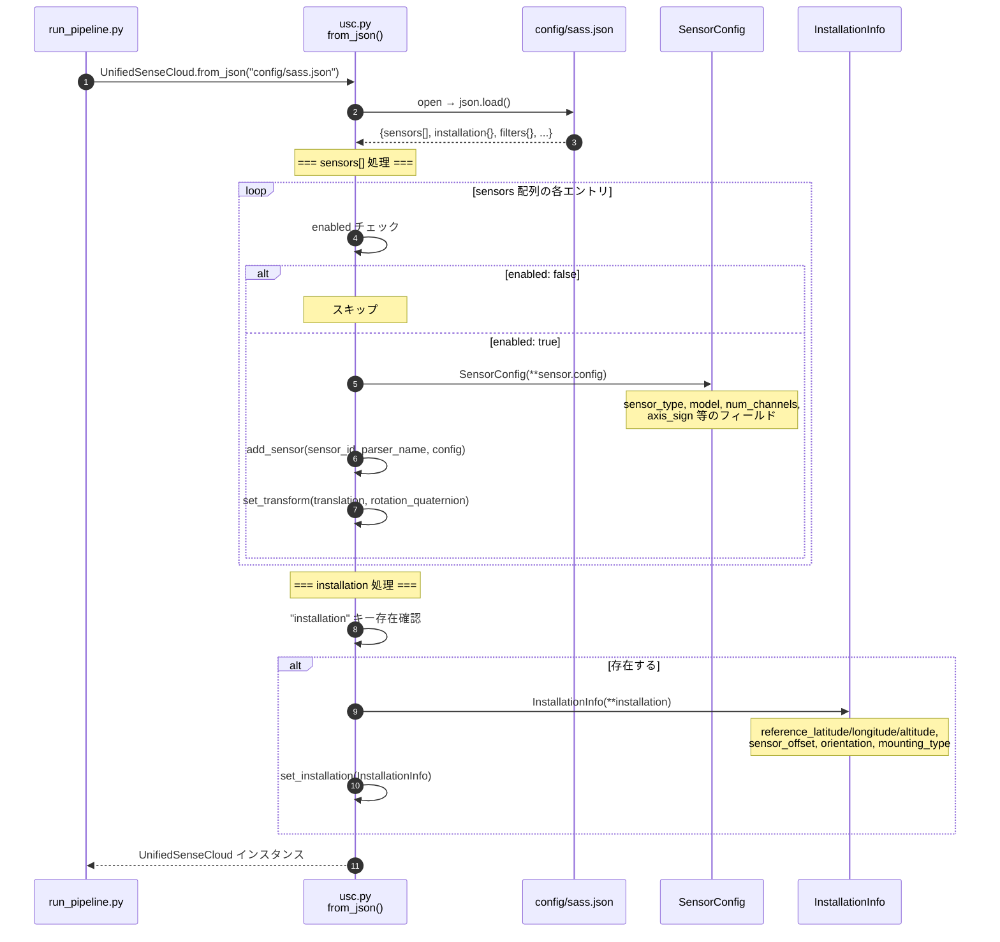

# SASS(Smart Airspace Surveillance System)　開発ドキュメント

**プロジェクト:** [JPD-studio/sass](https://github.com/JPD-studio/sass)
**組織:** Japan Process Development Co., Ltd.
**CEPF 仕様バージョン:** v1.40
**SDK パッケージバージョン:** 0.2.0
**Python:** 3.10+

---

## 目次

1. [プロジェクト概要](#1-プロジェクト概要)
2. [リポジトリ構成](#2-リポジトリ構成)
3. [セットアップ](#3-セットアップ)
   - [3.6 統合起動スクリプト（start.sh）](#36-統合起動スクリプトstartsh)
4. [コアアーキテクチャ（Python）](#4-コアアーキテクチャpython)
5. [データストリーミングアーキテクチャ](#5-データストリーミングアーキテクチャ)
6. [API リファレンス](#6-api-リファレンス)
7. [フィルター体系](#7-フィルター体系)
   - [7.4 range フィルター 設定リファレンス](#74-range-フィルター-設定リファレンスconfigsassjson)
8. [TypeScript パッケージ](#8-typescript-パッケージ)
9. [対応センサー](#9-対応センサー)
10. [使用例](#10-使用例)
11. [開発ガイド](#11-開発ガイド)
12. [テスト](#12-テスト)
13. [ドキュメント一覧](#13-ドキュメント一覧)
14. [設定ファイルアーキテクチャ（config/ 統合リファクタリング）](#14-設定ファイルアーキテクチャconfig-統合リファクタリング)
    - [14.5 データフロー図](#145-データフローリファクタリング後)
    - [14.6 設定ファイルフロー図](#146-設定ファイルフロー)
    - [14.7 シーケンス図](#147-シーケンス図)
    - [14.8 AxisSignFilter](#148-axissignfilter軸符号変換フィルター)
    - [14.9 ワイヤーフレーム同期](#149-ワイヤーフレーム同期websocket-ブロードキャスト方式)

---

## 1. プロジェクト概要

**SASS(Smart Airspace Surveillance System)** :上空監視システム
LiDAR・Radar 等の複数センサーから取得した点群データを
**CEPF (CubeEarth Point Format) v1.40** という統一フォーマットに変換するマルチセンサー対応 Python SDK と、
WebSocket 経由でリアルタイム 3D 可視化・侵入検知を行う TypeScript クライアント群で構成されます。

### 解決する課題

各センサーメーカーはそれぞれ独自のパケットフォーマットと SDK を持っています。
SASS は **UnifiedSenseCloud (USC)** クラスを通じて、センサー差異を吸収し、後段処理（フィルタリング・可視化・記録）を
センサー種別に依存しない共通コードで記述できるようにします。

```
[RoboSense Airy] ──┐
[Ouster Dome 128] ──┤─── USC.forge() ──→ CepfFrame (v1.40) ──→ FilterPipeline ──→ WebSocket
[Velodyne VLP-16] ──┤
[TI AWR1843 Radar]──┘
```

---

## 2. リポジトリ構成

```
sass/
├── config/                      # 統合設定ディレクトリ（Git 追跡、人間が編集）
│   └── sass.json                #   統合設定（センサー HW・フィルタ・設置情報・検出器）
│       （websocket.json は廃止・自動ホスト名解決を使用）
│
├── cepf_sdk/                    # Python SDK コア
│   ├── __init__.py              #   公開 API（CepfFrame, USC 等）
│   ├── frame.py                 #   CepfFrame / CepfMetadata データクラス
│   ├── usc.py                   #   UnifiedSenseCloud メインクラス
│   ├── enums.py                 #   SensorType, CoordinateMode, PointFlag 等
│   ├── config.py                #   SensorConfig, Transform, InstallationInfo
│   ├── errors.py                #   例外階層（9 種）
│   ├── types.py                 #   CepfPoints 型エイリアス
│   │
│   ├── airy/                    #   Airy LiDAR デコーダー
│   │   ├── __init__.py
│   │   └── decoder.py
│   │
│   ├── drivers/                 #   センサー固有バイナリ解析（CepfFrame 非依存）
│   │   └── robosense_airy_driver.py
│   │
│   ├── parsers/                 #   センサー → CepfFrame 変換
│   │   ├── base.py              #     RawDataParser 抽象基底クラス
│   │   ├── robosense_airy.py    #     RoboSense Airy
│   │   ├── ouster.py            #     Ouster OS シリーズ（ouster-sdk 依存）
│   │   ├── ouster_dome128.py    #     Ouster Dome 128
│   │   ├── velodyne.py          #     Velodyne VLP-16 / VLP-32C / HDL-32E
│   │   ├── ti_radar.py          #     TI AWR1843 / IWR6843
│   │   └── continental.py       #     Continental ARS（スタブ）
│   │
│   ├── filters/                 #   点群フィルタリング（15 種）
│   │   ├── base.py              #     FilterMode, PointFilter ABC
│   │   ├── pipeline.py          #     FilterPipeline（複数フィルター順次適用）
│   │   ├── range/               #     領域カット系（5 種）
│   │   ├── statistical/         #     統計系（3 種）
│   │   ├── attribute/           #     属性値系（3 種）
│   │   ├── transform/           #     座標変換系（2 種: AxisSignFilter, CoordinateTransform）
│   │   └── classification/      #     分類系（2 種）
│   │
│   ├── sources/                 #   データソース
│   │   ├── __init__.py
│   │   └── ouster_pcap.py       #     OusterPcapSource（PCAP→CepfFrame）
│   │
│   ├── transport/               #   WebSocket / HTTP 配信
│   │   ├── base.py              #     TransportBase 抽象基底クラス
│   │   ├── websocket_server.py  #     asyncio WebSocket ブロードキャスト + broadcast_raw()
│   │   └── http_server.py       #     静的ファイル配信（viewer HTML/JS）
│   │
│   └── utils/                   #   汎用ユーティリティ
│       ├── coordinates.py       #     球面⇔直交, LLA⇔ECEF
│       ├── quaternion.py        #     回転行列
│       └── io.py                #     CEPF ファイル I/O
│
├── tests/                       # pytest テスト群（143 テスト）
│   ├── test_frame.py
│   ├── test_enums.py
│   ├── test_usc.py
│   ├── test_parsers/
│   ├── test_filters/
│   ├── test_transport/
│   └── test_utils/
│
├── apps/                        # Python アプリケーション層
│   ├── run_pipeline.py          #   エントリーポイント（argparse, config/sass.json 読み込み）
│   ├── processor.py             #   FrameProcessor ハンドラー管理
│   ├── pcap_replay.py           #   PCAP リプレイ（Velodyne/Ouster 汎用）
│   ├── ouster_pcap_replay.py    #   Ouster PCAP リプレイ（ouster-sdk + IP フラグメント対応）
│   └── generate_demo_pcap.py    #   テスト用 Velodyne PCAP 生成ツール
│
├── ws-client/                   # TS: WebSocket クライアント
│   └── src/
│       ├── ws-connection.ts     #   WsConnection（ブラウザ & Node.js 自動切替）
│       ├── ws-connection-node.ts #   Node.js 専用 WebSocket 実装
│       ├── point-stream.ts      #   PointStream（マルチソース）
│       ├── types.ts             #   ConnectionConfig, PointData 等
│       └── index.ts
│
├── voxel/                       # TS: ボクセル演算エンジン
│   └── src/
│       ├── voxel-grid.ts        #   VoxelGrid（3D グリッド化）
│       ├── background-voxel-map.ts  # BackgroundVoxelMap（指数移動平均）
│       ├── voxel-diff.ts        #   computeDiff（背景差分計算）
│       ├── spatial-id-converter.ts  # 空間ID変換（スタブ — TODO）
│       ├── types.ts             #   VoxelKey, VoxelSnapshot 等
│       └── index.ts
│
├── detector/                    # TS: 侵入検知エンジン
│   └── src/
│       ├── intrusion-detector.ts    # IntrusionDetector（ストラテジーパターン）
│       ├── types.ts             #   IntrusionEvent
│       ├── threshold/
│       │   ├── threshold-strategy.ts   # ThresholdStrategy interface
│       │   ├── static-threshold.ts     # 固定閾値
│       │   ├── adaptive-mean.ts        # 平均ベース適応閾値
│       │   └── adaptive-stddev.ts      # 標準偏差ベース適応閾値
│       └── index.ts
│
├── viewer/                      # TS: Three.js 3D ビューワー（port:3000）
│   ├── index.html
│   ├── config.example.json      #   Viewer 設定テンプレート（Git 追跡）
│   └── src/
│       ├── index.ts             #   ViewerApp クラス
│       ├── main.ts              #   ブラウザエントリーポイント（voxel_mode 分岐）
│       ├── stats.ts             #   パフォーマンス計測
│       ├── layers/              #   描画レイヤー管理
│       │   ├── index.ts
│       │   ├── types.ts         #     RenderLayer interface
│       │   ├── frame-dispatcher.ts  # フレーム分配
│       │   ├── point-cloud-layer.ts  # 点群描画レイヤー
│       │   ├── voxel-layer.ts       # ローカルボクセルレイヤー
│       │   ├── global-voxel-layer.ts # グローバル（WGS84）ボクセルレイヤー
│       │   ├── range-wireframe-layer.ts  # フィルター領域ワイヤーフレーム描画
│       │   └── range-filter-config.ts   # フィルター形状定義
│       ├── renderers/
│       │   ├── voxel-renderer.ts         # InstancedMesh（最大 100,000 ボクセル）
│       │   ├── global-voxel-renderer.ts  # WGS84 グリッドレンダラー
│       │   └── spatial-id-renderer.ts
│       └── overlays/
│           ├── drone-sprite.ts
│           ├── intrusion-highlight.ts
│           └── layer-panel.ts   #   レイヤー表示切替 UI
│
├── geo-viewer/                  # TS: CesiumJS 地図ビューワー（port:3001）
│   ├── index.html
│   ├── config.example.json      #   Geo-Viewer 設定テンプレート（Git 追跡）
│   └── src/
│       ├── main.ts              #   CesiumJS エントリーポイント（Google 3D Tiles）
│       ├── point-cloud-layer.ts #   Cesium 点群描画レイヤー
│       └── types.ts             #   GeoViewerConfig
│
├── spatial-grid/                # TS: 座標変換・空間ユーティリティ
│   └── src/
│       ├── index.ts
│       ├── types.ts             #   SensorMount, MountPosition, MountOrientation
│       ├── coordinate-transform.ts  # WGS84 ⇔ ECEF ⇔ ローカル変換
│       ├── euler-quaternion.ts  #   オイラー角 ⇔ 四元数変換
│       └── spatial-id-converter.ts  # グリッド座標マッピング
│
├── apps_ts/                     # TS: アプリケーションエントリーポイント
│   └── src/
│       ├── main-viewer.ts       #   ブラウザビューワー起動（fetch('/config.json')）
│       ├── main-detector.ts     #   ヘッドレス検知起動（config/sass.json 直接読み込み）
│       ├── main-detector-nodejs.ts  # Node.js 専用検知（ws 直接使用）
│       ├── main-detector-debug.ts   # デバッグ版検知（接続状態・フレーム数ログ）
│       └── simple-ws-test.ts    #   WebSocket 基本接続テスト
│
├── vendor/                      # 空間ID TypeScript ライブラリ（変更禁止）
│   ├── alogs/                   #   CEex / Encode / Decode (CJS)
│   ├── models/                  #   LatLng / Model 型定義
│   ├── util/                    #   HitTest / Util ユーティリティ
│   └── docs/                    #   README
│
├── pcap/                        # PCAP データファイル
│   └── 250808sbir_*.pcap        #   Ouster OS1-128 サンプルデータ
│
├── docs/                        # ドキュメント
│   ├── CEPF_USC_Specification_v1_4.md
│   ├── cepf-sdk-refactoring-guide.md
│   ├── implementation-log.md
│   ├── implementation-roadmap.md
│   ├── phase2b-3a-implementation.md
│   └── websocket-stream-failure-investigation.md
│
├── start.sh                     # 統合起動スクリプト（PCAP → WS → Viewer → Geo-Viewer → Detector）
├── pyproject.toml
├── run_tests.py                 # pytest 未インストール時の簡易テストランナー
└── demo.pcap                    # デモ用 PCAP ファイル
```

---

## 3. セットアップ

### 3.1 基本インストール

```bash
git clone https://github.com/JPD-studio/sass.git
cd sass
pip install -e .
```

### 3.2 Ouster センサーを使う場合

```bash
pip install -e ".[ouster]"
```

### 3.3 開発環境（テスト込み）

```bash
pip install -e ".[dev]"
~/.local/bin/pytest tests/ -v
```

### 3.4 TypeScript パッケージのセットアップ

```bash
# Node.js は NVM で管理（Jetson 環境）
export NVM_DIR="/home/jetson/.nvm" && . /home/jetson/.nvm/nvm.sh

# 各パッケージを個別にインストール
cd ws-client  && npm install
cd ../voxel   && npm install
cd ../detector && npm install
cd ../viewer  && npm install
cd ../geo-viewer && npm install
cd ../spatial-grid && npm install
cd ../apps_ts && npm install
```

### 3.5 依存関係

| パッケージ | 用途 | 必須/任意 |
|-----------|------|:--------:|
| numpy | 点群配列演算 | 必須 |
| scipy | KD-tree（ROR/SOR フィルター） | 必須 |
| websockets >= 12.0 | asyncio WebSocket サーバー | 必須 |
| ouster-sdk >= 0.13 | Ouster センサーパーサー | 任意 |
| laspy | LAS ファイル出力 | 任意 |
| pytest | テスト実行 | 開発時 |

### 3.6 統合起動スクリプト（start.sh）

本リポジトリには、SASS 全コンポーネントを一括起動する統合スクリプト `start.sh` が用意されています。

#### 基本的な使い方

**デフォルト起動（推奨）:**
```bash
./start.sh
```

**実行内容:**
- WebSocket サーバー（`ws://0.0.0.0:8765`）
- Viewer：スプリット画面（Three.js デュアルビューワー）
  - 左：ローカルボクセルレイヤー
  - 右：グローバルボクセルレイヤー（WGS84）
- Detector：ヘッドレス侵入検知エンジン
- Geo-Viewer：**スキップ**（CesiumJS バンドルは時間がかかるため）

#### コマンドラインオプション

| コマンド | 説明 |
|---------|------|
| `./start.sh` | デフォルト: PCAP + Viewer スプリット画面 |
| `./start.sh --use-airy-live` | Airy LiDAR 実機接続モード |
| `./start.sh --geo-viewer` | Geo-Viewer（CesiumJS 地図ビューワー）も起動 |
| `./start.sh --single-view` | Viewer 単画面（ローカルボクセルのみ）で起動 |
| `./start.sh --no-detector` | Detector なしで起動 |
| `./start.sh --no-viewer` | Viewer なしで起動 |
| `./start.sh --install-only` | 依存関係インストールのみ（起動しない） |
| `./start.sh --restart` | 既存プロセスをキルしてクリーン再起動 |
| `./start.sh --stop` | 起動中のプロセスを停止（または Ctrl+C） |

> **オプションは組み合わせ可能:** `./start.sh --use-airy-live --no-detector --geo-viewer` のように同時指定できます。

#### 環境変数で設定（カスタマイズ）

```bash
# WebSocket ポート変更（デフォルト 8765 をオーバーライド）
export SASS_WS_PORT=9999

# デフォルト PCAP ファイルを変更
export SASS_PCAP=/path/to/your/file.pcap
export SASS_PCAP_META=/path/to/your/metadata.json

# 再生速度を指定（1.0=実時間, 0=最速, 2.0=2倍速）
export SASS_PCAP_RATE=2.0

# Airy 実機接続時の UDP ポート変更（デフォルト 6699）
export SASS_AIRY_PORT=7700

./start.sh
```

#### WebSocket 接続について

**V2 リファクタリング以降（2026-03-21）**

`config/websocket.json` は廃止され、ブラウザ側で **アクセスしたホスト名を自動検出** するようになりました。

| アクセス方法 | 自動接続先 | 備考 |
|------------|-----------|------|
| `http://localhost:3000` | `ws://localhost:8765` | ローカル開発 |
| `http://192.168.10.101:3000` | `ws://192.168.10.101:8765` | リモート IP アクセス |
| `http://192.168.10.101:3000?ws=ws://custom.host:9000` | `ws://custom.host:9000` | URL クエリで指定（最優先） |

**利点:**
- 設定ファイル管理が不要
- 127.0.0.1 固定による接続失敗がない
- リモートアクセス時に自動的に正しい IP に接続

**Docker / NAT 環境での明示指定:**
```bash
# ブラウザで以下のように URL クエリで接続先を指定
http://192.168.10.101:3000?ws=ws://webserver-internal-dns:8765
```

#### データフロー

```
▼ PCAP モード（デフォルト）:
PCAP ──▶ Python パーサー ──▶ WebSocket (ws://0.0.0.0:8765)
                                 ├──▶ Viewer スプリット (http://localhost:3000) [Three.js]
                                 └──▶ Detector        (ヘッドレス侵入検知)

▼ Airy 実機モード (--use-airy-live):
Airy LiDAR (UDP :6699) ──▶ AiryLiveSource ──▶ WebSocket (ws://0.0.0.0:8765)
                                                     ├──▶ Viewer
                                                     └──▶ Detector
```

#### ログの確認

```bash
# PCAP モードのログ
tail -f .logs/pcap_replay.log

# Airy 実機モードのログ
tail -f .logs/airy_live.log

# Viewer（ブラウザ） の WebSocket 受信ログ
tail -f .logs/viewer.log

# Detector（検知エンジン） のログ
tail -f .logs/detector.log

# すべてのログ確認
tail -f .logs/*.log
```

#### ポート一覧

| サービス | ポート | 説明 |
|---------|--------|------|
| WebSocket | 8765 | 点群フレーム配信（`SASS_WS_PORT` で変更可、ブラウザは自動ホスト名解決） |
| Airy UDP | 6699 | Airy LiDAR UDP 受信（`SASS_AIRY_PORT` で変更可、`--use-airy-live` 時のみ） |
| Viewer (HTTP) | 3000 | Three.js ビューワー（ブラウザ） |
| Geo-Viewer (HTTP) | 3001 | CesiumJS 地図ビューワー（`--geo-viewer` 指定時のみ） |

#### Airy LiDAR 実機接続マニュアル

RoboSense Airy LiDAR 実機に接続して SASS パイプラインを稼働させる手順です。

**前提条件:**

| 項目 | 要件 |
|------|------|
| ネットワーク | Airy LiDAR と Jetson が同一サブネットに接続済み |
| UDP ポート | 6699（デフォルト）が Airy → Jetson 宛に届くこと |
| config/sass.json | `sensors` セクションで `robosense_airy` が `enabled: true` になっていること |

**手順 1: config/sass.json でセンサーを切り替え**

`ouster_dome128` を `false` にし、`robosense_airy` を `true` にします：

```json
{
  "sensors": [
    {
      "enabled": false,
      "sensor_id": "lidar",
      "parser_name": "ouster_dome128",
      ...
    },
    {
      "enabled": true,
      "sensor_id": "lidar",
      "parser_name": "robosense_airy",
      "config": {
        "sensor_type": "LIDAR",
        "model": "RoboSense Airy",
        "num_channels": 16,
        "max_range_m": 25.0,
        "axis_sign": { "x": 1, "y": 1, "z": 1 }
      },
      ...
    }
  ]
}
```

> **⚠️ `enabled: true` は必ず 1 つのセンサーだけにしてください。** 複数有効化すると同じ `sensor_id` のパーサーが上書きされ、意図しないセンサーが使用されます（§10.3.1 参照）。

**手順 2: 起動**

```bash
./start.sh --use-airy-live
```

**手順 3: 確認**

```bash
# ログでデータ受信を確認
tail -f .logs/airy_live.log

# ブラウザで Viewer を開く
# http://localhost:3000  （ローカル）
# http://192.168.10.101:3000  （リモート）
```

**UDP ポートを変更する場合:**

```bash
# 環境変数で指定
export SASS_AIRY_PORT=7700
./start.sh --use-airy-live

# または run_pipeline.py を直接実行
PYTHONPATH=. python3 apps/run_pipeline.py \
  --use-airy-live \
  --config config/sass.json \
  --airy-port 7700 \
  --ws-port 8765 \
  --test-frustum \
  --verbose
```

**トラブルシューティング:**

| 症状 | 原因 | 対処 |
|------|------|------|
| ログに「点なし」が連続する | UDP パケットが届いていない | `sudo tcpdump -i eth0 udp port 6699` で疎通確認 |
| `SensorNotFoundError` | sass.json に `robosense_airy` が未設定 or `enabled: false` | `enabled: true` に変更 |
| Viewer が黒い画面のまま | WebSocket 未接続 or フレームが空 | ブラウザのコンソールログ + `.logs/airy_live.log` を確認 |

---

## 4. コアアーキテクチャ（Python）

### 4.1 レイヤー構造

```
┌───────────────────────────────────────────────────────────────┐
│                   UnifiedSenseCloud (USC)                      │
│                                                               │
│  add_sensor(sensor_id, parser_name, config)                   │
│  forge(sensor_id, raw_data)  ──→  CepfFrame (CEPF v1.40)     │
│  forge_multi(data_dict)      ──→  CepfFrame (統合)            │
└──────────────────┬────────────────────────────────────────────┘
                   │ パーサーレジストリ経由
         ┌─────────┴──────────────────┐
         │                            │
  RoboSenseAiryParser         OusterLidarParser  ...
         │                            │
  drivers/                     ouster-sdk
  robosense_airy_driver.py    （外部ライブラリ）
         │                            │
         └──────────┬─────────────────┘
                    ↓
              CepfFrame (CEPF v1.40)
           ┌──────────────┐
           │ metadata      │  ← センサー種別・座標系・タイムスタンプ
           │ points        │  ← {x, y, z, intensity, flags, velocity, ...}
           │ extensions    │  ← センサー固有拡張データ
           └──────────────┘
                    ↓
             FilterPipeline（15 種のフィルター）
                    ↓
             transport/
             ├── WebSocketTransport（asyncio ブロードキャスト）
             └── http_server（viewer 静的配信）
```

### 4.2 レイヤー別責務

| レイヤー | 役割 | CepfFrame 依存 |
|---------|------|:----------:|
| `drivers/` | センサーバイナリパケット解析 | なし |
| `parsers/` | RAW データ → CepfFrame 変換 | あり |
| `usc.py` | センサー管理・座標変換・フィルター適用 | あり |
| `filters/` | 点群フィルタリング | あり |
| `transport/` | フレーム配信（WebSocket / HTTP） | あり |
| `utils/` | 座標変換・I/O ユーティリティ | なし |

### 4.3 forge() 処理フロー（7 ステップ）

1. `sensor_id` → パーサー特定
2. `validate(raw_data)` — バリデーション
3. `coordinate_mode` 決定（引数 or USC デフォルト）
4. `parse(raw_data, coordinate_mode)` — CepfFrame 生成
5. 設置情報 `InstallationInfo` 付与
6. `Transform`（平行移動 + 四元数回転）適用
7. 登録済みフィルター順次実行

---

## 5. データストリーミングアーキテクチャ

SASS はセンサーからブラウザまでの **エンドツーエンドのリアルタイム点群パイプライン** を実装しています。
Python バックエンドと TypeScript フロントエンドが WebSocket で接続され、
`voxel/` の後でパイプラインが **ビューワー系** と **検知系** の 2 本に分岐します。

### 5.1 全体データフロー



### 5.2 transport/ レイヤー（Python 側）

`cepf_sdk/transport/` は、フィルタリング済み `CepfFrame` をネットワーク経由で送信する配信レイヤーです。

| モジュール | クラス/関数 | 役割 | 状態 |
|----------|------------|------|:----:|
| `base.py` | `TransportBase` (ABC) | `send()`, `start()`, `stop()` 抽象定義 | ✅ 実装済み |
| `websocket_server.py` | `WebSocketTransport` | asyncio WebSocket ブロードキャスト + `broadcast_raw()` | ✅ 実装済み |
| `http_server.py` | `serve(directory, port)` | viewer HTML/JS 静的配信 | ✅ 実装済み |

**WebSocket 送信フォーマット（JSON）:**

```json
{
  "frame_id": 1234,
  "timestamp": 1709500000.0,
  "points": {
    "x": [1.0, 2.0],
    "y": [0.5, 1.5],
    "z": [0.0, 0.1],
    "intensity": [100, 200]
  }
}
```

### 5.3 TypeScript コンポーネント（フロントエンド側）

| コンポーネント | 役割 | テスト | 状態 |
|-------------|------|:------:|:----:|
| `ws-client/` | WebSocket 受信・点群ストリーム抽象化 | 8 | ✅ 実装済み |
| `voxel/` | VoxelGrid・BackgroundVoxelMap・VoxelDiff・空間ID変換 | 26 | ✅ 実装済み |
| `detector/` | 閾値ストラテジー・侵入検知エンジン | 18 | ✅ 実装済み |
| `viewer/` | Three.js シーン・レイヤー管理・InstancedMesh 大量点描画 | 21 | ✅ 実装済み |
| `geo-viewer/` | CesiumJS 地図ビューワー・Google 3D Tiles・WGS84 点群描画 | — | ✅ 実装済み |
| `spatial-grid/` | WGS84 ⇔ ECEF 座標変換・オイラー角⇔四元数変換 | 25 | ✅ 実装済み |
| `apps_ts/` | フロントエンド配線・センサー設定読み込み | tsc | ✅ 実装済み |
| `vendor/` | 空間ID TS ライブラリ（変更禁止） | — | ✅ 組み込み済み |

### 5.4 実装状況サマリー

| レイヤー | 状態 |
|---------|:----:|
| `drivers/` | ✅ 実装済み |
| `parsers/` | ✅ 実装済み（Continental はスタブ） |
| `usc.py` | ✅ 実装済み |
| `filters/` | ✅ 実装済み（15 種） |
| `transport/` | ✅ 実装済み |
| `ws-client/` | ✅ 実装済み |
| `voxel/` | ✅ 実装済み |
| `detector/` | ✅ 実装済み |
| `viewer/` | ✅ 実装済み |
| `geo-viewer/` | ✅ 実装済み |
| `spatial-grid/` | ✅ 実装済み |

---

## 6. API リファレンス

### 6.1 CepfFrame

1 フレーム分の点群データを保持する **イミュータブル** なデータクラスです。

```python
@dataclass(frozen=True)
class CepfFrame:
    format: str                          # "CEPF"
    version: str                         # "1.40"
    metadata: CepfMetadata               # メタデータ（frozen）
    schema: Dict[str, Any]               # フィールド定義
    points: CepfPoints                   # 点群データ辞書 {"x": ndarray, ...}
    point_count: int                     # 点数
    extensions: Optional[Dict[str, Any]] # センサー固有拡張データ
```

**主なメソッド:**

```python
frame.format            # "CEPF"
frame.version           # "1.40"
frame.metadata          # CepfMetadata (frozen)
frame.points            # {"x": ndarray, "y": ndarray, "z": ndarray, ...}
frame.point_count       # int
frame.extensions        # センサー固有拡張 (dict | None)

frame.to_json(indent=2)     # CEPF JSON 文字列
frame.to_binary()           # CEPF バイナリ
frame.to_numpy()            # Dict[str, ndarray]

CepfFrame.from_json(json_str)    # CepfFrame
CepfFrame.from_binary(data)      # CepfFrame

frame.filter_by_flags(include=PointFlag.VALID, exclude=PointFlag.NOISE)  # CepfFrame
frame.transform_points(transform)  # CepfFrame
```

### 6.2 CepfMetadata

```python
@dataclass(frozen=True)
class CepfMetadata:
    timestamp_utc: str              # ISO 8601 UTC タイムスタンプ
    frame_id: int                   # フレーム連番
    coordinate_system: str          # "sensor_local" | "vehicle_body" | "world_enu" | "world_ecef"
    coordinate_mode: str            # "cartesian" | "spherical" | "both" | "cartesian_with_range"
    units: Dict[str, str]           # {"position": "meters", ...}
    sensor: Optional[Dict[str, Any]]              # センサー種別情報
    transform_to_world: Optional[Dict[str, Any]]  # 座標変換パラメータ
    installation: Optional[Dict[str, Any]]        # 設置地点情報
    extra: Optional[Dict[str, Any]]               # 拡張フィールド
```

### 6.3 座標モード (CoordinateMode)

| モード | 含まれるフィールド |
|--------|-----------------|
| `CARTESIAN` | x, y, z |
| `SPHERICAL` | azimuth, elevation, range |
| `BOTH` | x, y, z, azimuth, elevation, range |
| `CARTESIAN_WITH_RANGE` | x, y, z, range |

### 6.4 PointFlag（ビットフラグ）

| フラグ | 値 | 意味 |
|--------|-----|------|
| `VALID` | 0x0001 | 有効な点 |
| `DYNAMIC` | 0x0002 | 動体 |
| `GROUND` | 0x0004 | 地面（GroundClassifier が付与） |
| `SATURATED` | 0x0008 | 飽和 |
| `NOISE` | 0x0010 | ノイズ（NoiseClassifier が付与） |
| `RAIN` | 0x0020 | 雨滴 |
| `MULTIPATH` | 0x0040 | マルチパス反射 |
| `LOW_CONFIDENCE` | 0x0080 | 低信頼度 |

### 6.5 UnifiedSenseCloud

```python
usc = UnifiedSenseCloud()

# センサー登録・設定（メソッドチェーン対応）
usc.add_sensor(sensor_id, parser_name, config, **kwargs)  → self
usc.set_transform(translation, rotation_quat)              → self
usc.set_output_coordinate(coord_sys)                       → self
usc.set_output_coordinate_mode(coord_mode)                 → self
usc.set_installation(installation)                         → self
usc.add_filter(filter_func)                                → self

# JSON 設定ファイルから一括ロード
usc = UnifiedSenseCloud.from_json("config/sass.json")

# 変換実行
frame = usc.forge(sensor_id, raw_data, coordinate_mode=None)       → CepfFrame
frame = usc.forge_multi(data_dict, coordinate_mode=None)            → CepfFrame

# カスタムパーサー動的登録
UnifiedSenseCloud.register_parser("my_sensor", MyParser)

# パーサー参照
parser = usc.get_parser(sensor_id)   → Optional[RawDataParser]
```

### 6.6 SensorConfig / Transform / InstallationInfo

```python
@dataclass
class SensorConfig:
    sensor_type: SensorType
    model: str
    serial_number: str = ""
    firmware_version: str = ""
    num_channels: int = 0
    horizontal_fov_deg: float = 360.0
    vertical_fov_deg: float = 45.0
    max_range_m: float = 200.0
    range_resolution_m: float = 0.1
    velocity_resolution_mps: float = 0.1
    axis_sign: dict = {"x": 1, "y": 1, "z": 1}  # 軸符号変換（±1, §14.8 参照）

@dataclass
class Transform:
    translation: np.ndarray          # [x, y, z]（デフォルト: [0,0,0]）
    rotation_quaternion: np.ndarray  # [w, x, y, z]（デフォルト: [1,0,0,0]）

    def to_matrix() → np.ndarray     # 4×4 同次変換行列
    def inverse()   → Transform      # 逆変換

@dataclass
class InstallationInfo:
    reference_description: str = ""
    reference_latitude: float = 0.0    # WGS84 緯度（度）
    reference_longitude: float = 0.0   # WGS84 経度（度）
    reference_altitude: float = 0.0    # 標高（m）
    reference_datum: str = "WGS84"
    sensor_offset: np.ndarray = ...    # 基準点からの相対位置 [x, y, z]（m）
    sensor_offset_description: str = ""
```

### 6.7 例外階層

```
CEPFError
├── ParseError
│   ├── InvalidHeaderError    # ヘッダー不正
│   ├── InvalidDataError      # データ不正
│   └── ChecksumError         # チェックサム不一致
├── ValidationError           # バリデーション失敗
├── ConfigurationError
│   ├── SensorNotFoundError   # 未登録センサー ID
│   └── ParserNotFoundError   # 未登録パーサー名
└── SerializationError        # JSON/バイナリ変換失敗
```

---

## 7. フィルター体系

### 7.1 FilterMode

| モード | 動作 |
|--------|------|
| `MASK` | 条件外の点を除去した新フレームを返す |
| `FLAG` | 条件に合う点にビットフラグを付与する |

### 7.2 フィルター一覧（15 種）

| カテゴリ | クラス | 主なパラメータ |
|---------|--------|-------------|
| **座標変換** | `AxisSignFilter` | x_sign, y_sign, z_sign（±1, config/sass.json から自動注入） |
| | `CoordinateTransform` | azimuth, elevation, tx, ty, tz |
| **領域カット** | `CylindricalFilter` | radius_m, z_min_m, z_max_m, cx, cy, invert |
| | `SphericalFilter` | radius_m, cx, cy, cz, invert |
| | `BoxFilter` | x/y/z_min, x/y/z_max, invert |
| | `PolygonFilter` | vertices（XY 多角形）, invert |
| | `FrustumFilter` | r_bottom, r_top, height, z_bottom, invert |
| **統計** | `RadiusOutlierRemoval` | radius, min_neighbors（cKDTree） |
| | `StatisticalOutlierRemoval` | k, std_ratio（cKDTree） |
| | `VoxelDownsample` | voxel_size |
| **属性値** | `IntensityFilter` | min_intensity, max_intensity |
| | `ConfidenceFilter` | min_confidence |
| | `FlagFilter` | include_flags, exclude_flags |
| **分類** | `GroundClassifier` | height_threshold（FLAG モード） |
| | `NoiseClassifier` | radius, min_neighbors（FLAG モード） |

#### 各カテゴリの概要

**領域カット（range）**
センサー座標系における空間的な範囲を定義し、その範囲外の点を除去します。
- `CylindricalFilter`：センサー原点（または任意の中心点）から水平半径 `radius_m` 以内・Z軸方向 `z_min_m`〜`z_max_m` 以内の円柱状領域を通過させます。上空監視では最も使用頻度が高く、センサー直近の不要点と遠距離ノイズを同時にカットできます。
- `SphericalFilter`：任意の中心点 `(cx, cy, cz)` からの三次元距離が `radius_m` 以内の球形領域を通過させます。全方向に均等な距離フィルターが必要なときに使います。
- `BoxFilter`：XYZ 各軸の min/max で定義した直方体（AABB: Axis-Aligned Bounding Box）領域を通過させます。建物の壁面や床などの既知形状を矩形で除去する用途に向いています。
- `PolygonFilter`：XY 平面上の任意の多角形（ポリゴン）と Z 範囲で柱状の関心領域を定義します。フェンスや立入禁止エリアなど不規則な形状の領域指定に使います。レイキャスティングアルゴリズムで内外判定するため CPU のみで動作します。
- `FrustumFilter`：底面半径 `r_bottom`・上面半径 `r_top`・高さ `height` で定義した円錐台（フラスタム）形状の関心領域を通過させます。底部の `z_bottom` から上に向かって線形補間された半径で内外判定します。CuPy が利用可能な場合は GPU で演算します。

  本センサー設置条件における設計値（LiDAR をセンサー原点 z=0 とする座標系）：

  ```
  z=+30m  _______________   r=2.500m  直径=5000mm（実計測:4950mm）
          \  +25mm/m    /   ← 1m上がるごとに半径 +25mm
           \           /
            \         /
  z=0        \_______/   r=1.775m  直径=3550mm（実計測:3390mm、安全側+160mm）
  ‐‐‐‐‐‐‐‐ LiDAR 高さ（離着陸面 +1.0m 想定、未確定）‐‐‐‐‐‐
  z=-2m    r=1.750m  直径=3500mm（底面: パッド方向）
  ═════════ 離着陸面 ═════════
  ```

  | 定数 | 値 | 意味 |
  |---|---|---|
  | `R_BOTTOM` | 1.775 m | LiDAR 高さ（z=0）での半径 |
  | `R_TOP` | 2.5 m | z=+30m での半径 |
  | `HEIGHT` | 32.0 m | 円錐台の高さ（z=-2 から z=+30 まで） |
  | `Z_BOTTOM` | -2.0 m | 底面 Z 座標（LiDAR の下方向、パッド面） |

  マスト高さが確定し LiDAR 設置高度が変わった場合は、[frustum.py](../cepf_sdk/filters/range/frustum.py) 冒頭の定数を変更するだけで反映されます。
  離着陸面まで含めたい場合は `Z_BOTTOM = -1.0`（LiDAR の設置高さ分だけ下げる）に変更してください。


**統計系（statistical）**
点群全体の統計的特性に基づいて孤立点や重複点を除去します。
- `RadiusOutlierRemoval（ROR）`：各点の半径 `radius_m` 内に `min_neighbors` 個以上の近傍点がない孤立点を除去します。センサーの反射ノイズや遠距離の単発誤検出を取り除くのに有効です。
- `StatisticalOutlierRemoval（SOR）`：k 近傍点との平均距離を算出し、全体平均から `std_ratio × 標準偏差` を超える点を除去します。ROR より計算コストは高いですが、点密度が不均一な場合でも安定して機能します。
- `VoxelDownsample`：三次元空間を `voxel_size` メートルの格子（ボクセル）に分割し、各ボクセル内の最初の 1 点だけを残します。処理負荷の軽減やリアルタイム配信のデータ量削減に使用します。CuPy 利用時は GPU でハッシュ演算を実行します。

**属性値系（attribute）**
強度・信頼度・フラグなど、XYZ 座標以外の付帯情報に基づいてフィルタリングします。
- `IntensityFilter`：受光強度が `min_intensity`〜`max_intensity` の範囲内の点のみ通過させます。舗装面や特定素材など反射率で対象物を選別できます。
- `ConfidenceFilter`：センサーが出力する信頼度スコアが `min_confidence` 以上の点のみ残します。低確度点をまとめて除去し、後段処理の精度を上げるのに使います。
- `FlagFilter`：ビットマスクで点のフラグを評価します。`include_flags` に指定したビットが立っている点を通過させ、`exclude_flags` に指定したビットが立っている点を除去します。GroundClassifier や NoiseClassifier が付与したフラグとの組み合わせで活用できます。

**分類系（classification）**
点に除去はせず FLAG モードでビットフラグを付与し、後段での選択的な処理を可能にします。
- `GroundClassifier`：Z 座標が `z_threshold` 以下の点に `PointFlag.GROUND` ビットを付与します。地面点を完全に除去するのではなく「地面である」という情報を保持したまま後段に渡せるため、再フィルタリングや可視化色分けに利用できます。
- `NoiseClassifier`：半径 `radius` 内の近傍点数が `neighbors` 未満の孤立点に `PointFlag.NOISE` ビットを付与します。ROR と検出ロジックは同等ですが点を削除せず分類するため、ノイズ点の位置を保存したままデバッグや統計収集が行えます。

#### GPU 対応状況

ファイル上部の定数（`RADIUS_M`、`Z_MIN_M` 等）を変更することでパラメータを一元管理できます。
CuPy がインストールされ GPU が利用可能な場合、領域カット・属性値・VoxelDownsample の各フィルターは自動的に GPU 演算に切り替わります。
scipy の cKDTree を使用する ROR・SOR・NoiseClassifier は GPU 非対応（CPU 演算のみ）です。

### 7.3 フィルター実行順序

FilterPipeline に渡すリストの順序がそのまま実行順序になります。
データの特性に応じた効率的なパイプラインを設計する際には、以下の推奨順序を参考にしてください。

#### 推奨実行順序

| 順序 | カテゴリ | フィルター例 | 目的 |
|---|---|---|---|
| **0** | 座標変換 | `AxisSignFilter` | 軸符号変換（config/sass.json から自動注入） |
| **1** | 領域カット | `CylindricalFilter`, `BoxFilter` | 観測範囲外の点をまず削除 → 後段を高速化 |
| **2** | 統計除去 | `RadiusOutlierRemoval`, `VoxelDownsample` | ノイズ・外れ値を除去 → 点密度を正規化 |
| **3** | 属性フィルター | `IntensityFilter`, `ConfidenceFilter` | 反射強度・信頼度で品質向上 |
| **4** | 分類（フラグ付与） | `GroundClassifier`, `NoiseClassifier` | FLAG モードでメタデータ追加 → 可視化・検知向け |

#### 実装例：Ouster Dome-128（上空監視）

```python
from cepf_sdk import UnifiedSenseCloud
from cepf_sdk.filters.pipeline import FilterPipeline
from cepf_sdk.filters.range.cylindrical import CylindricalFilter
from cepf_sdk.filters.statistical.ror import RadiusOutlierRemoval
from cepf_sdk.filters.attribute.confidence import ConfidenceFilter
from cepf_sdk.filters.classification.ground import GroundClassifier

pipeline = FilterPipeline(filters=[
    # 1️⃣ 領域カット（131K点 → ~60K点）
    CylindricalFilter(
        radius_m=50.0,
        z_min_m=-2.0,          # 地面
        z_max_m=30.0,          # 上限高度
    ),
    # 2️⃣ 統計除去（~60K点 → ~50K点）
    RadiusOutlierRemoval(
        radius_m=0.3,
        min_neighbors=5,
        distance_scale=0.1,    # 遠距離の点密度低下を補正
        use_gpu=False,         # 131K点ではCPU cKDTree が最適
    ),
    # 3️⃣ 属性フィルター（信頼度で品質管理）
    ConfidenceFilter(min_confidence=0.6),
    # 4️⃣ 分類（地面検出 → 後段で色分け可能）
    GroundClassifier(z_threshold=-1.0),
], verbose=True)

# フレーム処理
from dataclasses import replace

usc = UnifiedSenseCloud.from_json("config/sass.json")

def apply_pipeline(frame):
    """FilterPipeline を CepfFrame に適用"""
    result = pipeline.apply(frame.points)
    return replace(frame, points=result.points, point_count=result.count_after)

usc.add_filter(apply_pipeline)

# リアルタイムフレーム処理ループ（例）
# for raw_data in sensor_stream:
#     frame = usc.forge("lidar", raw_data)
#     process_frame(frame)  # フィルター自動適用

```

#### 設計のポイント

**distance_scale（距離適応）の重要性**
- LiDAR の点群密度は距離 $d$ の 2 乗に反比例
- 固定半径フィルターで遠距離の正常点を誤除去しないため、**範囲カットと統計除去に必ず `distance_scale > 0` を設定**
- Ouster Dome-128：$k = 0.05 \sim 0.15$ を推奨

**CPU/GPU 選択**
- Ouster 131K 点/フレーム → **CPU cKDTree** が最適（$O(N \log N)$）
- RoboSense Airy 10K 点/フレーム → **CPU 推奨**（GPU メモリOH が支配的）
- 小規模センサー <5K点 かつ CuPy インストール時のみ GPU 検討

**FLAG モード（分類系）の活用**
- 地面・ノイズの点を削除せず、ビットフラグを付与
- 後段で「地面をグレイで表示」「ノイズを赤でハイライト」等の処理が可能

---

### 7.4 range フィルター 設定リファレンス（config/sass.json）

`config/sass.json` の `filters` セクションで全フィルターの有効/無効とパラメータを一元管理します。
`enabled: true` にするだけで有効になります（CLI フラグ不要）。CLI フラグが指定された場合は JSON 設定より優先されます。

#### フィルター実行順序（config/sass.json の記述順に対応）

```
① AxisSignFilter       ← sensors[].config.axis_sign から自動注入（filters セクション外）
② FrustumFilter        ← filters.frustum
③ RadiusOutlierRemoval ← filters.ror
④ CoordinateTransform  ← filters.coordinate_transform
⑤ CylindricalFilter    ← filters.cylindrical
⑥ SphericalFilter      ← filters.spherical
⑦ BoxFilter            ← filters.box
⑧ PolygonFilter        ← filters.polygon
```

---

#### filters.frustum — 円錐台フィルター

センサー原点から上方向に広がる円錐台（フラスタム）内の点のみを残します。
LiDAR マスト・支柱などセンサー筐体の近傍点を除去するのに使います。

```json
"frustum": {
  "enabled": true,
  "wireframe": true,
  "r_bottom": 1.775,
  "r_top": 2.5,
  "height": 32.0,
  "z_bottom": -20.0
}
```

| パラメータ | 型 | 単位 | 説明 |
|-----------|-----|------|------|
| `enabled` | bool | — | `true` で有効化（CLI `--test-frustum` でも強制 ON） |
| `wireframe` | bool | — | `true` でビューアーに境界線を描画（緑色） |
| `r_bottom` | float | m | 底面（`z_bottom`）の円半径 |
| `r_top` | float | m | 上面（`z_bottom + height`）の円半径 |
| `height` | float | m | 円錐台の高さ（`z_bottom` 基準） |
| `z_bottom` | float | m | 底面の Z 座標。負値で地面下まで拡張できる |

> **注意:** `z_bottom` を変更した場合は `filters.cylindrical.z_min` も同値以下に揃えること。  
> z_bottom > z_min のとき Frustum が通した点を Cylindrical が後段で切り捨てる（競合警告が出ます）。

---

#### filters.ror — 半径外れ値除去（RadiusOutlierRemoval）

各点の半径 `radius` 内に指定件数以上の近傍点がない孤立点を除去します。

```json
"ror": {
  "enabled": false,
  "radius": 0.3,
  "min_neighbors": 5,
  "distance_scale": 0.0
}
```

| パラメータ | 型 | 単位 | 説明 |
|-----------|-----|------|------|
| `enabled` | bool | — | `true` で有効化（CLI `--test-ror` でも強制 ON） |
| `radius` | float | m | 近傍点探索の球半径 |
| `min_neighbors` | int | — | 近傍点数の最低閾値（これ未満の点を除去） |
| `distance_scale` | float | — | 距離適応係数。`> 0` にすると遠距離ほど探索半径を拡大（`radius × (1 + scale × dist)`） |

---

#### filters.coordinate_transform — 座標変換

方位角・仰角回転と XYZ 平行移動を組み合わせた座標変換を適用します。

```json
"coordinate_transform": {
  "enabled": false,
  "azimuth": 0.0,
  "elevation": 0.0,
  "tx": 0.0,
  "ty": 0.0,
  "tz": 0.0
}
```

| パラメータ | 型 | 単位 | 説明 |
|-----------|-----|------|------|
| `enabled` | bool | — | `true` で有効化（CLI `--transform` でも強制 ON） |
| `azimuth` | float | deg | Z 軸まわりの回転（北向きゼロ、時計回り正） |
| `elevation` | float | deg | 仰角方向の回転 |
| `tx` / `ty` / `tz` | float | m | XYZ 平行移動量 |

> CLI 指定値（`--transform-azimuth` 等）が `None` の場合は JSON 値が使われます。  
> JSON も未設定なら `0.0` が適用されます（変換なし）。

---

#### filters.cylindrical — 円柱フィルター

センサー原点を軸とした円柱内の点を残します。広域クリッピングに最もよく使います。

```json
"cylindrical": {
  "enabled": false,
  "wireframe": true,
  "radius": 50.0,
  "z_min": -20.0,
  "z_max": 30.0
}
```

| パラメータ | 型 | 単位 | 説明 |
|-----------|-----|------|------|
| `enabled` | bool | — | `true` で有効化 |
| `wireframe` | bool | — | `true` でビューアーに境界線を描画（青色） |
| `radius` | float | m | 水平面での円柱半径 |
| `z_min` | float | m | Z 下限（地面下を除去）。`frustum.z_bottom` 以下を推奨 |
| `z_max` | float | m | Z 上限（上空ノイズを除去） |

---

#### filters.spherical — 球形フィルター

任意の中心点から三次元距離が `radius` 以内の点を残します。

```json
"spherical": {
  "enabled": false,
  "wireframe": true,
  "radius": 30.0,
  "cx": 0.0,
  "cy": 0.0,
  "cz": 0.0,
  "invert": false
}
```

| パラメータ | 型 | 単位 | 説明 |
|-----------|-----|------|------|
| `enabled` | bool | — | `true` で有効化（CLI `--spherical` でも強制 ON） |
| `wireframe` | bool | — | `true` でビューアーに境界線を描画（オレンジ色） |
| `radius` | float | m | 球の半径 |
| `cx` / `cy` / `cz` | float | m | 球中心座標。センサー原点なら `0.0` |
| `invert` | bool | — | `true` にすると球の**外側**（遠距離点）を残す |

> `invert: true` で「一定距離以内のセンサー直近点を除去」するノイズカットにも使えます。

---

#### filters.box — 直方体フィルター（AABB）

XYZ 各軸の min/max で定義した軸平行直方体（AABB）内の点を残します。
CuPy が利用可能な場合は GPU で演算します。

```json
"box": {
  "enabled": false,
  "wireframe": true,
  "x_min": -25.0,
  "x_max": 25.0,
  "y_min": -25.0,
  "y_max": 25.0,
  "z_min": -20.0,
  "z_max": 30.0,
  "invert": false
}
```

| パラメータ | 型 | 単位 | 説明 |
|-----------|-----|------|------|
| `enabled` | bool | — | `true` で有効化（CLI `--box` でも強制 ON） |
| `wireframe` | bool | — | `true` でビューアーに境界線を描画（黄色） |
| `x_min` / `x_max` | float | m | X 軸方向の範囲 |
| `y_min` / `y_max` | float | m | Y 軸方向の範囲 |
| `z_min` / `z_max` | float | m | Z 軸方向の範囲 |
| `invert` | bool | — | `true` にすると直方体の**外側**を残す |

---

#### filters.polygon — 多角形柱フィルター

XY 平面上の任意の多角形（3頂点以上）と Z 範囲で定義した柱状領域内の点を残します。
レイキャスティング法で内外判定するため **CPU のみ動作**（CuPy 非対応）。

```json
"polygon": {
  "enabled": false,
  "wireframe": true,
  "vertices": [
    [10.0,  0.0],
    [ 0.0, 10.0],
    [-10.0, 0.0],
    [ 0.0, -10.0]
  ],
  "z_min": -20.0,
  "z_max": 30.0,
  "invert": false
}
```

| パラメータ | 型 | 単位 | 説明 |
|-----------|-----|------|------|
| `enabled` | bool | — | `true` で有効化（CLI `--polygon` でも強制 ON） |
| `wireframe` | bool | — | `true` でビューアーに境界線を描画（マゼンタ色） |
| `vertices` | `[[x,y], ...]` | m | XY 平面上の多角形頂点リスト。**3頂点以上必須**。空リストの場合フィルターは無効化される |
| `z_min` | float | m | Z 下限 |
| `z_max` | float | m | Z 上限 |
| `invert` | bool | — | `true` にすると多角形の**外側**を残す |

> `vertices` が 3 点未満の状態で `enabled: true` にした場合、起動時に警告ログが出力されて  
> PolygonFilter は自動的にスキップされます（他のフィルターは正常動作）。

---

#### フィルター共通の invert フラグ

`invert: true` を指定すると、フィルター条件の**内外が反転**します。

| フィルター | `invert: false`（デフォルト） | `invert: true` |
|-----------|-------------------------------|----------------|
| frustum | 円錐台**内**を残す | 円錐台**外**を残す（筐体除去） |
| cylindrical | 円柱**内**を残す | 円柱**外**を残す |
| spherical | 球**内**を残す | 球**外**を残す（近傍ノイズ除去） |
| box | 直方体**内**を残す | 直方体**外**を残す |
| polygon | 多角形柱**内**を残す | 多角形柱**外**を残す |

> `frustum` と `cylindrical` の `config/sass.json` には `invert` キーが設定されていませんが、コード上は `invert` パラメータをサポートしています。必要に応じて `sass.json` に追加し、CLI 引数でオーバーライドすることも可能です。

---

## 8. TypeScript パッケージ

### 8.1 ws-client/

WebSocket 接続の管理と点群フレームの受信を担います。

```typescript
import { WsConnection, PointStream } from "./ws-client/src/index.js";

// コールバック方式（viewer 向け）
const conn = new WsConnection({ url: "ws://192.168.1.100:8765", reconnectInterval: 3000 });
conn.onMessage((points: PointData[]) => { /* ... */ });
conn.connect();

// AsyncIterator 方式（detector ヘッドレス向け）
for await (const points of conn.frames()) { /* ... */ }

// マルチソース統合
const stream = new PointStream();
stream.addSource("lidar_north", conn1);
stream.addSource("lidar_south", conn2);
for await (const { sourceId, points } of stream.mergedFrames()) { /* ... */ }
```

### 8.2 voxel/

点群の 3D グリッド化・背景学習・差分計算を行います。

```typescript
import { VoxelGrid, BackgroundVoxelMap, computeDiff } from "./voxel/src/index.js";

const grid = new VoxelGrid(1.0);  // cellSize = 1.0 m
points.forEach(p => grid.addPoint(p.x, p.y, p.z, frameId));
const snapshot = grid.snapshot();           // Map<VoxelKey, VoxelState>
const center = grid.keyToCenter("2:3:-1"); // { x: 2.5, y: 3.5, z: -0.5 }

const bg = new BackgroundVoxelMap();
bg.learn(snapshot);              // alpha=0.1 の指数移動平均
if (bg.isStable(30)) {           // 全ボクセルが 30 サンプル以上
  const diffs = computeDiff(snapshot, bg);  // delta > 0 のみ返す
}
```

### 8.3 detector/

ストラテジーパターンで閾値判定ロジックを差し替えられる侵入検知エンジンです。

```typescript
import { IntrusionDetector, AdaptiveStddevThreshold, StaticThreshold } from "./detector/src/index.js";

const detector = new IntrusionDetector(new AdaptiveStddevThreshold(2.0));
const events: IntrusionEvent[] = detector.evaluate(diffs);

// 実行時にストラテジー交換
detector.setStrategy(new StaticThreshold(5));
```

| ストラテジー | 判定条件 | デフォルト引数 |
|------------|---------|:--------:|
| `StaticThreshold(threshold)` | `delta > threshold` | — |
| `AdaptiveMeanThreshold(multiplier)` | `delta > bgMean × multiplier` | 2.0 |
| `AdaptiveStddevThreshold(sigma)` | `delta > sigma × bgStddev`（stddev=0 なら delta>0） | 2.0 |

### 8.4 viewer/

Three.js `InstancedMesh` で最大 100,000 ボクセルをリアルタイム描画します。

```typescript
import { ViewerApp } from "./viewer/src/index.js";

const viewer = new ViewerApp(document.getElementById("viewer-container")!);
viewer.updateVoxels(snapshot);  // VoxelSnapshot を渡すだけで描画更新
viewer.render();                // requestAnimationFrame ループ開始
viewer.dispose();               // リソース解放
```

### 8.5 geo-viewer/

CesiumJS を使用した地図ベースの 3D ビューワーです。Google Photorealistic 3D Tiles と WGS84 座標系での点群オーバーレイを提供します。

```typescript
// geo-viewer/src/main.ts
// CesiumJS + Google 3D Tiles による地理空間ビューワー
// WebSocket で受信した点群を WGS84 座標系で地図上に描画
// ポート: 3001（viewer の Three.js ビューワーとは別ポート）
```

**設定ファイル:** `geo-viewer/config.json`
- `websocket_url`: WebSocket 接続先
- マウント位置（緯度・経度・高度）
- 姿勢（heading / pitch / roll）

### 8.6 spatial-grid/

WGS84・ECEF・ローカル座標系間の変換、およびオイラー角・四元数変換を提供するユーティリティパッケージです。

```typescript
import { CoordinateTransformer, latLngAltToECEF, ecefToLatLngAlt } from "./spatial-grid/src/index.js";
import { eulerToQuaternion, quaternionToEuler } from "./spatial-grid/src/euler-quaternion.js";

// WGS84 → ECEF 変換
const ecef = latLngAltToECEF(35.6762, 139.6503, 40.0);

// オイラー角 → 四元数
const quat = eulerToQuaternion(heading, pitch, roll);

// センサーマウント定義による点群変換
const transformer = new CoordinateTransformer(sensorMount);
const worldPoints = transformer.transformPointCloud(localPoints);
```

**主な型定義:** `SensorMount`, `MountPosition`（lat/lng/alt）, `MountOrientation`（heading/pitch/roll）

---

## 9. 対応センサー

| メーカー | モデル | 種別 | パーサー名 | 状態 |
|---------|--------|------|-----------|:----:|
| RoboSense | Airy | LiDAR | `robosense_airy` | ✅ 実装済み |
| Ouster | OS0/OS1/OS2 | LiDAR | `ouster` | ✅ 実装済み |
| Ouster | Dome 128 | LiDAR | `ouster_dome128` | ✅ 実装済み |
| Velodyne | VLP-16 | LiDAR | `velodyne` | ✅ 実装済み |
| Velodyne | VLP-32C | LiDAR | `velodyne` | ✅ 実装済み |
| Velodyne | HDL-32E | LiDAR | `velodyne` | ✅ 実装済み |
| Texas Instruments | AWR1843 | Radar | `ti_radar` | ✅ 実装済み |
| Texas Instruments | IWR6843 | Radar | `ti_radar` | ✅ 実装済み |
| Continental | ARS シリーズ | Radar | `continental` | 🔲 スタブ |

---

## 10. 使用例

### 基本的な変換フロー

```python
from cepf_sdk import UnifiedSenseCloud, SensorConfig, SensorType, CoordinateMode

usc = UnifiedSenseCloud()
usc.add_sensor(
    sensor_id="front_lidar",
    parser_name="velodyne",
    config=SensorConfig(
        sensor_type=SensorType.LIDAR,
        model="Velodyne VLP-16",
        num_channels=16,
        max_range_m=100.0,
    ),
)

# raw_data は UDP パケット bytes
frame = usc.forge("front_lidar", raw_data, coordinate_mode=CoordinateMode.CARTESIAN)
print(f"CEPF version: {frame.version}")   # "1.40"
print(f"点数: {frame.point_count}")
print(f"x[0]: {frame.points['x'][0]:.3f} m")
```

### JSON 設定ファイルから一括ロード

```python
usc = UnifiedSenseCloud.from_json("config/sass.json")
frame = usc.forge("lidar_north", raw_data)
```

### JSON 設定ファイルによるセンサー切り替え

センサーを切り替えるには **`config/sass.json`** の `"enabled"` フラグを編集するだけです。
Python コードは一切変更不要です。`from_json()` は `"enabled": true` のエントリだけを USC に登録します。

#### 10.3.1 enabled フラグの仕組み

`config/sass.json` には全メーカーのセンサー定義が入っています。
**使いたいセンサーを `true`、他を `false` にするだけ**で切り替えられます。

```json
{
  "sensors": [
    {
      "enabled": true,
      "sensor_id": "lidar",
      "parser_name": "ouster_dome128",
      ...
    },
    {
      "enabled": false,
      "sensor_id": "lidar",
      "parser_name": "velodyne",
      ...
    }
  ]
}
```

`from_json()` 内部では以下のように処理されます：

```python
for sensor_cfg in config_dict.get('sensors', []):
    if not sensor_cfg.get('enabled', True):  # false はスキップ
        continue
    usc.add_sensor(...)  # true のみ登録
```

> **⚠️ 重要な制限：複数センサー enabled 時の挙動**
>
> 複数センサーを同時に `"enabled": true` にした場合、以下のような処理が行われます：
>
> 1. **UnifiedSenseCloud.from_json()** — 全 `enabled: true` センサーを `self._parsers` 辞書に登録
> 2. **同じ `sensor_id` の場合** — **後から登録されたものが上書き**される（辞書のため）
> 3. **実際の処理** — `forge()` 時に使用されるのは**最後に登録されたセンサーのパーサーのみ**⚠️
>
> 例：sass.json で 2 つの Ouster センサーが enabled の場合
> ```json
> "sensors": [
>   { "enabled": true, "sensor_id": "lidar", "parser_name": "ouster_dome128" },  // 登録
>   { "enabled": true, "sensor_id": "lidar", "parser_name": "ouster" }           // 上書き！
> ]
> ```
> **結果** → "ouster" パーサーのみが有効。ouster_dome128 は無視される
>
> **複数センサーの融合はサポートされていません。** 1 つの `sensor_id` に対して `enabled: true` は必ず **1 エントリだけ**にしてください。
>
> 異なるセンサーを区別したい場合は、`sensor_id` を変更してください（`sensor_id: "lidar_north"`, `"lidar_south"` など）。ただし、run_pipeline.py では `sensor_id="lidar"` がハードコードされているため、CLI での `--config` の変更だけでは対応できません。

#### 10.3.2 対応センサー一覧と parser_name

| メーカー | モデル | parser_name | num_channels | max_range_m | 現在の状態 |
|---------|--------|-------------|:----------:|:----------:|:--------:|
| **Ouster** | Dome 128 | `ouster_dome128` | 128 | 120 | ✅ `enabled: true` |
| **Ouster** | OS0/OS1/OS2 | `ouster` | 64 or 128 | 120～240 | `enabled: false` |
| **RoboSense** | Airy | `robosense_airy` | 16 | 25 | `enabled: false` |
| **Velodyne** | VLP-16 | `velodyne` | 16 | 100 | `enabled: false` |
| **Velodyne** | VLP-32C | `velodyne` | 32 | 200 | `enabled: false` |
| **Velodyne** | HDL-32E | `velodyne` | 32 | 200 | `enabled: false` |
| **TI** | AWR1843 | `ti_radar` | 1 | 60 | `enabled: false` |
| **TI** | IWR6843 | `ti_radar` | 1 | 60 | `enabled: false` |

#### 10.3.3 実例：Ouster Dome-128 → RoboSense Airy への切り替え

`config/sass.json` を開き、`enabled` を以下のように変更するだけです：

```json
{
  "sensors": [
    {
      "enabled": false,          ← false に変更
      "sensor_id": "lidar",
      "parser_name": "ouster_dome128",
      ...
    },
    {
      "enabled": true,           ← true に変更
      "sensor_id": "lidar",
      "parser_name": "robosense_airy",
      "config": {
        "model": "RoboSense Airy",
        ...
      }
    }
  ]
}
```

Python コードは変更不要：

```python
from cepf_sdk import UnifiedSenseCloud

usc = UnifiedSenseCloud.from_json("config/sass.json")
# robosense_airy パーサーが自動選択される
frame = usc.forge("lidar", raw_data)
```

#### 10.3.4 センサー別フィルター推奨パラメータ

| センサー | 点数/frame | distance_scale | min_neighbors | 処理 |
|---------|:----------:|:--------------:|:-------------:|------|
| Ouster Dome-128 | ~131K | 0.10～0.15 | 5～7 | CPU |
| Ouster OS1 | ~80K | 0.10～0.15 | 5～7 | CPU |
| Velodyne VLP-32C | ~40K | 0.05～0.10 | 3～5 | CPU |
| Velodyne VLP-16 | ~25K | 0.05～0.10 | 3～4 | CPU |
| RoboSense Airy | ~10K | 0.00～0.05 | 2～3 | CPU / GPU 可 |
| TI Radar | ~1K | 0.00 | 1～2 | CPU |

#### 10.3.5 センサー切り替えチェックリスト

| 項目 | 確認内容 |
|------|---------|
| `enabled` | 使いたいセンサーだけ `true`、同一 `sensor_id` で重複しないか |
| `parser_name` | 対応センサー一覧の値と一致しているか |
| `num_channels` / `max_range_m` | センサー仕様書に合わせて更新したか |
| `distance_scale` / `min_neighbors` | 上表の推奨値に設定したか |
| `transform` | センサーの設置向き（天吊り等）に合わせて rotation を設定したか |

#### 10.3.6 設定ファイルの配置

```bash
sass/
├── config/
│   └── sass.json               # ← 統合設定（全センサー定義 + フィルタ + 検出器）
├── apps/
│   └── run_pipeline.py
```

本番環境では `config/sass.json` を直接編集するか、別名でコピーして `--config` で指定します：

```bash
cp config/sass.json config/sass.prod.json
# sass.prod.json で enabled フラグを本番用に設定
```

```python
usc = UnifiedSenseCloud.from_json("config/sass.prod.json")   # 本番
usc = UnifiedSenseCloud.from_json("config/sass.json")         # 開発・テスト
```

### 複数センサーの統合

```python
frame = usc.forge_multi(
    data_dict={"lidar_north": raw_a, "lidar_south": raw_b},
    coordinate_mode=CoordinateMode.CARTESIAN,
)
print(f"統合点数: {frame.point_count}")
```

### PointFlag によるフィルタリング

```python
from cepf_sdk import PointFlag

# 有効かつノイズ・地面でない点のみ抽出
moving = frame.filter_by_flags(
    include=PointFlag.VALID,
    exclude=PointFlag.GROUND | PointFlag.NOISE | PointFlag.RAIN,
)
```

### フィルターパイプライン

```python
from cepf_sdk.filters.pipeline import FilterPipeline
from cepf_sdk.filters.range.cylindrical import CylindricalFilter
from cepf_sdk.filters.statistical.ror import RadiusOutlierRemoval
from cepf_sdk.filters.classification.ground import GroundClassifier

pipeline = FilterPipeline([
    CylindricalFilter(radius_m=50.0, z_min_m=-2.0, z_max_m=5.0),
    RadiusOutlierRemoval(radius=0.5, min_neighbors=3),
    GroundClassifier(height_threshold=-1.5),
])
filtered = pipeline.run(frame)
```

### WebSocket 配信（Python 側）

```python
import asyncio
from cepf_sdk.transport.websocket_server import WebSocketTransport
from cepf_sdk.transport.http_server import serve

serve("viewer/", port=8080, daemon=True)   # viewer HTML/JS 静的配信

ws = WebSocketTransport(host="0.0.0.0", port=8765)

async def main():
    await ws.start()
    while True:
        raw_data = recv_udp()
        frame = usc.forge("lidar_north", raw_data)
        filtered = pipeline.run(frame)
        await ws.send(filtered)           # 全クライアントにブロードキャスト

asyncio.run(main())
```

### Ouster センサー（LidarScan を使う場合）

```python
from cepf_sdk.parsers.ouster import OusterLidarParser
from cepf_sdk import SensorConfig, SensorType

parser = OusterLidarParser(SensorConfig(sensor_type=SensorType.LIDAR, model="OS1-128"))
parser.set_sensor_info(sensor_info)     # ouster_sdk.SensorInfo
frame = parser.parse_scan(lidar_scan)   # ouster_sdk.LidarScan
```

---

### Three.js ビューワーの起動（PCAP リプレイ）

PCAPファイルを使ってビューワーを動かすエンド・ツー・エンドの手順です。

#### ① ビューワーのビルド（初回のみ）

```bash
cd viewer
npm install          # three.js, webpack, ts-loader をインストール
npm run bundle       # dist/bundle.js を生成（約 1.4 MiB）
cd ..
```

#### ② Python 依存パッケージのインストール（初回のみ）

```bash
python3 -m pip install dpkt websockets numpy
```

#### ③ Python リプレイサーバーを起動

```bash
# ターミナル A — WebSocket サーバー + PCAP リプレイ
PYTHONPATH=/home/jetson/repos/sass \
  python3 apps/pcap_replay.py \
    --pcap  data/sample.pcap \
    --parser velodyne          # velodyne / velodyne32 / ouster / ouster128 / ti_radar
    --rate  1.0                # 1.0=実時間, 2.0=2倍速, 0=最速
    --loop                     # ループ再生する場合


# 初回起動時はクライアント（ブラウザ）が接続するまで送信を待機します。
```

#### ④ 静的ファイルサーバーを起動

```bash
# ターミナル B — index.html / dist/bundle.js を配信
cd viewer
npx http-server . -p 3000 --cors
# または:
python3 -m http.server 3000    # Python 内蔵サーバーでも可
```

#### ⑤ ブラウザで確認

```
http://localhost:3000
```

デフォルトの WebSocket 接続先は `ws://localhost:8765` です。
別のホスト/ポートに変更する場合は URL クエリパラメータを使います:

```
http://localhost:3000?ws=ws://192.168.1.100:8765
```

#### データフロー まとめ

```
PCAP ファイル
  └─ dpkt で UDP ペイロード抽出
       └─ VelodyneLidarParser / OusterLidarParser 等で CepfFrame へ変換
            └─ WebSocketTransport (ws://0.0.0.0:8765) でブロードキャスト
                  └─ [ブラウザ] WsConnection → VoxelGrid → ViewerApp (Three.js)
```

#### PCAP リプレイオプション一覧

| オプション | 説明 | デフォルト |
|-----------|------|-----------|
| `--pcap` | PCAP ファイルパス（必須） | — |
| `--parser` | パーサー名 | `velodyne` |
| `--port` | WebSocket ポート | `8765` |
| `--rate` | 再生速度倍率（0=最速） | `1.0` |
| `--loop` | ループ再生 | off |
| `--verbose` | フレーム毎のログ | off |

---

## 11. 開発ガイド

### 11.1 新しいパーサーを追加する手順

**1. `cepf_sdk/parsers/your_sensor.py` を作成**

```python
from cepf_sdk.parsers.base import RawDataParser
from cepf_sdk.frame import CepfFrame, CepfMetadata
from cepf_sdk.enums import CoordinateMode

class YourSensorParser(RawDataParser):
    def validate(self, raw_data: bytes) -> bool:
        return len(raw_data) == EXPECTED_SIZE

    def parse(self, raw_data: bytes,
              coordinate_mode: CoordinateMode | None = None) -> CepfFrame:
        # バイナリ解析 → CepfFrame 生成
        ...
```

**2. `cepf_sdk/parsers/__init__.py` のレジストリに追加**

```python
_PARSER_MAP = {
    ...
    "your_sensor": ("cepf_sdk.parsers.your_sensor", "YourSensorParser"),
}
```

**3. `tests/test_parsers/test_your_sensor.py` にテストを書く**

### 11.2 コミット規約

| プレフィックス | 意味 |
|-------------|------|
| `feat:` | 新機能 |
| `fix:` | バグ修正 |
| `docs:` | ドキュメント更新 |
| `chore:` | ビルド・設定変更 |
| `test:` | テスト追加・修正 |

### 11.3 重要な制約

- `vendor/` は **変更禁止**（空間ID TS ライブラリ）
- `CepfFrame` は `frozen=True` のデータクラス — 直接変更不可
- パーサーは `CepfFrame` を返す前に必ず `validate()` を通すこと
- `drivers/` は `CepfFrame` を import しないこと（レイヤー分離の維持）
- `node_modules/` は `.gitignore` 済み — コミットしないこと

---

## 12. テスト

### Python テスト（pytest）

```bash
cd /home/jetson/repos/sass
~/.local/bin/pytest tests/ -v                # 全テスト（143 テスト）
~/.local/bin/pytest tests/test_parsers/ -v   # パーサーのみ
~/.local/bin/pytest tests/test_filters/ -v   # フィルターのみ
~/.local/bin/pytest tests/test_transport/ -v # トランスポートのみ
```

### TypeScript テスト（Jest）

```bash
export NVM_DIR="/home/jetson/.nvm" && . /home/jetson/.nvm/nvm.sh

cd ws-client  && npm test   #  8 テスト
cd ../voxel   && npm test   # 26 テスト
cd ../detector && npm test  # 18 テスト
cd ../viewer  && npm test   # 21 テスト（5 テストファイル）
cd ../spatial-grid && npm test  # 25 テスト
```

### テスト総数

| 対象 | テスト数 |
|------|:-------:|
| Python（pytest） | 143 |
| ws-client（Jest） | 8 |
| voxel（Jest） | 26 |
| detector（Jest） | 18 |
| viewer（Jest） | 21 |
| spatial-grid（Jest） | 25 |
| **合計** | **241** |

---

## 13. ドキュメント一覧

| ドキュメント | 内容 |
|------------|------|
| [`docs/CEPF_USC_Specification_v1_4.md`](CEPF_USC_Specification_v1_4.md) | CEPF v1.40 完全仕様書（フォーマット・API 仕様） |
| [`docs/cepf-sdk-refactoring-guide.md`](cepf-sdk-refactoring-guide.md) | アーキテクチャ設計方針・実装ガイド |
| [`docs/config-refactoring-spec.md`](config-refactoring-spec.md) | 設定ファイル統合リファクタリング仕様書（§14 の根拠文書） |
| [`docs/implementation-log.md`](implementation-log.md) | 実装履歴・フェーズ別成果物一覧 |
| [`docs/implementation-roadmap.md`](implementation-roadmap.md) | 実装ロードマップ・機能計画 |
| [`docs/phase2b-3a-implementation.md`](phase2b-3a-implementation.md) | Phase 2b・3a 実装詳細 |
| [`docs/websocket-stream-failure-investigation.md`](websocket-stream-failure-investigation.md) | WebSocket ストリーム障害調査記録 |
| [`config/sass.json`](../config/sass.json) | 統合設定ファイル（センサー HW・フィルタ・設置情報・検出器） |

---

## 14. 設定ファイルアーキテクチャ（config/ 統合リファクタリング）

2026-03-21 のリファクタリングにより、散在していた設定ファイルを `config/` ディレクトリに統合しました。
詳細な実装仕様は [`docs/config-refactoring-spec.md`](config-refactoring-spec.md) を参照してください。

### 14.1 設計原則

1. **`config/` = 人間が編集する正規設定**（Git 追跡対象）
2. **生成ファイルは Git 追跡しない** — `.gitignore` に追加
3. **Single Source of Truth** — 同一データの複数箇所記述を排除
4. **CLI 引数 > 設定ファイル** — CLI 引数は設定ファイルの値をオーバーライド
5. **ブラウザアプリへは `start.sh` がコピーで配信** — ブラウザは `config/` を直接読めない

### 14.2 設定ファイル一覧

| ファイル | Git 追跡 | 役割 | 編集者 |
|---------|:--------:|------|--------|
| `config/sass.json` | ✅ | 統合設定（センサー HW・フィルタ・設置情報・検出器） | 人間 |
| `viewer/config.example.json` | ✅ | Viewer 設定テンプレート | — |
| `geo-viewer/config.example.json` | ✅ | Geo-Viewer 設定テンプレート | — |
| `viewer/config.json` | ❌ | Viewer 表示設定（`start.sh` が初回生成） | ユーザーカスタマイズ可 |
| `geo-viewer/config.json` | ❌ | Geo-Viewer 設定（`start.sh` が初回生成） | ユーザーカスタマイズ可 |
| `config/websocket.json` | ❌ | 廃止（WebSocket URL はブラウザが自動検出） | — |

### 14.3 `config/sass.json` スキーマ

```json
{
  "voxel_cell_size": 1.0,
  "sensors": [
    {
      "enabled": true,
      "sensor_id": "lidar",
      "parser_name": "ouster_dome128",
      "config": {
        "sensor_type": "LIDAR",
        "model": "Ouster Dome 128",
        "num_channels": 128,
        "axis_sign": { "x": 1, "y": 1, "z": 1 }
      },
      "transform": {
        "translation": [0.0, 0.0, 0.0],
        "rotation_quaternion": [1.0, 0.0, 0.0, 0.0]
      }
    }
  ],
  "installation": {
    "reference_latitude": 34.649394,
    "reference_longitude": 135.001478,
    "reference_altitude": 54.0,
    "reference_datum": "WGS84",
    "sensor_offset": [0.0, 0.0, 1.0],
    "orientation": { "heading": 0.0, "pitch": 0.0, "roll": 0.0 },
    "mounting_type": "pole_mounted"
  },
  "filters": {
    "frustum":      { "enabled": true,  "wireframe": true, "r_bottom": 1.775, "r_top": 2.5, "height": 32.0, "z_bottom": -20.0 },
    "ror":          { "enabled": false, "radius": 0.3, "min_neighbors": 5, "distance_scale": 0.0 },
    "coordinate_transform": { "enabled": false, "azimuth": 0.0, "elevation": 0.0, "tx": 0.0, "ty": 0.0, "tz": 0.0 },
    "cylindrical":  { "enabled": false, "wireframe": true, "radius": 50.0, "z_min": -20.0, "z_max": 30.0 },
    "spherical":    { "enabled": false, "wireframe": true, "radius": 30.0, "cx": 0.0, "cy": 0.0, "cz": 0.0, "invert": false },
    "box":          { "enabled": false, "wireframe": true, "x_min": -25.0, "x_max": 25.0, "y_min": -25.0, "y_max": 25.0, "z_min": -20.0, "z_max": 30.0, "invert": false },
    "polygon":      { "enabled": false, "wireframe": true, "vertices": [], "z_min": -20.0, "z_max": 30.0, "invert": false }
  },
  "detector": {
    "strategy": "adaptive-stddev",
    "sigma": 2.0,
    "min_background_samples": 30
  }
}
```

**設定の優先順位:**

```
CLI 引数 ＞ config/sass.json ＞ モジュール定数（フォールバック）
           ↑ 人間が編集         ↑ frustum.py 等のハードコード値
```

### 14.4 廃止されたファイル

| 廃止ファイル | 移行先 | 理由 |
|------------|--------|------|
| `runtime/websocket.json` | 廃止（自動検出に移行） | ブラウザの自動ホスト名検出に統合 |
| `runtime/` ディレクトリ | `config/` | 不要な中間ディレクトリ |
| `apps/sensors.example.json` | `config/sass.json` | センサー HW・設置情報を統合 |
| `apps_ts/sensors.example.json` | `config/sass.json` | 検出器パラメータを統合（ファイル名が実態と不一致だった） |
| `apps_ts/sensors.json` | `config/sass.json` | 中間生成ファイル不要 |

### 14.5 データフロー（リファクタリング後）

点群データが生成・処理・配信・消費される全体フロー。



**凡例:**
- 実線: 実装済みのデータフロー
- 点線: config リファクタリングで追加されたフロー（ワイヤーフレーム同期）
- 黄色背景: 将来拡張予定（MQTT 等）

### 14.6 設定ファイルフロー

設定データが読み込まれ・消費される流れ。



**凡例:**
- 緑背景: Git 追跡対象の正規設定ファイル（人間が編集）
- 赤背景: `.gitignore` 対象の生成ファイル（`start.sh` が生成）
- 青背景: CLI 引数＆環境変数（最優先オーバーライド）
- 黄背景: ブラウザ側の自動検出機構（WebSocket URL 解決）

### 14.7 シーケンス図

#### 14.7.1 start.sh — 起動時の設定配布



#### 14.7.2 run_pipeline.py — Python パイプライン初期化



#### 14.7.3 Detector（検出器）— 設定読み込みと接続



#### 14.7.4 Viewer — ブラウザ 3D ビューア



#### 14.7.5 Geo-Viewer — CesiumJS 地理ビューア



#### 14.7.6 WebSocket URL 解決 — Node.js 版 / ブラウザ版

**重要:** リファクタリング後、`config/websocket.json` は廃止されました。  
ブラウザ側は **アクセス元ホスト名を自動使用** するため、どのホストからアクセスしても正しく接続されます。

#### 14.7.7a ブラウザ版 WebSocket URL 解決（推奨フロー）



**特徴:**
- 設定ファイル不要（Git 管理対象外）
- リモート IP/ホスト名の変更に自動対応
- 同一マシンに複数の設定が必要な場合は URL クエリで指定可能

#### 14.7.7b Node.js 版 WebSocket URL 解決

Node.js 環境（main-detector.ts 等）では、通常 localhost でのアクセスを想定するため、デフォルトは `ws://localhost:8765` です。ポートは環境変数 `SASS_WS_PORT` で指定可能です。

#### 14.7.7 USC (UnifiedSenseCloud) センサー設定読み込み



### 14.8 AxisSignFilter（軸符号変換フィルター）

下向き設置センサー（例: OS-DOME 天井マウント）の Z 軸反転等に対応する新しいフィルター。

**ファイル:** `cepf_sdk/filters/transform/axis_sign.py`

**設定方法:** `config/sass.json` の各センサーの `config.axis_sign` フィールドで制御。

```json
"axis_sign": { "x": 1, "y": 1, "z": -1 }
```

- 各値は `1`（正方向維持）または `-1`（符号反転）のみ有効
- `{"x": 1, "y": 1, "z": 1}` の場合は AxisSignFilter 自体が注入されない（ノーコスト）

**FilterPipeline 内の位置:**

```
CepfFrame 生成（XYZ 直交座標変換済み）
  ↓
FilterPipeline
  ┌─[0] AxisSignFilter   ← axis_sign から自動注入（全センサー共通）
  ├─[1] FrustumFilter
  ├─[2] RadiusOutlierRemoval
  ├─[3] CoordinateTransform
  ├─[4] CylindricalFilter
  ├─[5] SphericalFilter
  ├─[6] BoxFilter
  └─[7] PolygonFilter
  ↓
WebSocket → Viewer
```

**`--flip-z` の非推奨化:**

旧 CLI オプション `--flip-z` は `DeprecationWarning` を出力します。代わりに `config/sass.json` の `axis_sign.z: -1` を使用してください。`OusterPcapSource` の `flip_z` パラメータも削除されました。

### 14.9 ワイヤーフレーム同期（WebSocket ブロードキャスト方式）

Viewer のフィルター領域ワイヤーフレーム描画を、Python パイプラインの effective config と自動同期させる仕組み。

**問題:** `viewer/src/layers/range-filter-config.ts` のハードコード値が陳腐化し、CLI でオーバーライドされた値と一致しなくなる。

**解決策:** パイプライン起動時に `WebSocketTransport.broadcast_raw()` で effective config を WS メッセージとして送信。

**対応フィルター（5 種）:**

| フィルター | ワイヤーフレーム色 | Viewer メソッド | show_wireframe デフォルト |
|-----------|-----------------|------------------|:-------------------:|
| frustum | 緑 (`0x00ff88`) | `updateConfig()` | `true` |
| cylindrical | 青 (`0x0088ff`) | `updateCylindricalConfig()` | `false` |
| spherical | オレンジ (`0xff8800`) | `updateSphericalConfig()` | `false` |
| box | 黄 (`0xffff00`) | `updateBoxConfig()` | `false` |
| polygon | マゼンタ (`0xff00ff`) | `updatePolygonConfig()` | `false` |

**ワイヤーフレーム表示ロジック（優先度順）:**
1. `show_wireframe` が明示的に指定 → それを使用（`active` 無視）
2. `show_wireframe` なし → `active` を使用（後方互換）
3. どちらもなし → デフォルト値（frustum のみ `true`、他は `false`）

```json
{
  "type": "filter_config",
  "frustum": {
    "r_bottom": 1.775, "r_top": 2.5, "height": 32.0, "z_bottom": -20.0,
    "active": true, "show_wireframe": true
  },
  "cylindrical": {
    "radius": 50.0, "z_min": -20.0, "z_max": 30.0,
    "active": false, "show_wireframe": true
  },
  "spherical": {
    "radius": 30.0, "cx": 0.0, "cy": 0.0, "cz": 0.0,
    "active": false, "show_wireframe": true
  },
  "box": {
    "x_min": -25.0, "x_max": 25.0, "y_min": -25.0, "y_max": 25.0,
    "z_min": -20.0, "z_max": 30.0,
    "active": false, "show_wireframe": true
  },
  "polygon": {
    "vertices": [], "z_min": -20.0, "z_max": 30.0,
    "active": false, "show_wireframe": true
  }
}
```

**動作フロー:**

1. `run_pipeline.py` が起動時に effective config を `broadcast_raw()` で送信
2. `WebSocketTransport` が `_last_raw` にペイロードを保持
3. 接続済みクライアントに即時送信
4. 新規接続クライアントにも `_handler` 内で自動再送
5. `viewer/src/main.ts` が `msg.type === "filter_config"` で判別
6. 各 `updateXxxConfig()` メソッドで対応するワイヤーフレームを再構築（全 5 種）

**メッセージ判別:** 既存のフレーム JSON には `type` フィールドがないため、`type` の有無で安全に判別可能。

```typescript
// ws-client の onRawMessage で type 付きメッセージを分岐
conn.onRawMessage((msg) => {
  if (msg.type === "filter_config") {
    if (msg.frustum)    wireframeLayer.updateConfig(msg.frustum);
    if (msg.cylindrical) wireframeLayer.updateCylindricalConfig(msg.cylindrical);
    if (msg.spherical)  wireframeLayer.updateSphericalConfig(msg.spherical);
    if (msg.box)        wireframeLayer.updateBoxConfig(msg.box);
    if (msg.polygon)    wireframeLayer.updatePolygonConfig(msg.polygon);
  }
});
```

### 14.10 環境変数

| 環境変数 | 用途 | デフォルト |
|---------|------|-----------|
| `SASS_WS_PORT` | WebSocket ポート番号（Python パイプライン用） | `8765` （デフォルト） |
| `SASS_PCAP` | デフォルト PCAP ファイルパス | `start.sh` 内のハードコード値 |
| `SASS_PCAP_META` | Ouster メタデータ JSON パス | `start.sh` 内のハードコード値 |
| `SASS_PCAP_RATE` | PCAP 再生速度倍率 | `1.0` |
| `SASS_VOXEL_MODE` | Viewer ボクセルモード | `local` |
| `SASS_PIPELINE_FILTERS` | パイプラインフィルター引数（`--test-frustum` 等） | 空 |
| `SASS_AIRY_PORT` | Airy LiDAR UDP 受信ポート（`--use-airy-live` 時） | `6699` |

---

*最終更新: 2026-03-21 / CEPF v1.40 / SDK v0.2.0*

---

## 2026-03-21 修正内容（config/ 統合リファクタリング）

### 概要

設定ファイル統合リファクタリング（[config-refactoring-spec.md](config-refactoring-spec.md)）を実施。
全6フェーズ（31ステップ）を完了。

### 主な変更点

| 変更種別 | 内容 |
|---------|------|
| **新規** | `config/sass.json` — 統合設定ファイル（センサー・フィルタ・設置情報・検出器） |
| **新規** | `viewer/config.example.json`, `geo-viewer/config.example.json` — テンプレート |
| **新規** | `cepf_sdk/filters/transform/axis_sign.py` — AxisSignFilter 実装 |
| **変更** | `start.sh` — `runtime/` → `config/` 移行、`SASS_WS_PORT` 対応、古い設定ファイル削除 |
| **変更** | `apps/run_pipeline.py` — `config/sass.json` からデフォルト値読み込み、AxisSignFilter 自動注入 |
| **変更** | `cepf_sdk/transport/websocket_server.py` — `broadcast_raw()` メソッド追加 |
| **変更** | `viewer/src/main.ts` — `filter_config` WS メッセージハンドラ追加 |
| **変更** | `viewer/src/layers/range-wireframe-layer.ts` — `updateConfig()` メソッド追加 |
| **変更** | `viewer/src/layers/range-filter-config.ts` — 値修正（height=32, zBottom=-2） |
| **変更** | `cepf_sdk/config.py` — `SensorConfig` に `axis_sign` フィールド追加 |
| **変更** | `cepf_sdk/sources/ouster_pcap.py` — `flip_z` パラメータ削除 |
| **変更** | `apps_ts/src/main-detector*.ts`, `simple-ws-test.ts` — `config/` パス参照に変更 |
| **変更** | `apps_ts/src/main-viewer.ts` — `fetch('/config.json')` 非同期読み込みに変更 |
| **変更** | `ws-client/src/resolve-ws-url.ts` — ブラウザ自動ホスト名検出に移行 |
| **変更** | `ws-client/src/ws-connection.ts` — `onRawMessage()` メソッド追加 |
| **変更** | `.gitignore` — 生成ファイルのルール追加 |
| **廃止** | `config/websocket.json` — ブラウザ自動ホスト名検出に統合 |
| **削除** | `runtime/` ディレクトリ、`apps/sensors.example.json`、`apps_ts/sensors*.json` |

---

## 2026-03-18 修正内容

本ドキュメントをリポジトリの実態と照合し、以下の修正を行いました。

### 訂正した誤り

| 箇所 | 修正前 | 修正後 | 理由 |
|------|--------|--------|------|
| 全体（§2, §5.1, §7.2） | フィルター **14** 種 | **15** 種 | 5+3+3+2+2=15（Range 5 + Statistical 3 + Attribute 3 + Transform 2 + Classification 2） |
| §2 ツリー, §12 | Python テスト **156** | **143** | `pytest --co` 実計測値 |
| §5.3, §12 | viewer テスト **2 + tsc** | **21**（5ファイル） | layers/ 配下に4テストファイル追加済み |
| §12 | 合計 **210** テスト | **241** テスト | 143+8+26+18+21+25=241 |

### 追加した漏れ

| 箇所 | 追加内容 |
|------|---------|
| §2 ツリー | `cepf_sdk/airy/`（decoder.py）ディレクトリ |
| §2 ツリー | `apps/pcap_replay.py`, `ouster_pcap_replay.py`, `generate_demo_pcap.py` |
| §2 ツリー | `ws-client/src/ws-connection-node.ts`（Node.js 専用 WebSocket 実装） |
| §2 ツリー | `viewer/src/layers/`（8ファイル: frame-dispatcher, point-cloud-layer, voxel-layer, global-voxel-layer, range-wireframe-layer, range-filter-config, types, index） |
| §2 ツリー | `viewer/src/main.ts`, `stats.ts`, `renderers/global-voxel-renderer.ts`, `overlays/layer-panel.ts` |
| §2 ツリー | `apps_ts/src/main-detector-nodejs.ts`, `main-detector-debug.ts`, `simple-ws-test.ts`, `sensors.json` |
| §2 ツリー | `geo-viewer/`（CesiumJS 地図ビューワー, port:3001）パッケージ全体 |
| §2 ツリー | `spatial-grid/`（WGS84⇔ECEF 座標変換, オイラー⇔四元数）パッケージ全体 |
| §2 ツリー | `pcap/`（Ouster サンプルデータ）, `start.sh`, `run_tests.py`, `demo.pcap` |
| §2 ツリー | `vendor/` の `models/`, `util/`, `docs/` サブディレクトリ |
| §3.4 | `geo-viewer`, `spatial-grid` のインストールコマンド |
| §5.1 | Mermaid 図に `spatial-grid/` と `geo-viewer/` のフローを追加 |
| §5.3 | TypeScript コンポーネント表に `geo-viewer/` と `spatial-grid/` を追加 |
| §5.4 | 実装状況表に `geo-viewer/` と `spatial-grid/` を追加 |
| §8 | **§8.5 geo-viewer/**（CesiumJS 地図ビューワー）セクション新設 |
| §8 | **§8.6 spatial-grid/**（座標変換ユーティリティ）セクション新設 |
| §9, §10.3.2 | Velodyne **HDL-32E** を対応センサーに追加 |
| §12 | `spatial-grid` テスト（25テスト）を追加 |
| §13 | `implementation-roadmap.md`, `phase2b-3a-implementation.md`, `websocket-stream-failure-investigation.md` を追加 |

### 修正した曖昧・説明不足

| 箇所 | 内容 |
|------|------|
| §2 `ws-client/ws-connection.ts` | 「コールバック・AsyncIterator」→「ブラウザ & Node.js 自動切替」に修正（実態を反映） |
| §2 `voxel/spatial-id-converter.ts` | 「スタブ」→「BigInt ベース」に修正（実装済み） |
| §2 `viewer/` | 「Three.js 3D ビューワー」→「Three.js 3D ビューワー（port:3000）」ポート明記 |
| §13 ドキュメント一覧 | 実在する6ドキュメント全てを網羅 |
| 最終更新日 | 2026-03-04 → 2026-03-18 |
